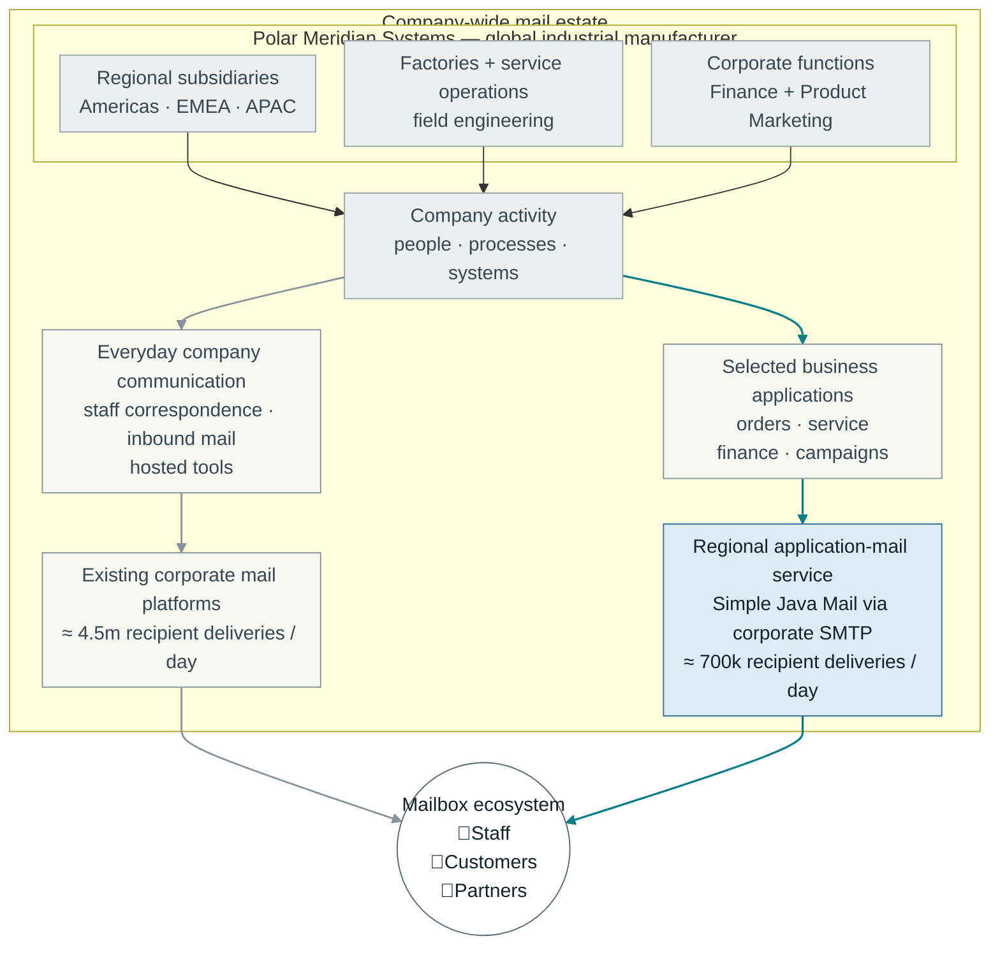
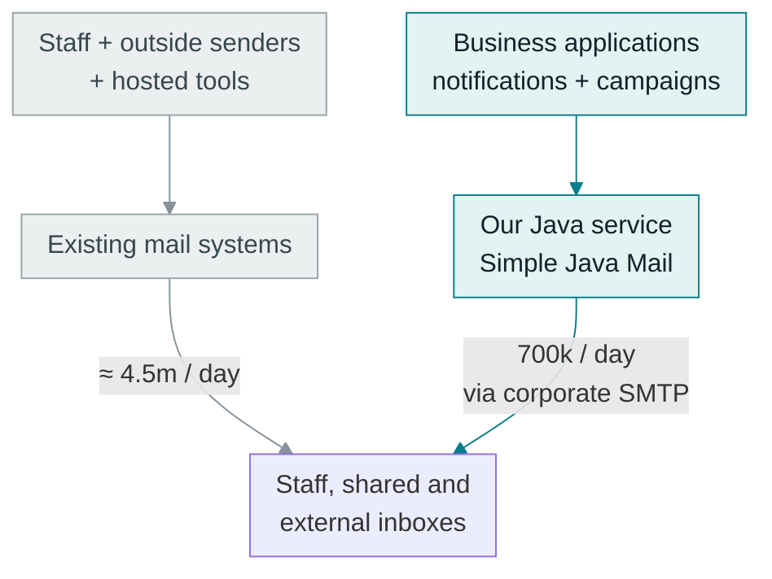
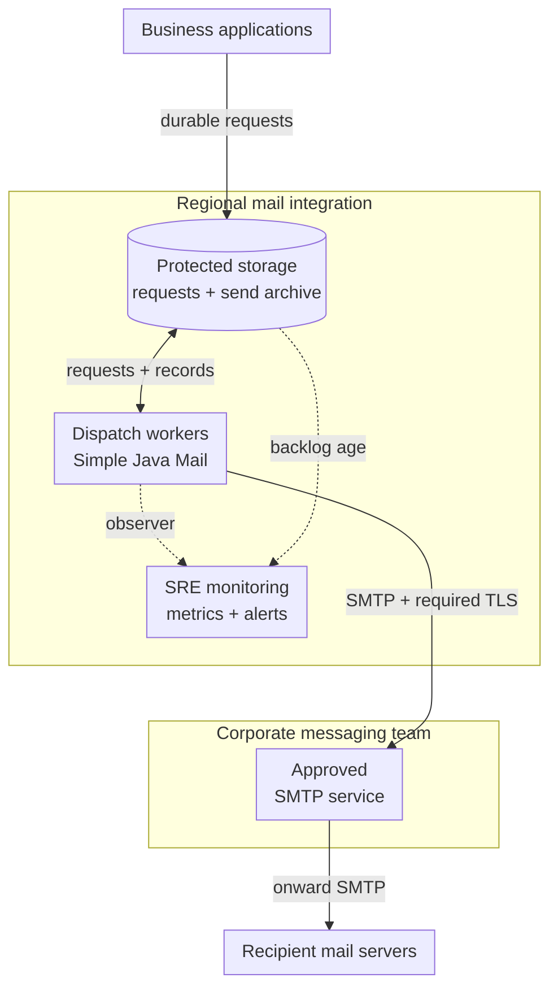
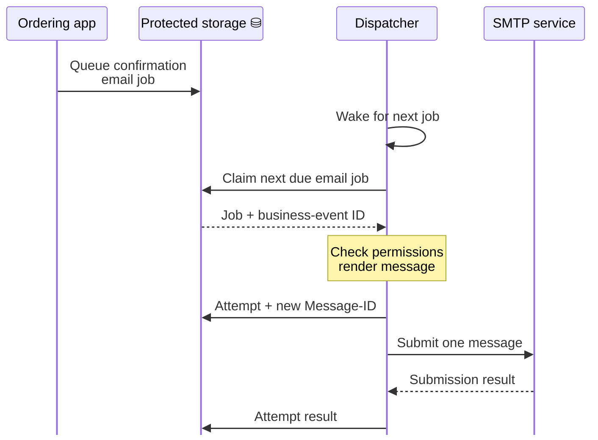
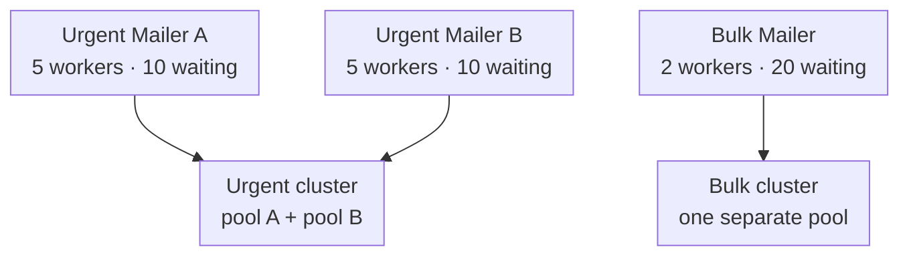
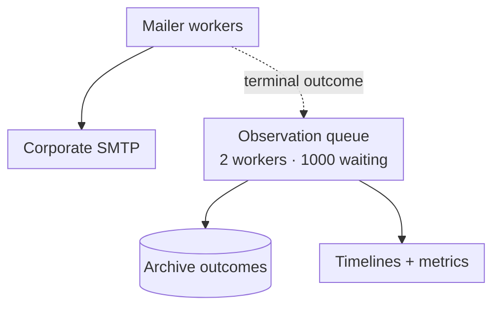

At Polar Meridian Systems, with hundreds of teams all over the world, someone is always logged in, closing the books, sending a maintenance notice, recovering yesterday's backlog, requesting new certificates, sending release notes to a large list of stakeholders. They all think their email is as important as the next.

Well, with roughly **5.2 million email deliveries per working day**, they can't all go first.

Meet the company.

<div class="journal-diagram-wide polar-meridian-estate-map">



</div>

Unlike [Staple & Sons](/journal/your-mail-server-works-for-a-troll-farm-now.html), this company has a messaging-platform team, SREs and security engineers. Email has enough volume and enough competing users to warrant proper orchestration. A mistake in one application should not make several continents wait for password resets.

## Let's break it down, shall we?

Let's give Polar Meridian 150,000 employees worldwide, with about 100,000 regular users of corporate email. These are rough planning figures for our fictional manufacturer, covering a full 24-hour working day across all its regions and mail platforms.

- **About 4.1 million to staff inboxes:** conversations, meetings, workflow notifications, engineering and operational alerts, and incoming external mail.
- **200,000 to shared mailboxes and processing addresses:** deliveries to support queues, operational mailboxes and email-to-ticket systems, separate from individual inboxes.
- **600,000 from staff to external contacts:** replies, sales, support, procurement and distributor conversations.
- **150,000 external application notifications:** order and shipment updates, account notices, documents and service bulletins.
- **100,000 campaign deliveries, averaged across working days:** two million eligible contacts receiving thirteen campaigns a year, spread over 260 working days. An actual campaign day will look quite different.

That's about **5.2 million recipient deliveries per working day**, excluding blocked spam, retries or archive copies. The staff estimate allows roughly forty received emails a day per regular user on average, and much less for infrequent users. Some teams receive far more than others.

Our **Java service** handles **600,000 transactional and operational deliveries**, plus the campaign averages: **700,000 per working day**, already included in the company total. Employee correspondence, incoming mail and notifications sent directly by hosted tools stay on their existing systems.



*Two routes within the same 5.2-million total. We're designing the 700,000-delivery application route.*

There are real examples of this kind of application-mail setup. Retarus describes [BSH bringing about a dozen cloud applications onto one mail platform](https://www.retarus.com/cases/customer-stories/bsh/) and [Solvay sending about 350,000 emails a month from SAP](https://www.retarus.com/cases/customer-stories/solvay/). Those are particular application workloads, not whole-company totals or the measurements behind our fictional numbers.

Let's design the service they operate using Simple Java Mail 10.0.0. We'll follow an order confirmation and a confidential service bulletin through a busy service and a couple of deliberately awkward rehearsals. Marketing's newsletter will be waiting for its turn too.

## The setup

One *regional deployment* is shown here. Simple Java Mail runs inside the dispatch workers; the corporate messaging team operates the SMTP service behind the approved submission endpoints.



The SMTP service is deliberately one box. Its operators already handle relay redundancy, onward delivery and their side of domain authentication. Simple Java Mail belongs in the dispatch workers: composing messages, applying the selected protection, reusing connections and reporting what happened during submission.

The work we're designing sits before and around those SMTP connections. Which application gets the next worker? Who may read the bulletin? How does the person on call find a delayed order confirmation after a worker restarts? An existing mail server doesn't answer those application questions.

## Nobody agrees how urgent their email is

The platform team starts by asking what can wait. This is an unpopular but productive meeting.

Password resets lose their value quickly. An order confirmation matters, but the order is already recorded independently of the notification. A monthly statement run has a completion window. A product newsletter can pause when the system is under pressure. Equipment safety systems do not depend on email arriving before something dangerous happens.

They settle on a few traffic classes rather than allowing every application to invent its own priority:

| Workload | What the application needs | What the platform reserves |
| --- | --- | --- |
| Account access and time-sensitive service notices | Prompt submission and early warning when it slows | Dedicated admission and execution capacity |
| Orders, invoices and statements | Durable work, traceable outcomes and a completion window | A steady allocation with paced catch-up |
| Product announcements and digests | Consent-aware delivery within a flexible window | A capped allocation that can pause |

The order confirmation uses the normal authenticated mail route. The bulletin can wait within its agreed sending window, but it must be signed and encrypted for approved partners. Making it urgent would not change who may read it. The template's protection rules apply independently of its traffic class.

For urgent mail, they set a service-level objective (SLO): **99.9% submitted within thirty seconds**, measured over a rolling thirty-day window.

- **Start the clock** when an authorized, immediately due request reaches durable storage.
- **Stop it** at confirmed SMTP acceptance, not delivery to a mailbox.
- **Count the misses**, including requests still waiting or without confirmed acceptance at the deadline.

Each class gets separate queues, Mailers and workers. The platform assigns the class from application and template rules; a campaign cannot become urgent just because Marketing's release date moved.

## Follow one order confirmation

A customer places an order. The ordering application commits it together with a notification request in its outbox. The platform receives the business-event ID, template, permitted recipients and region, then chooses the approved sender and route. SMTP credentials and signing keys stay with the platform.

The application's dispatcher polls for due email jobs.



*Order-confirmation batch job: claim and send a mail job, and store the result of the attempt.*

The business-event ID stays the same across retries; each attempt gets a new Message-ID. Most waiting work stays in durable storage, with only a small local buffer in the Mailer.

A restart can recover unfinished requests, but "unfinished" does not mean "unsent." SMTP may have accepted the message before the connection or process died. That [acknowledgement gap](https://www.rfc-editor.org/rfc/rfc5321.html#section-6.1) needs a duplicate-handling policy, not an automatic resend.

The bulletin follows the same process, with an extra check before creating an attempt: can the platform still sign it and encrypt it for every approved recipient?

## Security before the first application joins

Onboarding gives each application an identity and a short list of permissions:

- Approved templates, sender domains and recipient rules.
- Any required message signing and encryption, including the approved partner identities.
- A traffic class, conservative sending limits and a support contact.

The dispatcher rechecks permissions before sending, so suspending an application also stops its pending work. Marketing suppression rules remain separate from necessary transactional mail.

### The connection and the sending identity

The platform and messaging teams agree on three things before opening a route:

- **TLS:** require encryption, validate the certificate chain and server name, and install private issuing authorities in the worker's trust store. Test [certificate validation](https://www.rfc-editor.org/rfc/rfc8314.html#section-5.3) during onboarding and configuration changes.
- **Credentials:** keep them in deployment secrets, separate them where independent revocation is needed, and rehearse rotation. These endpoints use STARTTLS/password; OAuth2 endpoints would use `withOAuth2AccessTokenProvider(...)` with a thread-safe provider and `SMTP_OAUTH2`.
- **Sending domains:** the domain team manages SPF and DMARC; corporate relays add DKIM after their final message transformations. Both teams check the resulting signatures and alignment.

[Staple & Sons](/journal/your-mail-server-works-for-a-troll-farm-now.html#spf-dkim-and-dmarc) had to learn those lessons during an incident. Polar Meridian gets to make them admission requirements.

### One protected message, several partners

The distributor and service partner both need the whole bulletin. They need to verify that it came from Polar Meridian without being altered, and their mail providers should not be able to read its protected body. The platform signs it and encrypts it for both recipients using [S/MIME](/security.html#section-sending-smime). TLS still protects the connection to the relay.

The application's `partnerDirectory` supplies a verified address and certificate in a `PartnerIdentity`. The helper below refuses missing or expired certificates; `checkValidity()` checks dates, while the directory establishes whose certificate it is:

```java
Recipient protectedRecipient(String partnerId) throws CertificateException {
    PartnerIdentity partner = partnerDirectory.requireApprovedIdentity(partnerId);
    X509Certificate certificate = partner.getEncryptionCertificate();
    if (certificate == null) {
        throw new IllegalStateException("No encryption certificate for " + partnerId);
    }
    certificate.checkValidity();

    return new RecipientBuilder()
        .withAddress(partner.getEmailAddress())
        .withType(Message.RecipientType.TO)
        .withSmimeCertificate(certificate)
        .build();
}
```

*Before the bulletin can leave, resolve each approved partner and their encryption certificate.*

With `smime-module` installed, the worker can build the message using `mail`, the platform's configured `SimpleJavaMail` factory. `partnerSigningConfig` contains the platform's signing credentials; `partnerEncryptionConfig` contains the encryption algorithms agreed and tested with these partners. Every recipient in this example has its own certificate, so no shared fallback certificate is needed:

```java
Email protectedNotice = mail.emailBuilder().startingBlank()
    .from("Polar Meridian Service", "service@polarmeridian.com")
    .withRecipients(
        protectedRecipient("distributor"),
        protectedRecipient("service-partner"))
    .withSubject("Confidential service bulletin")
    .withPlainText(approvedBulletinText)
    .signWithSmime(partnerSigningConfig)
    .encryptWithSmime(partnerEncryptionConfig)
    .buildEmail();
```

*Sign once, then let each approved partner decrypt the bulletin with their own private key.*

### Certificates need looking after too

`partnerDirectory` uses the company's certificate-validation service to check [trust, permitted key use and revocation status](https://www.rfc-editor.org/rfc/rfc8550.html#section-4), and ties the approved certificate to the partner's verified address. Those checks belong to the application and its PKI integration; the date check in the helper is not a substitute.

- **Before onboarding a partner**, send a non-sensitive test bulletin through the real mail route. Both partners must be able to decrypt it and verify Polar Meridian's signature using their own receiving software.
- **Before certificates expire**, alert the partner integration team. Approve replacements and repeat that test before switching. The platform's signing certificate needs the same attention as the recipients' encryption certificates.
- **Before each send attempt**, resolve the current approved certificates, including for any recipients added by templates or Mailer policy. A queued request must not keep using a certificate that has since been revoked or replaced.

If those checks fail, the application holds the bulletin and records why. It does not remove encryption to get the queue moving. Different recipient keys still protect the same message body, so both partners must be allowed to read the whole bulletin. Its retained copy is encrypted separately in the archive.

## A budget before another replica

Those 700,000 daily deliveries work out to only about eight a second across twenty-four hours. Then Marketing queues a newsletter for 300,000 recipients in Europe, each getting their own message. For this exercise, the messaging team gives bulk mail a ceiling of eighty recipient submissions per second, with separate capacity reserved for urgent and routine transactional mail:

```text
300,000 recipients
÷ 80 recipients/second
= 3,750 seconds
= 62.5 minutes minimum
```

*The newsletter needs at least an hour; a password reset cannot wait behind it.*

That is a minimum submission time, not a promise of inbox delivery. Slower sends or other work sharing the bulk allowance extend it. More connections cannot buy a higher allowance, either. [Amazon SES, for example, limits both the sending rate and recipients submitted over a rolling twenty-four hours](https://docs.aws.amazon.com/ses/latest/dg/manage-sending-quotas.html). Where both limits apply, the platform reserves room for urgent mail in both: spare connections are useless after the daily quota is exhausted. The dispatcher enforces those allowances across all replicas.

### Size workers for the busy periods

Before choosing pool sizes, the SREs count workers, waiting tasks and connections separately. A worker waiting for a connection still occupies a worker slot. A connection waiting for a slow SMTP response still occupies a connection slot.

Their load tests include the small order confirmation and the larger, signed and encrypted bulletin. For an urgent peak in this region, suppose they need 100 submissions per second and a connection is occupied for an average of 0.2 seconds per message:

```text
100 submissions/second × 0.2 seconds = 20 busy connections on average

4 replicas × 10 connections per relay = a ceiling of 40 per relay
8 replicas × 10 connections per relay = a ceiling of 80 per relay
```

*Another replica multiplies the connection allowance, even when its configuration stays the same.*

The first line estimates occupied connections at that load. The other two show configured ceilings, not measured demand or throughput. If a replica registers two relay pools, each has its own ceiling. Smaller worker allocations may keep actual use below those ceilings; idle reusable connections still count against the servers' limits.

The messaging team and SREs agree a regional budget covering every workload and replica. Provider-wide rate limits and deployment limits are enforced by the platform, outside individual pools. Doubling the replicas is not allowed to quietly double the load on the mail service.

### Leave most of the queue in the database

For the examples below, urgent mail has two Mailers per replica, one for each approved relay endpoint. Each has five workers and ten waiting slots. Bulk mail has a separate Mailer with two workers and twenty waiting slots. Other workloads, including our order confirmations and scheduled bulletins, get their own allocations; we'll show urgent and bulk here because the contrast matters.

```text
Per replica:
  urgent A:  5 workers + 10 waiting slots
  urgent B:  5 workers + 10 waiting slots
  bulk:      2 workers + 20 waiting slots

Four replicas:
  urgent:   40 workers + 80 waiting slots in total
  bulk:      8 workers + 80 waiting slots in total
```

*Bulk mail gets its own waiting space; it cannot fill the urgent Mailers' queues.*

These are trial limits for the fictional workload, not suggested defaults. The platform separately limits request size and concurrent message preparation. A [bounded async queue](/sending-and-execution.html#section-async-queue) counts waiting tasks; it does not account for every attachment buffer or everything the application is preparing before the call.

When a queue fills, the dispatcher leaves further work in durable storage. A rejected attempt with reason `QUEUE_FULL` can be deferred without duplicating an SMTP submission. Other failures need their own decision, especially an uncertain acceptance. [Staple & Sons' dispatcher](/journal/your-mail-server-works-for-a-troll-farm-now.html#the-dispatcher-in-full) shows that loop; Polar Meridian runs it with separate workload claims, regional budgets and rate controls.

They also distinguish a two-second wait to obtain a connection from a fifteen-second budget for a library send. Neither includes time already spent waiting in the application queue. The thirty-second service target starts earlier, at durable acceptance, so an old request can be late even when Simple Java Mail finishes its part quickly.

## Mailer settings are part of the service

The service keeps reusable Mailers for each region, traffic class and permitted sending identity. Application teams can request a supported behaviour; they cannot pass arbitrary Session properties or replace the approved SMTP destination.

The platform creates each route builder through the same `mail` factory. The host and credentials come from versioned deployment configuration and runtime secrets, not the notification request:

```java
MailerRegularBuilder<?> routeBuilder(String host, String username, String password) {
    return mail.mailerBuilder()
        .withSMTPServer(host, 587, username, password)
        .withTransportStrategy(TransportStrategy.SMTP_TLS)
        .trustingAllHosts(false)
        .trustingSSLHosts()
        .verifyingServerIdentity(true)
        // reject messages above ten MiB after MIME encoding
        .withMaximumEmailSize(10 * 1024 * 1024)
        // don't occupy a worker indefinitely while waiting for a connection
        .withConnectionPoolClaimTimeoutMillis(2000)
        // includes preparation and the local queue, not the application's queue
        .withMailSendTimeout(Duration.ofSeconds(15));
}
```

*Every route starts with the same transport checks and finite send budget.*

Their endpoints require STARTTLS on port 587. The private issuing CA is installed in the worker's trust store. These certificate and hostname checks are already normal defaults in 10.0.0; spelling them out also clears trust exceptions that might arrive through configuration. The managed Angus transport supports aborting stuck socket I/O when the [send budget expires](/sending-and-execution.html#section-send-deadlines). That still does not make a timeout proof that the server received nothing.

The team uses [configuration diagnostics](/configuration.html#section-config-snapshot) to review resolved values and their sources. Those describe the factory snapshot. Builder changes must also be checked on the built Mailer, through its transport and operational configuration. Loading another snapshot does not reconfigure existing Mailers; replacements are built and the old instances drained.

They also distinguish [email defaults from overrides](/configuration.html#section-combine-config). A default sender fills an omission. It cannot enforce an approved sender against a value already supplied. Permissions are checked before construction, and overrides enforce values that must not vary.

These are still builders. They receive their workload limits below, then the completion observer before `buildMailer()` is called.

## Pools that are allowed to share work

If the messaging team provides one highly available submission hostname, Polar Meridian uses that hostname. There is no reason to reproduce the service's internal server list in Java.

For this part of the exercise, suppose the European deployment instead gets two explicitly interchangeable urgent-mail endpoints and a separate bulk endpoint. The approved endpoints are stable configuration; the application is not discovering arbitrary hosts inside the corporate SMTP service.



Sharing a [cluster key](/sending-and-execution.html#section-clustering) lets a send borrow a connection from another registered pool in that cluster. It does not combine the Mailers' worker queues. The dispatchers divide urgent requests between the two Mailers; the connection pool chooses an eligible relay.

The two urgent endpoints must accept the same sending identities, require the same transport checks and be approved for the same content. A region with different data-handling requirements remains separate. [RelayDesk](/journal/everybody-brought-their-own-mail-server.html) has a less forgiving version of this problem: two customers' servers are not interchangeable simply because both speak SMTP.

Here `urgentABuilder`, `urgentBBuilder` and `bulkBuilder` were each created through `routeBuilder()` with their approved endpoint and credentials. The deployment includes `batch-module` for multi-worker sending and connection pooling:

```java
UUID urgentCluster = randomUUID();

for (MailerRegularBuilder<?> builder : List.of(urgentABuilder, urgentBBuilder)) {
    builder
        .withClusterKey(urgentCluster)
        .withThreadPoolSize(5)
        .withAsyncQueueCapacity(10)
        .withAsyncQueueOverflowPolicy(AsyncQueueOverflowPolicy.REJECT)
        // keep one connection ready per relay pool
        .withConnectionPoolCoreSize(1)
        // per relay pool, in this process
        .withConnectionPoolMaxSize(10)
        .withConnectionPoolLoadBalancingStrategy(LoadBalancingStrategy.ROUND_ROBIN);
}

bulkBuilder
    .withClusterKey(randomUUID())
    .withThreadPoolSize(2)
    .withAsyncQueueCapacity(20)
    .withAsyncQueueOverflowPolicy(AsyncQueueOverflowPolicy.REJECT)
    // no connection needs to remain open between bulk runs
    .withConnectionPoolCoreSize(0)
    .withConnectionPoolMaxSize(2);
```

*Urgent sends can use either approved relay; bulk work cannot borrow their connections.*

The first pool registration fixes the cluster's pool policy; later registrations do not renegotiate it. Configuring the urgent builders together avoids making startup order a policy decision. The two Mailers are built before dispatch starts.

These clusters live within one process. Reusing the UUID in another deployment does not share sockets, queues or quotas. Even a separate cluster does not reserve capacity inside a remote SMTP server. The messaging team has to honour the agreed allocations there too.

Round-robin selection spreads work across registered pools; it is not health-based failover. Invalidating a broken transport does not remove its server's pool from the cluster. Taking an endpoint out of service is a deliberate operational action, which we'll exercise later.

## An archive with something useful in it

A customer asks about an order confirmation. The service team needs to check who was included in a bulletin. Neither investigation should depend on finding a log line on whichever worker handled the request.

The platform keeps the approved content in encrypted storage, with an attempt record linking it to the business request, application, region and workload. Each retry gets its own Message-ID. That lets the completion observer find the attempt without treating a retry as a new business event.

The worker uses the Mailer selected for the request's approved route. `archive` is the application's repository; its insertion stores the protected content and attempt metadata before submission:

```java
MailSend<MailSubmissionReceipt> sendArchived(
        Mailer mailer, String requestId, Email approvedEmail) {
    Email email = mail.emailBuilder()
        .copying(approvedEmail)
        .fixingMessageId("<" + randomUUID() + "@mail.polarmeridian.com>")
        .buildEmail();

    archive.insertAttempt(email.getId(), requestId, email);
    return mailer.async().sendMail(email);
}
```

*Create an identifiable attempt before any SMTP work starts.*

Both our confirmation and our signed-and-encrypted bulletin pass through this helper. Its caller updates the request queue from the returned completion, deferring `QUEUE_FULL` and holding uncertain failures for review. Failure to insert the attempt stops the call before SMTP. Failure to record a result later cannot undo a message already accepted.

### Attach the result to that attempt

The [completion observer](/sending-and-execution.html#section-mail-send-observer) receives failures as well as successful results. `stageLog` stores the structured timeline; `monitoring` exports classified outcomes and durations. These are application adapters, not extra Simple Java Mail APIs.

The callback tries archive persistence and telemetry separately. A failure in one must not skip the other:

```java
public void onMailSendCompleted(MailSendOutcome outcome) {
    String attemptMessageId = outcome.getInitialMessageId();

    try {
        archive.recordOutcome(attemptMessageId, outcome);
    } catch (RuntimeException failure) {
        archiveWriteFailures.incrementAndGet();
        log.error("Could not archive outcome for {}", attemptMessageId, failure);
    }

    try {
        stageLog.record(attemptMessageId, "REQUESTED", outcome.getRequestedAt());
        outcome.getReadyAt().ifPresent(at ->
            stageLog.record(attemptMessageId, "READY", at));
        outcome.getStartedAt().ifPresent(at ->
            stageLog.record(attemptMessageId, "STARTED", at));
        stageLog.record(attemptMessageId, "COMPLETED", outcome.getCompletedAt());
        monitoring.recordAttempt(outcome);
    } catch (RuntimeException failure) {
        telemetryWriteFailures.incrementAndGet();
        log.error("Could not record timeline for {}", attemptMessageId, failure);
    }
}
```

*Record how the attempt ended, even when it never reached an SMTP server.*

`archiveWriteFailures` and `telemetryWriteFailures` are application `AtomicLong` counters exported by the monitoring adapter. The adapters must be thread-safe: several callbacks can run at once. Archive writes are idempotent by Message-ID, so repeating a persistence operation updates the same attempt.

The stage names are log labels written at completion, using the recorded timestamps. There are no per-stage callbacks here. A preparation failure may have neither `readyAt` nor `startedAt`; it still has a terminal outcome.

The archive keeps `isSuccessful()`, `isLoggingOnly()` and the optional [submission receipt](/analyzing-send-results.html#section-observer-results) as separate facts. A receipt can report accepted, partially accepted, rejected or unknown. An early preparation or scheduling failure may have no receipt. None of those records by itself proves delivery to a mailbox.

### What exactly did we keep?

The retained `Email` describes the approved content. The observer does not carry its body, and later Mailer defaults, signing or encryption may affect the submitted bytes. If exact-byte evidence is required, the platform instead finalizes and retains the EML before using the [preserved-message submission path](/features.html#section-exact-eml). Rebuilding it later is not equivalent to keeping what was submitted.

Archive access is different from dashboard access. An SRE can inspect counts, durations and result classifications without routinely opening attachments. Support gets scoped access to specific records. Content retention, decryption permissions and access auditing are designed alongside the sending service, not added after the archive has accumulated years of correspondence.

## When the archive is slower than SMTP

The callback above writes to storage. Running it inline would make the thread completing a send wait for that storage too. At low volume that may be acceptable; here a slow archive must not occupy all the sending workers.

Polar Meridian runs callbacks on a separate, bounded executor. This startup fragment provides two observation workers and space for a thousand waiting callbacks. `rejectedObservations` is another application `AtomicLong` counter:

```java
ThreadPoolExecutor observationWorkers = new ThreadPoolExecutor(
    2, 2, 0L, TimeUnit.MILLISECONDS,
    new ArrayBlockingQueue<>(1000),
    Executors.defaultThreadFactory(),
    (task, executor) -> {
        rejectedObservations.incrementAndGet();
        throw new RejectedExecutionException("Mail observation queue is full or stopped");
    });
```

*A slow archive queues observation work, without turning it into another SMTP retry.*

They use a rejecting policy deliberately. A caller-runs policy would put the slow callback back on a sending thread; silent discard would hide missing observations. The worker count and buffer are trial values too, sized against callback throughput and acceptable archive lag.

Now each configured route gets the same `observationSink`, whose callback we just wrote. Only then are the Mailers built:

```java
List<Mailer> mailers = new ArrayList<>();
for (MailerRegularBuilder<?> builder :
        List.of(urgentABuilder, urgentBBuilder, bulkBuilder)) {
    mailers.add(builder
        .withMailSendObserver(observationSink::onMailSendCompleted, observationWorkers)
        .buildMailer());
}
```

*Connect every route to the archive before the dispatchers start using it.*

Simple Java Mail attempts the handoff before completing the send, but does not wait for an executor-backed callback. Rejected handoffs are logged and are not retried or run inline. Callback exceptions leave the send result unchanged. These are two separate queues with separate failure reporting:



SMTP could accept the order confirmation just before the observation queue fills or the process dies. Its attempt record would then lack a result, despite the message having gone out. Monitoring watches those gaps. When the outcome survives, recovery retries the archive write, not the send. Otherwise the operator needs the request record, relay logs and any remaining submission evidence to decide what happened. An in-memory callback queue cannot make SMTP and the archive a single transaction.

## Timelines that turn into useful alerts

When an order confirmation is late, the SRE first checks whether it waited in the application queue or inside a send attempt. The observer supplies the latter's timestamps; a duration only makes sense when both ends exist:

| Interval | What it measures |
| --- | --- |
| `requestedAt` to `readyAt` | Library preparation |
| `readyAt` to `startedAt` | Waiting for execution, including any admission wait |
| `startedAt` to `completedAt` | Execution, including connection acquisition, submission and cleanup |
| Durable application acceptance to confirmed SMTP acceptance | The service target, including the wait before calling Simple Java Mail |

They do not insert zero for a stage that never happened, or call the whole execution interval "network latency." Wall-clock timestamps also require sane clocks; negative intervals are flagged rather than charted.

### The sends that have not finished yet

Completed-attempt charts have an obvious blind spot: work that is still waiting. The dashboard also reads the durable request queue, the Mailers' [queue snapshots](/debugging.html#section-async-queue) and the observation executor. That includes bulletins held by the application's certificate checks before `sendMail()` was called: they have a request and a hold reason, but no library completion callback.

Here is a small diagnostic poll for one Mailer. The application supplies the stable `workload` label and runs this on its monitoring schedule:

```java
mailer.getAsyncQueueSnapshot().ifPresent(queue ->
    log.info("workload={} active={}/{} queued={} observerQueued={} observerRejected={}",
        workload, queue.getActiveCount(), queue.getWorkerLimit(),
        queue.getQueuedCount(), observationWorkers.getQueue().size(),
        rejectedObservations.get()));
```

*Look at unfinished work as well as the attempts that managed to complete.*

The counts are momentary estimates, not an admission check. The shared observation-queue counts are process-wide, so the metric exporter samples them once per process rather than summing them once per Mailer.

For the thirty-second target, the durable request record is the starting point. A fast failed attempt does not satisfy that target, but an allowed retry confirmed within the original window still can. Retrying does not restart the clock. The SREs count requests without confirmed acceptance by the deadline as misses; averaging successful callback durations would leave those requests out entirely.

A simplified alert during their test might look like this. The worker figures combine the two urgent Mailers in one replica:

```text
WARN MailServicePressure region=EU replica=eu-worker-2 workload=urgent
    oldest_due_request=24s       submission_target=30s
    active_sends=10              worker_limit=10
    queued_sends=20              queue_capacity=20
    completed_attempts_last_30s=0
    action=check_dispatch_and_approved_relays
```

*No completions is not a healthy latency result when urgent work is still waiting.*

### A page should come with something to do

The dashboard groups latency distributions, queue pressure and classified outcomes by region, workload and a controlled set of application identifiers. Request IDs and recipient addresses stay in protected investigation records. Detailed exception logs have restricted access; raw exception text is not exported as a metric label.

The team distinguishes a service symptom from its possible causes, as described in [Google's SRE guidance](https://sre.google/sre-book/monitoring-distributed-systems/#symptoms-versus-causes-g0sEi4). A full connection pool is useful evidence. Urgent requests running out of time are the reason someone needs to act.

| What the operator sees | First response |
| --- | --- |
| Urgent requests approaching the deadline | Check admission, worker saturation and approved relay health |
| Rising observation queue or missing archive outcomes | Check persistence, reduce bulk admission and investigate rejected handoffs |
| SMTP certificate or authentication failures | Hold the affected route and inspect its credentials or trust configuration |
| A partner certificate nearing expiry, or a bulletin held by its certificate checks | Contact the partner integration team; renew and test the affected certificate |
| A slow newsletter within its agreed window | Keep watching; no urgent page just because it is slower |

Alert windows and thresholds are exercised against the workload, not copied from these invented numbers. Failed synthetic checks also help when real traffic is quiet. Regional SREs receive pages through an independent incident channel; a broken email service should not be its own only way of asking for help.

The [Staple & Sons timing log](/journal/your-mail-server-works-for-a-troll-farm-now.html#where-the-time-goes) is enough to start an investigation. Here the same observations are combined with request ages, queue pressure and an agreed response before a customer has to report the delay.

## A region goes quiet

The messaging team takes a relay offline during a busy rehearsal. The newsletter pauses. Our order confirmation is still waiting in the database when its route stops admitting work; the dashboard keeps its original request ID and age. Urgent mail has an approved surviving endpoint, but still has to fit within that endpoint's agreed capacity. Other work waits for its route to recover.

For the direct relay pair above, leaving a failed endpoint registered would keep it eligible for selection. The platform stops admission to the affected route and replaces its Mailers with a new cluster containing only the approved surviving endpoint. Previously admitted sends are drained and their outcomes examined; switching the configuration is not permission to repeat all of them. Where the messaging team supplies one highly available hostname instead, failover behind that hostname remains its job.

Before retrying, the dispatcher distinguishes:

- `QUEUE_FULL`: this offer did not start SMTP work and can wait for a later attempt.
- Confirmed acceptance: do not send another copy just because subsequent archive work failed.
- Partial or [unknown acceptance](/analyzing-send-results.html#section-unknown-acceptance): inspect the receipt and recipient-level evidence. A whole-message retry may duplicate mail.

When its route is restored, the waiting order confirmation is claimed from the same durable request and gets an attempt record. The operator can follow it through to confirmed SMTP acceptance without losing the time it spent waiting during the outage.

### A certificate expires instead

Next they queue a test bulletin with an expired service-partner certificate. The directory rejects it before a send attempt is created. The bulletin stays in protected storage; order confirmations continue through their own allocation. A simplified alert from the application's request monitor looks like this:

```text
WARN ProtectedMailHeld region=EU application=service-platform
    reason=recipient_certificate_expired
    held_requests=1              oldest_held_request=3m
    smtp_attempt_started=false
    action=renew_partner_certificate_and_repeat_decryption_test
```

*The bulletin waits for a usable certificate; unrelated mail keeps moving.*

The partner integration team approves a replacement and repeats the decryption and signature-verification test before releasing the held request. The rehearsal also checks that the held request made no SMTP call and that the released bulletin reaches the test inbox signed and encrypted. Advance expiry warnings should normally prevent this hold, but now they know what happens when renewal is missed.

### Stop the sends before stopping their observers

The application also tests shutdown. Here `dispatchers.stopAndAwait()` is its own lifecycle method: it stops claims and waits until those dispatchers can make no further send calls. The Mailers then finish their admitted work before the observation executor is stopped:

```java
dispatchers.stopAndAwait();

for (Mailer route : mailers) {
    route.close();
}

observationWorkers.shutdown();
if (!observationWorkers.awaitTermination(30, TimeUnit.SECONDS)) {
    throw new IllegalStateException("Mail observations are still draining");
}
```

*Finish admitted sends before draining the callbacks that record their outcomes.*

[Closing a Mailer](/sending-and-execution.html#section-mailer-lifecycle) does not close the supplied observation executor. Shutdown failures must remain visible; a timed-out drain is not a reason to discard queued outcomes or retry their emails. If the archive adapter hands work to another service instead of completing its write in the callback, that downstream service needs its own acknowledgement and shutdown handling.

## Bringing the applications along

The production rollout starts with order confirmations. The team verifies sender authorization, finds the attempts in the archive and measures the path from durable acceptance to SMTP submission. Application teams get examples and a staging route that sends to controlled recipients, not a second copy of the production mailing list.

The confidential bulletins follow once the partners can decrypt them, verify the signature and renew their certificates without improvising. Subsequent integrations get the same review of recipients, content, signing identity and route. A working SMTP connection is only the start of that conversation.

By the next monthly statement run, Finance knows its completion window. Account mail has room to run. The SRE on duty can investigate a delayed confirmation and distinguish an SMTP problem from a missing archive result. The partner integration team gets expiry warnings while there is still time to arrange a replacement.

Somebody is still asking whether their email can go first. At least there is now a useful answer.

*Next is [RelayDesk](/journal/everybody-brought-their-own-mail-server.html), where the customers bring their own mail services and there is no single messaging team to agree all this with.*
