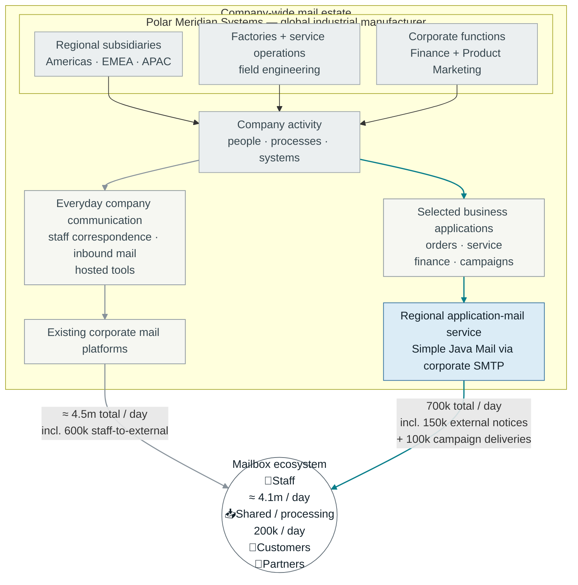
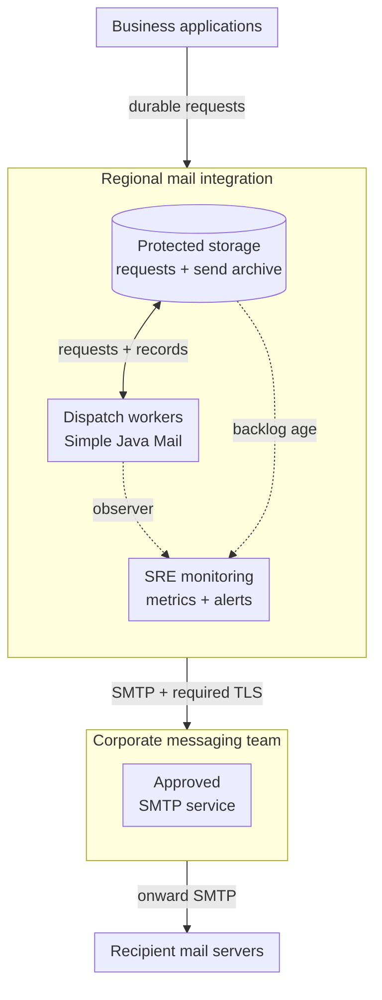
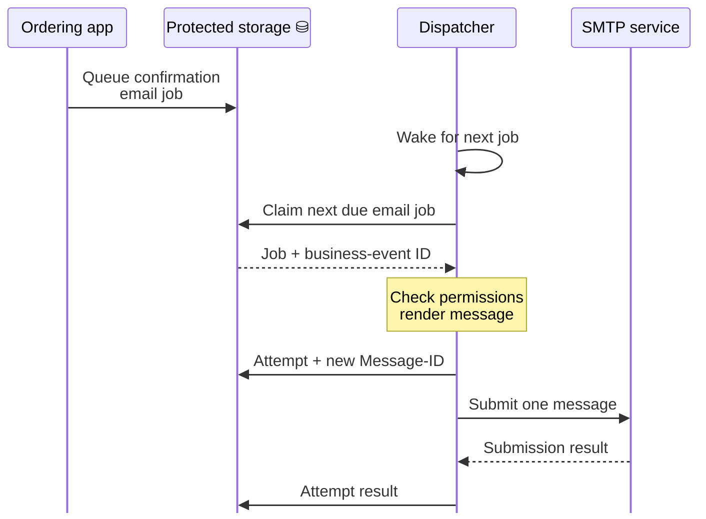
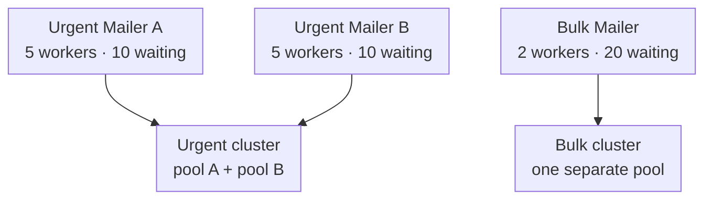
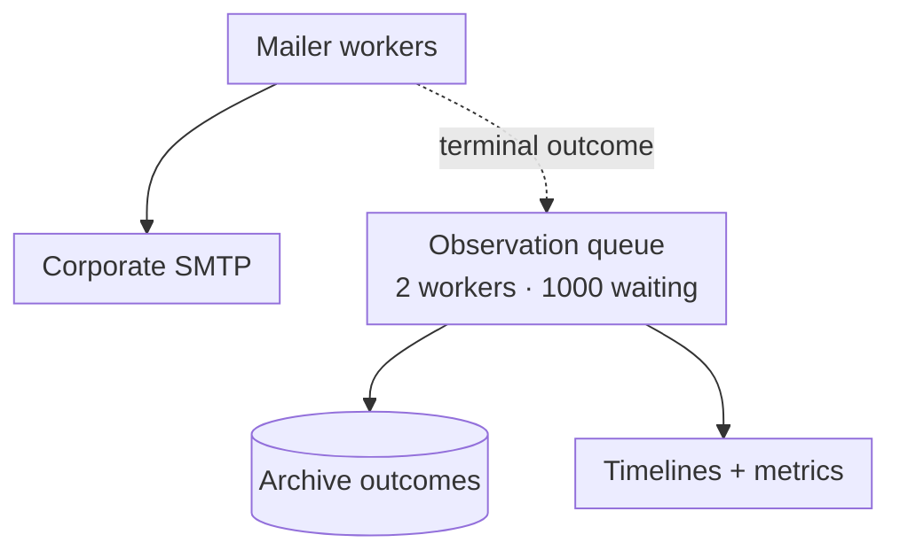

At Polar Meridian Systems, colleagues are emailing across continents, customers are asking about orders and suppliers are chasing payments. Meanwhile, its applications are sending order confirmations, service bulletins, login codes and a newsletter that Marketing would very much like to send today. Everyone involved thinks their email is as important as the next.

Well, with roughly **5.2 million email deliveries per working day**, they can't all go first.

## Meet the company

Let's give Polar Meridian 150,000 employees worldwide, with about 100,000 regular users of corporate email. That puts its workforce somewhere between ING's roughly 64,000 employees in 2025 and HCLTech's 223,000 in its 2024–25 annual report. The staff estimate allows roughly forty received emails a day per regular user on average, and much less for infrequent users. Some teams receive far more than others.

Unlike [Staple & Sons](/journal/your-mail-server-works-for-a-troll-farm-now.html), this company has a messaging-platform team, SREs and security engineers. Email has enough volume and enough competing users to warrant proper orchestration. A mistake in one application should not make several continents wait for password resets.

<div class="journal-diagram-wide polar-meridian-estate-map">



</div>

Our **Java service handles** 600,000 transactional and operational deliveries, plus the campaign averages: **700,000 per working day**, already included in the company total. Employee correspondence, incoming mail and notifications sent directly by hosted tools stay on their existing systems.

There are real examples of this kind of application-mail setup. Retarus describes [BSH bringing about a dozen cloud applications onto one mail platform](https://www.retarus.com/cases/customer-stories/bsh/) and [Solvay sending about 350,000 emails a month from SAP](https://www.retarus.com/cases/customer-stories/solvay/).

Let's design the service they operate using Simple Java Mail 10.0.0. We'll follow an order confirmation and a confidential service bulletin through a busy service and a couple of deliberately awkward rehearsals. Marketing's newsletter will be waiting for its turn too.

## The setup

Let's look inside one of Polar Meridian's regional application-mail services. Its Java dispatch workers use Simple Java Mail to send through the corporate SMTP service, which the messaging-platform team operates.



The SMTP service is deliberately one box. That might not look like a lot, but our 700,000 daily deliveries *average* only about eight per second. A newsletter queued for 300,000 people at once is another of course.

Its operators already handle relay redundancy, onward delivery and their side of domain authentication. Simple Java Mail belongs in the dispatch workers: composing messages, applying the selected protection, reusing connections and reporting what happened during submission.

The work we're designing sits before and around those SMTP connections. Which application gets the next worker? Who may read the bulletin? How does the person on call find a delayed order confirmation after a worker restarts? **An existing mail server doesn't answer those application questions.**

## Nobody agrees how urgent their email is

The platform team starts by asking what can wait. This is an unpopular but productive meeting.

Someone waiting for a 2FA confirmation email is stuck at the login screen, and the code may expire within minutes. Password resets are urgent too. An order confirmation matters, but the order is already recorded independently of the notification. A monthly statement run has a completion window. A product newsletter can pause when the system is under pressure. Equipment safety systems do not depend on email arriving before something dangerous happens.

They settle on a few traffic classes rather than allowing every application to invent its own priority:

| Workload | What the application needs | What the platform reserves |
| --- | --- | --- |
| 2FA confirmation emails, password resets and time-sensitive service notices | Prompt submission and early warning when it slows | Dedicated admission and execution capacity |
| Orders, invoices and statements | Durable work, traceable outcomes and a completion window | A steady allocation with paced catch-up |
| Product announcements and digests | Send to current subscribers within a flexible delivery window | A capped allocation that can pause |

The order confirmation uses the normal authenticated mail route. The bulletin can wait within its agreed sending window, but it must be signed and encrypted for approved partners. Making it urgent would not change who may read it. The template's protection rules apply independently of its traffic class.

For urgent mail, they set a service-level objective (SLO): **99.9% submitted within thirty seconds**, measured over a rolling thirty-day window.

- **Start the clock** when an authorized, immediately due request reaches durable storage.
- **Stop it** at confirmed SMTP acceptance, not delivery to a mailbox.
- **Count the misses**, including requests still waiting or without confirmed acceptance at the deadline.

Each class gets separate queues, Mailers and workers. The platform assigns the class from application and template rules; a campaign cannot become urgent just because Marketing's release date moved.

## Follow one order confirmation

An order confirmation can wait behind a login code, but it must survive a worker restart and leave a record of what happened. When a customer places an order, the ordering application therefore saves the order and adds a confirmation request to its outbox in the same transaction. The platform receives the business-event ID, template, permitted recipients and region, then chooses the approved sender and route. SMTP credentials and signing keys stay with the platform.

The mail service's dispatcher polls for due email jobs:



*Order-confirmation batch job: claim and send a mail job, and store the result of the attempt.*

The confirmation can wait in the database while urgent mail goes first. Its request survives a worker restart, and each sending attempt gets its own Message-ID while remaining tied to the same business-event ID.

First, we need to fill in the diagram's permission check. What is the ordering application allowed to send, to whom, and with what protection?

## Security before the first application joins

Before the ordering application can send mail, it needs an identity and a short list of permissions agreed at onboarding:

- Approved templates, sender domains and recipient rules.
- Any required message signing and encryption, including the approved partner identities.
- A traffic class, conservative sending limits and a support contact.

The dispatcher rechecks permissions before sending, so suspending an application also stops its pending work. Marketing suppression rules remain separate from necessary transactional mail.

### The connection and the sending identity

The platform and messaging teams agree on three things before opening an SMTP route:

- **TLS:** require encryption, validate the certificate chain and server name, and install private issuing authorities in the worker's trust store. Test [certificate validation](https://www.rfc-editor.org/rfc/rfc8314.html#section-5.3) when opening or changing a route.
- **Credentials:** keep them in deployment secrets and rehearse rotation. These endpoints use STARTTLS/password; OAuth2 routes would use `SMTP_OAUTH2` and a thread-safe token provider via `withOAuth2AccessTokenProvider(...)`.
- **Sending domains:** the domain team manages SPF and DMARC; corporate relays add DKIM after their final message changes. Check the resulting signatures and alignment.

[Staple & Sons](/journal/your-mail-server-works-for-a-troll-farm-now.html#spf-dkim-and-dmarc) had to learn those lessons during an incident. Polar Meridian gets to make them admission requirements.

### One protected message, several partners

The distributor and service partner both need the whole service bulletin, but their mail providers should not be able to read its body. [S/MIME](/security.html#section-sending-smime) lets each partner decrypt it and verify Polar Meridian's signature. TLS still protects the connection to the relay.

The application's `partnerDirectory` verifies each partner's address and uses the company's PKI service to check [certificate trust, permitted key use and revocation](https://www.rfc-editor.org/rfc/rfc8550.html#section-4). It returns a `PartnerIdentity`; the helper also rejects missing certificates and checks their validity dates:

```java
Recipient protectedRecipient(String partnerId) throws CertificateException {
    PartnerIdentity partner = partnerDirectory.requireApprovedIdentity(partnerId);
    X509Certificate certificate = partner.getEncryptionCertificate();
    if (certificate == null) {
        throw new IllegalStateException("No encryption certificate for " + partnerId);
    }
    certificate.checkValidity();

    return new RecipientBuilder()
        .withAddress(partner.getEmailAddress())
        .withType(Message.RecipientType.TO)
        .withSmimeCertificate(certificate)
        .build();
}
```

*Before the bulletin can leave, resolve each approved partner and their encryption certificate.*

With `smime-module` installed, the worker uses `mail`, the platform's configured `SimpleJavaMail` factory. `partnerSigningConfig` supplies its signing credentials; `partnerEncryptionConfig` selects the algorithms agreed and tested with the partners:

```java
Email protectedNotice = mail.emailBuilder().startingBlank()
    .from("Polar Meridian Service", "service@polarmeridian.com")
    .withRecipients(
        protectedRecipient("distributor"),
        protectedRecipient("service-partner"))
    .withSubject("Confidential service bulletin")
    .withPlainText(approvedBulletinText)
    .signWithSmime(partnerSigningConfig)
    .encryptWithSmime(partnerEncryptionConfig)
    .buildEmail();
```

*Sign once, then let each approved partner decrypt the bulletin with their own private key.*

### Certificates need looking after too

The partners' encryption certificates and Polar Meridian's signing certificate will need replacing while the service is running:

- **At onboarding**, send a non-sensitive bulletin through the real route and verify decryption and signature checking in each partner's receiving software.
- **Before expiry**, alert the partner integration team and test approved replacements. Include the platform's signing certificate in this process.
- **At each attempt**, resolve current approved certificates for every recipient, including any added by templates or Mailer configuration. A waiting request may outlive a certificate's approval.

If a check fails, the application holds the bulletin and records why; encryption stays required. Its retained copy is encrypted separately in the archive. We'll [test that hold with an expired certificate](#a-certificate-expires-instead).

## A budget before another replica

Our order confirmation and protected bulletin are approved to send, but Marketing has queued a newsletter for 300,000 recipients in Europe, each getting their own message. For this exercise, the messaging team gives bulk mail a ceiling of eighty recipient submissions per second, with separate capacity reserved for urgent and routine transactional mail:

```text
300,000 recipients
÷ 80 recipients/second
= 3,750 seconds
= 62.5 minutes minimum
```

*The newsletter needs at least an hour; a 2FA code may expire before it even leaves the queue.*

That is the earliest the batch could finish submission. Slower sends or competing bulk work extend it. [Amazon SES also limits recipients submitted over a rolling twenty-four hours](https://docs.aws.amazon.com/ses/latest/dg/manage-sending-quotas.html). The platform reserves urgent capacity in both the sending rate and any daily quota, across all replicas: spare connections are useless after the quota is exhausted.

### Size workers for the busy periods

Keeping room for login codes also means limiting the workers, waiting tasks and connections each workload can occupy. A worker waiting for a connection still occupies its slot; a connection waiting for a slow SMTP response occupies one too.

The platform team's load tests include the small order confirmation and the larger, signed and encrypted bulletin. For an urgent peak in this region, suppose they need 100 submissions per second and a connection is occupied for an average of 0.2 seconds per message:

```text
100 submissions/second × 0.2 seconds = 20 busy connections on average

4 replicas × 10 connections per relay = a ceiling of 40 per relay
8 replicas × 10 connections per relay = a ceiling of 80 per relay
```

*Another replica multiplies the connection allowance, even when its configuration stays the same.*

The first line estimates demand; the others show configured ceilings per relay pool. Worker limits may keep actual use lower, while idle connections still count against server limits. The messaging team and SREs agree budgets across all workloads and replicas. Pool settings apply locally, so the platform must enforce the shared rate and deployment limits.

### Leave most of the queue in the database

Each replica has two urgent Mailers, one per approved relay, and a separate bulk Mailer. Order confirmations and bulletins have their own allocations; we'll show urgent and bulk here:

```text
Per replica:
  urgent A:  5 workers + 10 waiting slots
  urgent B:  5 workers + 10 waiting slots
  bulk:      2 workers + 20 waiting slots

Four replicas:
  urgent:   40 workers + 80 waiting slots in total
  bulk:      8 workers + 80 waiting slots in total
```

*Bulk mail gets its own waiting space; it cannot fill the urgent Mailers' queues.*

The worker and queue limits need load testing. A [bounded async queue](/sending-and-execution.html#section-async-queue) counts waiting tasks, so the platform also limits request size and concurrent preparation to control memory use.

When a queue fills, further work stays in the database. `QUEUE_FULL` means that attempt did no SMTP work and can be deferred; other failures need [a separate retry decision](#a-relay-goes-quiet). [Staple & Sons' dispatcher](/journal/your-mail-server-works-for-a-troll-farm-now.html#the-dispatcher-in-full) shows the loop. Polar Meridian adds separate workload claims, regional budgets and rate controls.

## Mailer settings are part of the service

The mail service configures TLS checks, send timeouts and workload limits on reusable Mailers for each region, traffic class and permitted sending identity. It builds routes through the `mail` factory, taking hosts and credentials from deployment configuration and secrets. Applications submit notification requests without access to SMTP credentials or arbitrary Session properties.

Each send gets a fifteen-second budget, with at most two seconds spent claiming a connection. The thirty-second target for urgent mail also includes the earlier wait in the application queue:

```java
MailerRegularBuilder<?> routeBuilder(String host, String username, String password) {
    return mail.mailerBuilder()
        .withSMTPServer(host, 587, username, password)
        .withTransportStrategy(TransportStrategy.SMTP_TLS)
        .trustingAllHosts(false)
        .trustingSSLHosts()
        .verifyingServerIdentity(true)
        // reject messages above ten MiB after MIME encoding
        .withMaximumEmailSize(10 * 1024 * 1024)
        // don't occupy a worker indefinitely while waiting for a connection
        .withConnectionPoolClaimTimeoutMillis(2000)
        // includes preparation and the local queue, not the application's queue
        .withMailSendTimeout(Duration.ofSeconds(15));
}
```

*Every route starts with the same transport checks and finite send budget.*

The issuing CA is installed in the worker's trust store. The explicit trust settings restore 10.0.0's normal checks and clear configured exceptions. Managed Angus aborts stuck socket I/O when the [send budget expires](/sending-and-execution.html#section-send-deadlines); a timeout still requires checking whether SMTP accepted the message.

The team reviews [factory configuration and its sources](/configuration.html#section-config-snapshot), then checks builder changes on each Mailer's transport and operational configuration. To apply a new snapshot, they build replacement Mailers and drain the old ones.

The platform checks permissions and constructs the `Email` itself. [Defaults and overrides](/configuration.html#section-combine-config) help assemble it, but an Email can suppress overrides, so they cannot enforce those permissions by themselves.

We'll add [workload limits](#pools-that-are-allowed-to-share-work) and [the completion observer](#when-the-archive-is-slower-than-smtp) before calling `buildMailer()`.

## Pools that are allowed to share work

If the messaging team provides one highly available hostname, Polar Meridian uses it. Here, the European Mailers will use two approved, interchangeable urgent-mail endpoints and a separate bulk endpoint:



*The urgent Mailers share access to relay connections; each keeps its own worker queue.*

Dispatchers divide urgent requests between the two Mailers. A shared [cluster key](/sending-and-execution.html#section-clustering) lets either borrow a connection from either registered urgent pool.

Both endpoints must be approved for the same senders and content, with matching transport requirements. Different regional requirements need separate clusters. [RelayDesk](/journal/everybody-brought-their-own-mail-server.html) takes that further: two customers' servers are not interchangeable simply because both speak SMTP.

The three builders below come from `routeBuilder()` with their approved hosts and credentials. The deployment includes `batch-module` for worker pools and connection pooling:

```java
UUID urgentCluster = randomUUID();

for (MailerRegularBuilder<?> builder : List.of(urgentABuilder, urgentBBuilder)) {
    builder
        .withClusterKey(urgentCluster)
        .withThreadPoolSize(5)
        .withAsyncQueueCapacity(10)
        .withAsyncQueueOverflowPolicy(AsyncQueueOverflowPolicy.REJECT)
        // keep one connection ready per relay pool
        .withConnectionPoolCoreSize(1)
        // per relay pool, in this process
        .withConnectionPoolMaxSize(10)
        .withConnectionPoolLoadBalancingStrategy(LoadBalancingStrategy.ROUND_ROBIN);
}

bulkBuilder
    .withClusterKey(randomUUID())
    .withThreadPoolSize(2)
    .withAsyncQueueCapacity(20)
    .withAsyncQueueOverflowPolicy(AsyncQueueOverflowPolicy.REJECT)
    // no connection needs to remain open between bulk runs
    .withConnectionPoolCoreSize(0)
    .withConnectionPoolMaxSize(2);
```

*Urgent sends can use either approved relay; bulk work cannot borrow their connections.*

The first pool registration sets the cluster's pool policy, so both urgent builders use the same settings. Clusters are local to one process; reusing their UUID elsewhere shares no sockets or quotas. The messaging team must also reserve the agreed capacity on its servers.

Round-robin selection continues to choose registered pools even when an endpoint fails. Discarding a broken connection leaves its pool registered. We'll [rehearse taking a failed endpoint out of service](#a-relay-goes-quiet) later.

## An archive with something useful in it

The customer asks what happened to the order confirmation we queued earlier. Support needs to trace it, just as the service team needs to check who was included in the service bulletin. Both should be able to start with the business request, without knowing which worker handled it.

The application's `archive` repository encrypts the approved content and records each attempt against the request, application, region and workload. The worker assigns a new Message-ID before handing it to the approved Mailer:

```java
MailSend<MailSubmissionReceipt> sendArchived(
        Mailer mailer, String requestId, Email approvedEmail) {
    Email email = mail.emailBuilder()
        .copying(approvedEmail)
        .fixingMessageId("<" + randomUUID() + "@mail.polarmeridian.com>")
        .buildEmail();

    archive.insertAttempt(email.getId(), requestId, email);
    return mailer.async().sendMail(email);
}
```

*Create an identifiable attempt before any SMTP work starts.*

Both the confirmation and the protected bulletin pass through this helper. An archive insertion failure stops the send. The caller uses the returned completion to update the request queue, deferring `QUEUE_FULL` and holding uncertain failures for review.

The archive stores the approved `Email`; subsequent Mailer defaults, signing and encryption can affect the submitted bytes. For exact-byte evidence, finalize and retain the EML before using the [preserved-message submission path](/features.html#section-exact-eml). The observer carries the result, without the message body.

Support gets scoped access to archived content; SREs can work with counts and timings. Retention, decryption permissions and access auditing are part of the archive's design.

### Record the send result

The [completion observer](/sending-and-execution.html#section-mail-send-observer) receives successes and failures. It updates the archive and calls the application's `stageLog` and `monitoring` adapters separately, so an archive failure still allows telemetry:

```java
public void onMailSendCompleted(MailSendOutcome outcome) {
    String attemptMessageId = outcome.getInitialMessageId();

    try {
        archive.recordOutcome(attemptMessageId, outcome);
    } catch (RuntimeException failure) {
        archiveWriteFailures.incrementAndGet();
        log.error("Could not archive outcome for {}", attemptMessageId, failure);
    }

    try {
        stageLog.record(attemptMessageId, "REQUESTED", outcome.getRequestedAt());
        outcome.getReadyAt().ifPresent(at ->
            stageLog.record(attemptMessageId, "READY", at));
        outcome.getStartedAt().ifPresent(at ->
            stageLog.record(attemptMessageId, "STARTED", at));
        stageLog.record(attemptMessageId, "COMPLETED", outcome.getCompletedAt());
        monitoring.recordAttempt(outcome);
    } catch (RuntimeException failure) {
        telemetryWriteFailures.incrementAndGet();
        log.error("Could not record timeline for {}", attemptMessageId, failure);
    }
}
```

*Record how the attempt ended, even when it never reached an SMTP server.*

The failure counters are application `AtomicLong`s exported to monitoring. Callbacks can run concurrently, so the adapters are thread-safe and archive writes are idempotent by Message-ID.

The stage labels are written at completion, using the recorded timestamps. Missing stages stay absent: preparation or scheduling may have failed before execution started.

Support can now check what happened to our confirmation at the relay. The archive keeps `isSuccessful()`, `isLoggingOnly()` and the optional [submission receipt](/analyzing-send-results.html#section-observer-results) separately. The receipt distinguishes accepted, partially accepted, rejected and unknown submissions; an early failure may have none. It cannot tell Support whether the email arrived in a mailbox.

## When the archive is slower than SMTP

Running the completion observer inline would make the sending thread wait for archive writes. Polar Meridian gives observations two workers and a bounded queue, with an application `AtomicLong` counting rejected handoffs:

```java
ThreadPoolExecutor observationWorkers = new ThreadPoolExecutor(
    2, 2, 0L, TimeUnit.MILLISECONDS,
    new ArrayBlockingQueue<>(1000),
    Executors.defaultThreadFactory(),
    (task, executor) -> {
        rejectedObservations.incrementAndGet();
        throw new RejectedExecutionException("Mail observation queue is full or stopped");
    });
```

*Give archive writes their own workers and a bounded queue.*

Caller-runs would put slow writes back on sending threads; silent discard would hide missing observations. They choose explicit rejection and tune the worker count and buffer against acceptable archive lag.

With `observationSink.onMailSendCompleted` handling the archive and telemetry, the platform can finish building the urgent and bulk Mailers:

```java
List<Mailer> mailers = new ArrayList<>();
for (MailerRegularBuilder<?> builder :
        List.of(urgentABuilder, urgentBBuilder, bulkBuilder)) {
    mailers.add(builder
        .withMailSendObserver(observationSink::onMailSendCompleted, observationWorkers)
        .buildMailer());
}
```

*Connect every route to the archive before the dispatchers start using it.*

Simple Java Mail offers the completion notification to the observation executor before completing the send, without waiting for the callback. Rejections are logged without retry or inline fallback; callback exceptions leave the send result unchanged:



*SMTP can finish before the archive has recorded the result.*

Our order confirmation's archive record can still lack a result: SMTP accepts the message, then the process dies or the observation queue fills. A surviving outcome lets recovery repeat the archive write. Otherwise the operator checks the request and relay logs; if acceptance remains uncertain, the request stays held for review. Monitoring watches for records left without a result.

## Timelines that turn into useful alerts

Support can investigate the order confirmation through its archive record. The SRE uses the recorded send timestamps, plus the application's queue wait, to see where sends are slowing down:

| Interval | What it measures |
| --- | --- |
| `requestedAt` to `readyAt` | Library preparation |
| `readyAt` to `startedAt` | Waiting for execution, including any admission wait |
| `startedAt` to `completedAt` | Execution, including connection acquisition, submission and cleanup |
| Durable application acceptance to confirmed SMTP acceptance | The service target, including the wait before calling Simple Java Mail |

The charts use intervals only when both timestamps exist, and flag clock anomalies. The execution interval includes more than network latency.

### The sends that have not finished yet

A login code stuck in the queue has no completion to plot. The dashboard also reads the database queue, including bulletins held for certificate problems, and polls the Mailers' [queue snapshots](/debugging.html#section-async-queue). This diagnostic sample uses an application-supplied `workload` label:

```java
mailer.getAsyncQueueSnapshot().ifPresent(queue ->
    log.info("workload={} active={}/{} queued={} observerQueued={} observerRejected={}",
        workload, queue.getActiveCount(), queue.getWorkerLimit(),
        queue.getQueuedCount(), observationWorkers.getQueue().size(),
        rejectedObservations.get()));
```

*Look at unfinished work as well as the attempts that managed to complete.*

Snapshots are estimates, unsuitable for deciding whether a send will be admitted. When exporting metrics, count the shared observation queue once per process.

Retries of urgent mail keep the original thirty-second deadline. At that deadline, every request without confirmed acceptance counts as a miss, including failed and unfinished work. This sample alert combines the two urgent Mailers in one replica:

```text
WARN MailServicePressure region=EU replica=eu-worker-2 workload=urgent
    oldest_due_request=24s       submission_target=30s
    active_sends=10              worker_limit=10
    queued_sends=20              queue_capacity=20
    completed_attempts_last_30s=0
    action=check_dispatch_and_approved_relays
```

*The 2FA emails are approaching their deadline, even though there are no completed attempts to chart.*

### A page should come with something to do

The dashboard groups charts by region, workload and application. Recipient addresses, request IDs and detailed exceptions stay in restricted investigation records, out of metric labels.

[Google's SRE guidance distinguishes symptoms from causes](https://sre.google/sre-book/monitoring-distributed-systems/#symptoms-versus-causes-g0sEi4). A full pool helps explain a delay; urgent requests running out of time warrant action:

| What the operator sees | First response |
| --- | --- |
| Urgent requests approaching the deadline | Check admission, worker saturation and approved relay health |
| Rising observation queue or missing archive outcomes | Check persistence, reduce bulk admission and investigate rejected handoffs |
| SMTP certificate or authentication failures | Hold the affected route and inspect its credentials or trust configuration |
| A partner certificate nearing expiry, or a bulletin held by its certificate checks | Contact the partner integration team; renew and test the affected certificate |
| A slow newsletter within its agreed window | Keep watching; no urgent page just because it is slower |

The SREs test alert thresholds under load and run synthetic checks during quiet periods. They receive pages through an independent incident channel. The [timing logs that helped Staple & Sons investigate](/journal/your-mail-server-works-for-a-troll-farm-now.html#where-the-time-goes) now contribute to alerts with request ages, queue pressure and a first response already agreed.

## A relay goes quiet

The messaging team tests alerts for delayed mail by taking SMTP relay A offline during a busy rehearsal. It also serves the order-confirmation route, so our confirmation stays queued with its original request ID and age. The platform pauses bulk mail while checking the surviving capacity; 2FA emails can use relay B within its agreed allowance.

They stop admission to the affected urgent Mailers and replace them with a new cluster containing only relay B. Already-admitted sends are drained and checked before considering retries. A deployment using one highly available SMTP hostname would leave that failover to the messaging team.

Before retrying, the dispatcher distinguishes:

- `QUEUE_FULL`: this offer did not start SMTP work and can wait for a later attempt.
- Confirmed acceptance: do not send another copy just because subsequent archive work failed.
- Partial or [unknown acceptance](/analyzing-send-results.html#section-unknown-acceptance): inspect the receipt and recipient-level evidence. A whole-message retry may duplicate mail.

Once its route returns, the confirmation gets a new attempt against the same request. The rehearsal checks that alerts fire before requests miss their targets, and that Support can trace the accepted attempt with its earlier waiting time still visible.

### A certificate expires instead

Next, the platform team tests the service bulletin's certificate check with an expired partner encryption certificate. The partner directory blocks the send before an attempt is created; order confirmations continue. The application's request monitor reports:

```text
WARN ProtectedMailHeld region=EU application=service-platform
    reason=recipient_certificate_expired
    held_requests=1              oldest_held_request=3m
    smtp_attempt_started=false
    action=renew_partner_certificate_and_repeat_decryption_test
```

*The bulletin waits for a usable certificate; unrelated mail keeps moving.*

After approving and testing a replacement certificate, the partner integration team releases the request. The rehearsal checks that no SMTP call occurred while it was held, and that the released bulletin arrives signed and encrypted.

### Stop the sends before stopping their observers

Finally, the platform team rehearses a deployment while the service bulletin's result is still waiting to be archived. The application's `dispatchers.stopAndAwait()` stops new claims and waits until no dispatcher can make another send call. Then the Mailers finish before the observation executor drains:

```java
dispatchers.stopAndAwait();

for (Mailer route : mailers) {
    route.close();
}

observationWorkers.shutdown();
if (!observationWorkers.awaitTermination(30, TimeUnit.SECONDS)) {
    throw new IllegalStateException("Mail observations are still draining");
}
```

*Finish admitted sends before draining the callbacks that record their outcomes.*

[Closing a Mailer](/sending-and-execution.html#section-mailer-lifecycle) leaves the supplied observation executor open. Waiting for that executor lets queued callbacks finish; a failed drain or archive write still needs investigation. If persistence is delegated to another service, its acknowledgement and shutdown belong in this process too.

## Bringing the applications along

The rollout starts with order confirmations: check the sending identity, find the attempts in the archive and measure submission times. Application teams get examples and a staging route to controlled recipients. Bulletins follow once the partners can decrypt them, verify signatures and renew certificates.

By the next statement run, Finance knows its window, account mail has room to run, and the SRE on duty can trace a delayed confirmation. Each new application joins with its sending permissions, allocation and support contact agreed.

Somebody is still asking whether their email can go first. At least there is now a useful answer.

*Next is [RelayDesk](/journal/everybody-brought-their-own-mail-server.html), where the customers bring their own mail services and there is no single messaging team to agree all this with.*
