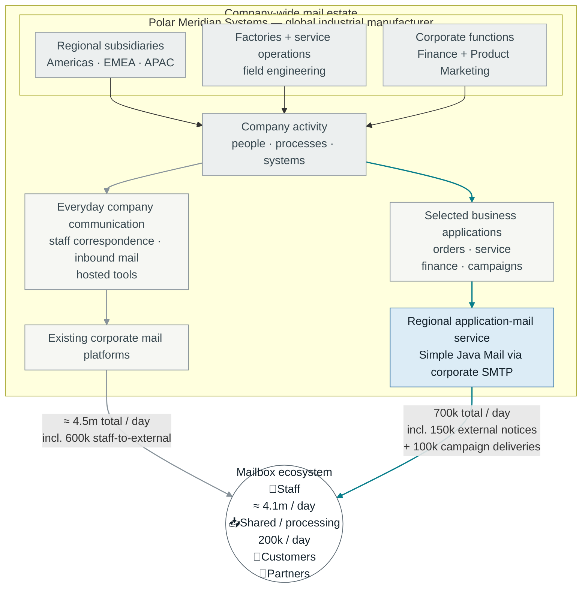
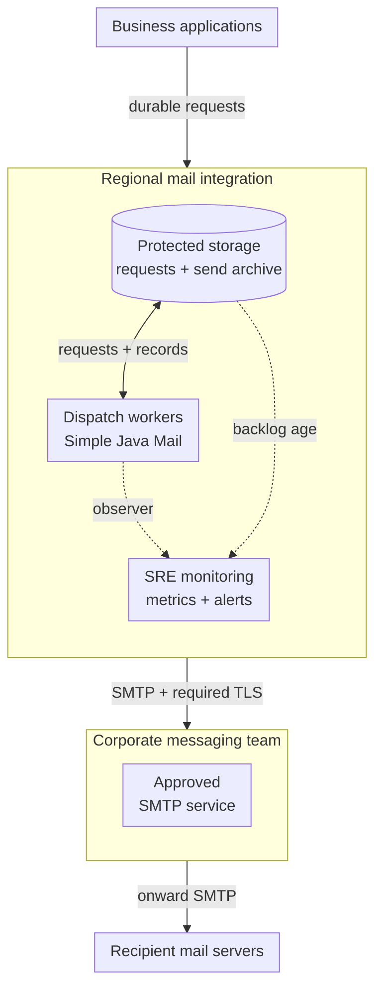
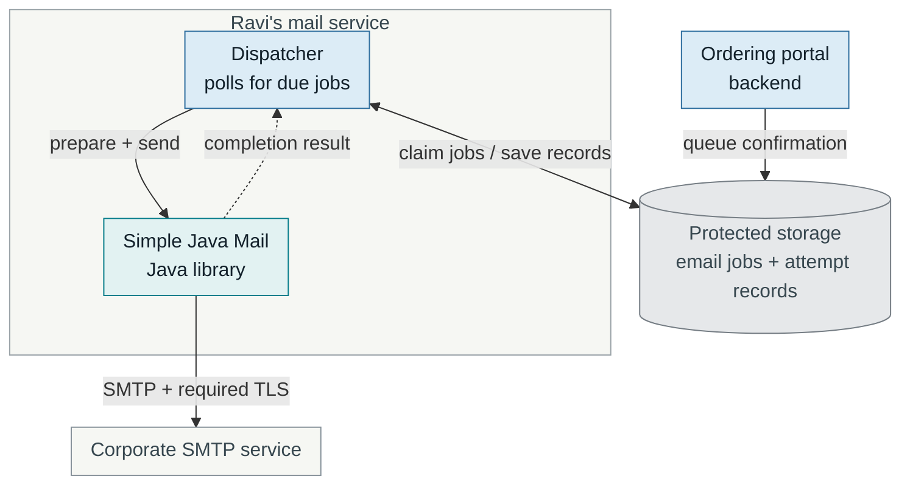
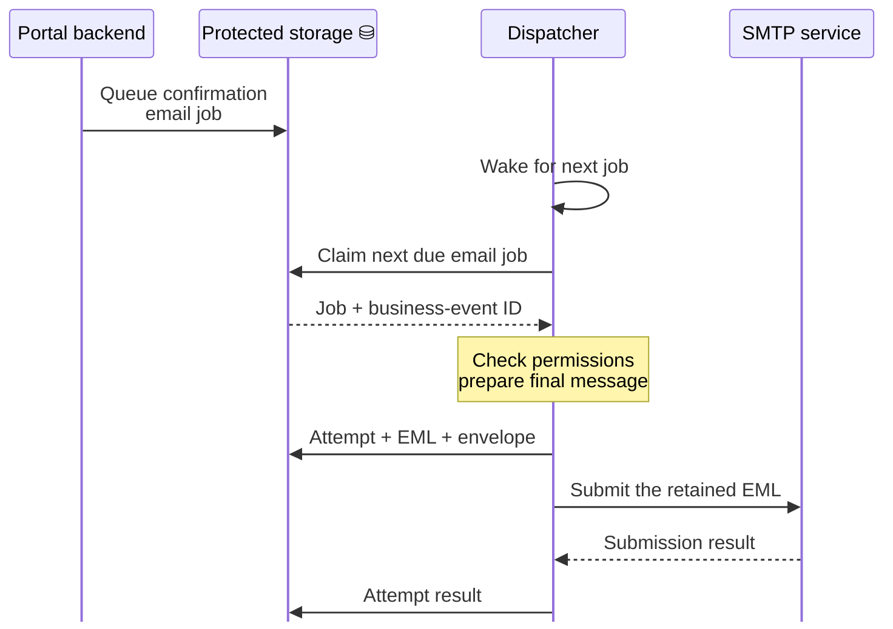
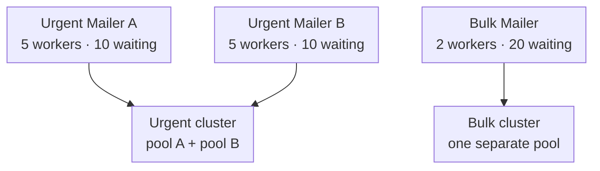
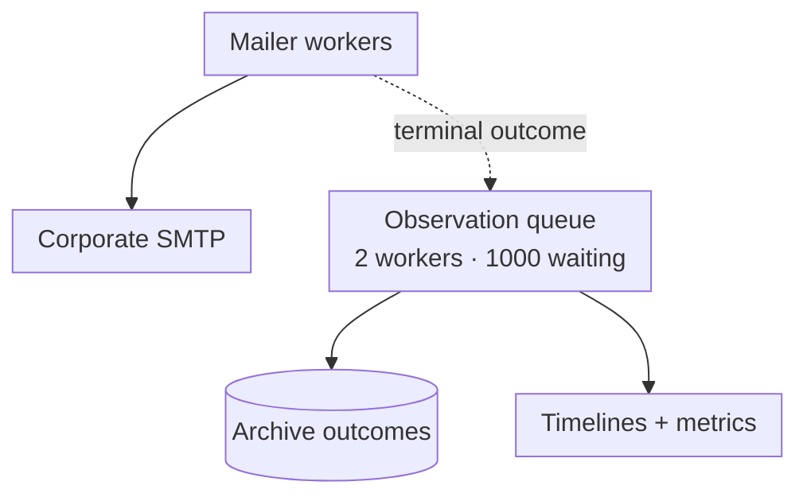
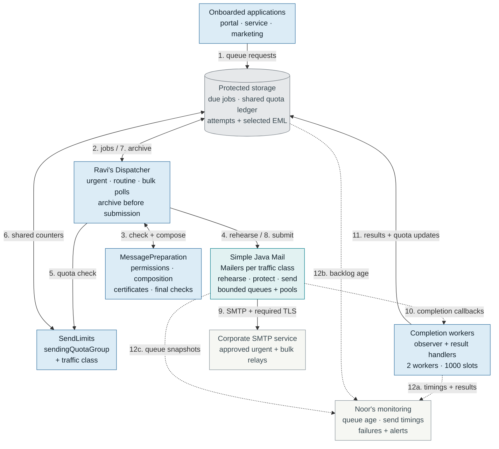

At Polar Meridian Systems, colleagues are emailing across continents, customers are asking about orders and suppliers are chasing payments. Meanwhile, its applications are sending order confirmations, confidential maintenance updates, login codes and a newsletter that Marketing would very much like to send today. Everyone involved thinks their email is as important as the next.

Well, with roughly **5.2 million email deliveries per working day**, they can't all go first.

## Meet the company


Polar Meridian Systems sells and distributes industrial equipment and replacement parts around the world. It runs its own factories and regional distribution centres, with field-service teams that install the equipment and keep it running.

Let's give Polar Meridian 150,000 employees worldwide, with about 100,000 regular users of corporate email. That puts its workforce somewhere between ING's roughly 64,000 employees in 2025 and HCLTech's 223,000 in its 2024–25 annual report. The staff estimate allows roughly forty received emails a day per regular user on average, and much less for infrequent users. Some teams receive far more than others.

Unlike [Staple & Sons](/journal/your-mail-server-works-for-a-troll-farm-now.html), this company has a messaging-platform team, SREs and security engineers. Email has enough volume and enough competing users to warrant proper orchestration. A mistake in one application should not make several continents wait for password resets.

<div class="journal-diagram-wide polar-meridian-estate-map">


```mermaid
%%{init: { "flowchart": { "padding": 8, "nodeSpacing": 24, "rankSpacing": 26 } } }%%
flowchart TB
    accTitle: Polar Meridian's company-wide mail estate
    accDescr: Polar Meridian has about 5.2 million recipient deliveries per working day. Existing corporate platforms carry around 4.5 million, including 600,000 from staff to external contacts. The regional application-mail service uses Simple Java Mail and corporate SMTP for 700,000, including 150,000 external application notifications and a working-day average of 100,000 campaign deliveries. The smaller figures are included in those two totals, not additional traffic. Across both mail streams, staff inboxes receive about 4.1 million deliveries and shared mailboxes and processing addresses receive 200,000. Both mail streams also reach customers and partners. These are rounded planning estimates, not exact reconciled counts.

    subgraph polar["Company-wide mail estate"]
        direction TB
        subgraph company["Polar Meridian Systems — global industrial manufacturer"]
            direction LR
            regions["Regional subsidiaries<br/>Americas · EMEA · APAC"]
            operations["Factories + service operations<br/>field engineering"]
            corporate["Corporate functions<br/>Finance + Product Marketing"]
        end

        activity["<span class='polar-activity-label'>Company activity<br/>people · processes · systems</span>"]

        everyday["<span class='polar-estate-label'>Everyday company communication<br/>staff correspondence · inbound mail<br/>hosted tools</span>"]
        existing["<span class='polar-estate-label'>Existing corporate mail platforms</span>"]

        apps["<span class='polar-estate-label'>Selected business applications<br/>orders · service<br/>finance · campaigns</span>"]
        integration["<span class='polar-estate-label'>Regional application-mail service<br/>Simple Java Mail via corporate SMTP</span>"]
    end

    mailboxes(("Mailbox ecosystem<br/><span class='mailbox-audience'><span class='mailbox-actor'>👥</span><span>Staff<br/>≈ 4.1m / day</span></span><br/><span class='mailbox-audience'><span class='mailbox-actor'>📥</span><span>Shared / processing<br/>200k / day</span></span><br/><span class='mailbox-audience'><span class='mailbox-actor'>👤</span><span>Customers</span></span><br/><span class='mailbox-audience'><span class='mailbox-actor'>👥</span><span>Partners</span></span>"))

    regions --> activity
    operations --> activity
    corporate --> activity
    activity --> everyday
    activity --> apps
    everyday --> existing
    apps --> integration
    existing -->|"≈ 4.5m total / day<br/>incl. 600k staff-to-external"| mailboxes
    integration -->|"700k total / day<br/>incl. 150k external notices<br/>+ 100k campaign deliveries"| mailboxes

    classDef organisational fill:#ECEFEF,stroke:#9AA3A8,color:#37474F
    classDef component fill:#DCECF6,stroke:#2F6F9F,color:#13212B
    classDef existing fill:#F6F7F3,stroke:#87929A,color:#37474F
    classDef person fill:#FFFFFF,stroke:#5B6872,color:#13212B
    class regions,operations,corporate,activity organisational
    class everyday,existing,apps existing
    class integration component
    class mailboxes person
    linkStyle 3,5,7 stroke:#87929A,stroke-width:1.5px
    linkStyle 4,6,8 stroke:#087E8B,stroke-width:1.75px
```

</div>

Our **Java service handles** 600,000 transactional and operational deliveries, plus the campaign averages: **700,000 per working day**, already included in the company total. Employee correspondence, incoming mail and notifications sent directly by hosted tools stay on their existing systems.

There are real examples of this kind of application-mail setup. Retarus describes [BSH bringing about a dozen cloud applications onto one mail platform](https://www.retarus.com/cases/customer-stories/bsh/) and [Solvay sending about 350,000 emails a month from SAP](https://www.retarus.com/cases/customer-stories/solvay/).


*Ravi builds the mail service the application teams will share.*

Ravi is the Java developer building this shared service with Simple Java Mail. He wants application teams to hand over notification requests without each team having to manage SMTP credentials, certificates and send tracking. His workers will construct and send the emails. Let's follow him through the integration, with an order confirmation, a maintenance update and Marketing's newsletter competing for attention.

## The setup

Ravi's Java code runs in the regional dispatch workers, using Simple Java Mail to send through the corporate SMTP service. The messaging-platform team operates the relays:


```mermaid
%% journal: compact
%%{init: { "flowchart": { "padding": 8 } } }%%
flowchart TB
    accTitle: Polar Meridian enterprise mail topology
    accDescr: Business applications submit durable notification requests to a regional integration service. Its Java dispatch workers use Simple Java Mail to submit through the approved corporate SMTP service, operated by the messaging team. Protected storage holds pending requests and archived sends. The completion observer records outcomes and feeds SRE monitoring; monitoring also reads the backlog.

    apps["Business applications"]

    subgraph integration["Regional mail integration"]
        direction TB
        database[("Protected storage<br/>requests + send archive")]
        workers["Dispatch workers<br/>Simple Java Mail"]
        monitoring["SRE monitoring<br/>metrics + alerts"]

        database <-->|requests + records| workers
        workers -.->|observer| monitoring
        database -.->|backlog age| monitoring
    end

    subgraph messaging["Corporate messaging team"]
        smtp["Approved<br/>SMTP service"]
    end

    apps --->|durable requests| integration
    integration -->|SMTP + required TLS| messaging
    messaging -->|onward SMTP| recipients["Recipient mail servers"]
```

The SMTP service is deliberately one box. That might not look like a lot, but our 700,000 daily deliveries *average* only about eight per second. A newsletter queued for 300,000 people at once is another matter of course.

Ravi’s platform team relies on the corporate messaging team for relay redundancy, onward delivery and DKIM signing. Simple Java Mail belongs in the dispatch workers: composing messages, applying the selected protection, reusing connections and reporting what happened during submission.

The work we're designing sits before and around those SMTP connections. Which application gets the next worker? Who may read the maintenance update? How does the person on call find a delayed order confirmation after a worker restarts? **An existing mail server doesn't answer those application questions.**

## Everyone’s email is urgent, but Leonie just wants to log in


*Leonie has an order ready. First, she needs that login code.*

Leonie buys replacement parts for one of Polar Meridian's distributors. She's picked out what she needs, but before she can place the order the ordering portal asks for a code from an email. You know the routine: check the inbox, refresh, check the spam folder. Her order is ready; she's waiting on six digits.

The login code may expire within minutes. Once her order is recorded, its confirmation has more time. Ravi uses that distinction when sorting workloads with the application teams: password resets need prompt attention too, Finance has a statement window, and Marketing can pause its newsletter under pressure. Equipment safety systems do not depend on email arriving before something dangerous happens.

Ravi and the application teams agree on a few traffic classes:

| Workload | What the application needs | What the platform reserves |
| --- | --- | --- |
| 2FA confirmation emails, password resets and time-sensitive service notices | Prompt submission and early warning when it slows | Dedicated admission and execution capacity |
| Orders, invoices and statements | Durable work, traceable outcomes and a completion window | A steady allocation with paced catch-up |
| Product announcements and digests | Send to current subscribers within a flexible delivery window | A capped allocation that can pause |

For urgent mail, they set a service-level objective (SLO): **99.9% submitted within thirty seconds**, measured over a rolling thirty-day window.

- **Start the clock** when an authorized, immediately due request reaches durable storage.
- **Stop it** at confirmed SMTP acceptance, not delivery to a mailbox.
- **Count the misses**, including requests still waiting or without confirmed acceptance at the deadline.

Each class gets separate queues, Mailers and workers. The platform assigns the class from application and template rules; a campaign cannot become urgent just because Marketing's release date moved.

## Leonie places her order and Ravi gets to work

Leonie gets her login code and places the order. The ordering portal's backend saves her order and adds a confirmation request to its outbox in the same transaction. Ravi's dispatcher service receives the business-event ID, template, permitted recipients and region, then chooses the approved sender address and SMTP server. SMTP credentials and signing keys stay with the platform.

The mail service's dispatcher polls for due email jobs:


```mermaid
%%{init: { "flowchart": { "padding": 8, "nodeSpacing": 28, "rankSpacing": 36 } } }%%
flowchart TB
    accTitle: The portal, Dispatcher and Simple Java Mail working together
    accDescr: The ordering portal queues a confirmation in protected storage. Ravi's Dispatcher polls for due jobs and saves the sending attempts and their results. Simple Java Mail runs inside the mail service: it prepares and submits the message through the corporate SMTP service and reports completion to the Dispatcher.

    portal["Ordering portal<br/>backend"]
    storage[("Protected storage<br/>email jobs + attempt records")]
    subgraph service["Ravi's mail service"]
        dispatcher["Dispatcher<br/>polls for due jobs"]
        sjm["Simple Java Mail<br/>Java library"]
        dispatcher -->|prepare + send| sjm
        sjm -.->|completion result| dispatcher
    end
    smtp["Corporate SMTP service"]

    portal -->|queue confirmation| storage
    dispatcher <-->|claim jobs / save records| storage
    sjm -->|SMTP + required TLS| smtp

    classDef application fill:#DCECF6,stroke:#2F6F9F,color:#13212B
    classDef database fill:#E6E8EA,stroke:#757D84,color:#37474F
    classDef library fill:#E2F2F2,stroke:#087E8B,color:#13212B
    classDef infrastructure fill:#F6F7F3,stroke:#87929A,color:#37474F
    class portal,dispatcher application
    class storage database
    class sjm library
    class smtp infrastructure
    style service fill:#F6F7F3,stroke:#9AA3A8,color:#37474F
```

*The Dispatcher manages the job and its records; Simple Java Mail handles message preparation and SMTP submission.*

And in more detail:


```mermaid
%%{init: { "sequence": { "mirrorActors": false, "actorMargin": 24, "width": 120, "height": 40, "messageMargin": 24, "diagramMarginX": 8, "diagramMarginY": 8 }, "themeCSS": "rect.actor[name=store] { fill: #E6E8EA; stroke: #757D84; } .actor-line[name=store] { stroke: #757D84; }" } }%%
sequenceDiagram
    accTitle: An order confirmation and its attempt record
    accDescr: The ordering portal's backend queues an order-confirmation email job from its outbox. The dispatcher claims a due job, checks permissions and prepares its final message. It retains the exact EML and envelope with a new attempt Message-ID before submitting those bytes to SMTP, then records the result.
    participant app as Portal backend
    participant store as Protected storage ⛁
    participant worker as Dispatcher
    participant smtp as SMTP service

    app->>store: Queue confirmation<br/>email job
    worker->>worker: Wake for next job
    worker->>store: Claim next due email job
    store-->>worker: Job + business-event ID
    Note over worker: Check permissions<br/>prepare final message
    worker->>store: Attempt + EML + envelope
    worker->>smtp: Submit the retained EML
    smtp-->>worker: Submission result
    worker->>store: Attempt result
```

*Order-confirmation batch job: claim and send a mail job, and store the result of the attempt.*

The examples combine two kinds of configuration:

- **Ravi's Dispatcher** applies the application's sending permissions, traffic classes, shared sending limits and archive-retention rules.
- **Simple Java Mail** applies the message and Mailer settings supplied through its builders: sender and recipients, signing and encryption, SMTP credentials, TLS, connection pools and local send workers.

Ravi starts with `dispatchPending()`, polled independently for each traffic class. We'll fill in this outline as we go; the early excerpts aren't ready for deployment:

```java
Optional<Job> next = outbox.claimNextDue(workload, clock.instant());
if (next.isEmpty()) {
    return;
}
Job job = next.get();
PreparedMail prepared = prepare(job);
MailSend<MailSubmissionReceipt> send = sendArchived(prepared, job.requestId);
```

*Leonie's confirmation becomes one claimed job, then one sending attempt.*

The application's `outbox` claims a database row atomically, preventing two instances from taking the same job. `prepare()` and `sendArchived()` are Ravi's helpers. First, what is the portal's backend allowed to send, to whom, and with what protection?

## Onboarding starts with security

Before connecting the portal's backend to the shared mail service, its developers go through an onboarding process with Ravi's platform team. Together, they agree on an identity and a short list of sending permissions:

- Allowed sender addresses and domains, plus any recipient restrictions.
- Any required message signing and encryption, including the approved partner identities.
- Whether to retain the message content or only its attempt metadata.
- A traffic class, conservative sending limits and a support contact.

Ravi's application adapter, `MessagePreparation`, rechecks the portal's current sending permissions in `checkPermissions(job)`, before `compose(job)` builds its Email. For Leonie's confirmation, it loads an `OrderConfirmation` from the stored request. `mail` is the configured SJM `SimpleJavaMail` factory, and `mailer` is the SJM Mailer selected for this request.

`sendingQuotaGroup` belongs to the Dispatcher: a name such as `"eu-application-mail"` identifies its [shared database sending limits](#getting-mail-jobs-to-share-not-compete). All Dispatcher instances using that group consult the same counters for each traffic class; the value is never passed to SJM. `Retention.EXACT_EML` is an application setting too, telling Ravi's archive to retain the message content:

```java
// SimpleJavaMail mail = ...

ComposedMail composeOrderConfirmation(
        OrderConfirmation confirmation, Mailer mailer, String sendingQuotaGroup) {

    Email email = mail.emailBuilder().startingBlank()
        .from("Polar Meridian Orders", "orders@polarmeridian.com")
        .withBounceTo("bounces@polarmeridian.com")
        .withRecipients(RecipientBuilder.to(
            confirmation.getCustomerName(), confirmation.getCustomerEmail()))
        .withSubject("Confirmation for order " + confirmation.getOrderNumber())
        .withPlainText(
            "We've received your replacement-parts order "
            + confirmation.getOrderNumber()
            + ". You can view its details in the ordering portal.")
        .buildEmail();

    return new ComposedMail(mailer, sendingQuotaGroup, email, Retention.EXACT_EML);
}
```

*Turn Leonie's stored order request into a confirmation, with its Mailer and content-retention choice.*

The application's `ComposedMail` carries the SJM Email and Mailer alongside the Dispatcher-only limit group and retention choice. Here is how `MessagePreparation.compose(job)` calls that helper for an order-confirmation job. `orderConfirmations` loads saved confirmation requests; `orderConfirmationComposer` contains the helper above. This European deployment selects `orderConfirmationMailer` and the `"eu-application-mail"` limit group:

```java
@Override
public ComposedMail compose(Job job) {
    OrderConfirmation confirmation = orderConfirmations.loadByRequestId(job.requestId);
    return orderConfirmationComposer.composeOrderConfirmation(
        confirmation, orderConfirmationMailer, "eu-application-mail");
}
```

*Look up the claimed confirmation request and pass its data to the composer.*

This implementation handles order-confirmation jobs; the application selects the corresponding composition logic for other notification types. The Dispatcher always calls `preparation.compose(job)`. Back in `prepare(job)`, Ravi gives the returned Email a fresh attempt Message-ID and rehearses the send without contacting SMTP:

```java
preparation.checkPermissions(job);
ComposedMail composed = preparation.compose(job);
Mailer mailer = composed.mailer;

EmailPopulatingBuilder attempt = mail.emailBuilder()
    .copying(composed.email)
    .fixingMessageId("<" + randomUUID() + "@mail.polarmeridian.com>");
if (!composed.email.getOverrideReceivers().isEmpty()) {
    attempt.withOverrideReceivers(composed.email.getOverrideReceivers());
}
Email email = attempt.buildEmail();

MailRehearsal rehearsal = mailer.rehearse(email);
preparation.checkFinalMessage(job, mailer, rehearsal);
List<String> recipients = rehearsal.getEnvelopeRecipients();
long encodedBytes = rehearsal.getEncodedSize();
```

*Check the prepared message, including configured recipients and protection, before it can leave.*

The [rehearsal](/features.html#section-email-validation) applies SJM's defaults, overrides, signing and encryption. Ravi's final check inspects that effective message and its actual envelope; failure holds the job. It does not test credentials or promise delivery.

### The connection and the sending identity

The platform and messaging teams agree on three things before connecting the mail service to an SMTP server:

- **TLS:** require encryption, validate the certificate chain and server name, and install private issuing authorities in the worker's trust store. Test [certificate validation](https://www.rfc-editor.org/rfc/rfc8314.html#section-5.3) when adding a server or changing its connection settings.
- **Credentials:** keep them in deployment secrets and rehearse rotation. These servers use STARTTLS/password; OAuth2 authentication would use `SMTP_OAUTH2` and a thread-safe token provider via `withOAuth2AccessTokenProvider(...)`.
- **Sending domains:** the domain team manages SPF and DMARC; corporate relays add DKIM after their final message changes. Check the resulting signatures and alignment.

[Staple & Sons](/journal/your-mail-server-works-for-a-troll-farm-now.html#spf-dkim-and-dmarc) had to learn those lessons during an incident, but Polar Meridian gets to make them onboarding requirements.

### One protected message, several partners

The maintenance update goes to Leonie's employer and an approved service partner, with revised servicing instructions for the equipment they sell or maintain. Both need the whole message, but their mail providers should not be able to read its body. Ravi uses [S/MIME](/security.html#section-sending-smime) to let each partner decrypt it and verify Polar Meridian's signature, while TLS still protects the connection to the relay.

The application's `partnerDirectory` verifies each partner's address and uses the company's PKI service to check [certificate trust, permitted key use and revocation](https://www.rfc-editor.org/rfc/rfc8550.html#section-4). The helper below then takes the certificate from the returned `PartnerIdentity`, rejects it if missing and checks its validity dates:

```java
Recipient protectedRecipient(String partnerId) throws CertificateException {
    PartnerIdentity partner = partnerDirectory.requireApprovedIdentity(partnerId);
    X509Certificate certificate = partner.getEncryptionCertificate();
    if (certificate == null) {
        throw new IllegalStateException("No encryption certificate for " + partnerId);
    }
    certificate.checkValidity();

    return new RecipientBuilder()
        .withAddress(partner.getEmailAddress())
        .withType(Message.RecipientType.TO)
        .withSmimeCertificate(certificate)
        .build();
}
```

*Before the maintenance update can leave, resolve each approved partner and their encryption certificate.*

For maintenance updates, `preparation.compose(job)` uses the same `mail` factory with `smime-module` installed. `partnerSigningConfig` supplies its signing credentials; `partnerEncryptionConfig` selects the algorithms agreed and tested with the partners:

```java
Email maintenanceUpdate(SmimeSigningConfig partnerSigningConfig,
        SmimeEncryptionConfig partnerEncryptionConfig,
        String approvedMaintenanceUpdateText) throws CertificateException {
    return mail.emailBuilder().startingBlank()
        .from("Polar Meridian Service", "service@polarmeridian.com")
        .withBounceTo("bounces@polarmeridian.com")
        .withRecipients(
            protectedRecipient("distributor"),
            protectedRecipient("service-partner"))
        .withSubject("Confidential maintenance update")
        .withPlainText(approvedMaintenanceUpdateText)
        .signWithSmime(partnerSigningConfig)
        .encryptWithSmime(partnerEncryptionConfig)
        .withTlsRequiredForOnwardDelivery() // reject relays that cannot honor onward TLS
        .buildEmail();
}
```

*Sign once, then let each approved partner decrypt the maintenance update with their own private key.*

Ravi also requires [onward TLS](/security.html#section-requiretls): S/MIME protects the content, while REQUIRETLS tells cooperating relays not to continue over an unencrypted connection. SJM rejects submission if its server cannot support that requirement; it cannot prove every later server complied.

### Keeping the certificates up to date

The partners' encryption certificates and Polar Meridian's signing certificate will need replacing while the service is running:

- **At onboarding**, send a test maintenance update using the service's SMTP configuration and verify decryption and signature checking in each partner's receiving software.
- **Before expiry**, alert the partner integration team and test the newly approved certificates. Include the platform's signing certificate in this process.
- **At each attempt**, resolve current approved certificates for every recipient, including any added by templates or Mailer configuration, since a waiting request may outlive a certificate's approval.

If a check fails, the application holds the maintenance update and records why; encryption stays required. Its retained copy is encrypted separately in the archive. We'll [test that hold with an expired certificate](#a-certificate-expires-instead).

## Getting mail jobs to share, not compete

Ravi has the sending permissions and security requirements sorted out for the order confirmation and maintenance update. But Marketing also has a newsletter for 300,000 people in Europe. For this exercise, the messaging team caps bulk mail at eighty recipient submissions per second. Even at that rate, it takes just over an hour to submit the newsletter. Login codes need to get through while that batch is still running, so Ravi's Dispatcher enforces a separate allocation for each traffic class, agreed with the messaging team.

Some providers also impose a daily ceiling, such as [Amazon SES's rolling twenty-four-hour limit](https://docs.aws.amazon.com/ses/latest/dg/manage-sending-quotas.html). If Polar Meridian's SMTP service does too, Ravi must cap Marketing's total sends as well. Between `prepare()` and `sendArchived()`, his application-level `limits.tryAcquire(...)` checks the `sendingQuotaGroup` selected earlier, together with the job's traffic class:

```java
if (!limits.tryAcquire(prepared.email.getId(), job.requestId,
        prepared.sendingQuotaGroup, // Dispatcher database group, e.g. "eu-application-mail"
        job.workload, prepared.evidence.recipients.size())) {
    outbox.defer(job, clock.instant().plusSeconds(1));
    return;
}
```

*Marketing's next job stays in the database; urgent polling carries on.*

Ravi's [application-side limiter](/assets/journal/examples/polar-meridian/JdbcDispatchLimits.java) uses a shared database. The `sendingQuotaGroup` argument and `workload` select a row in `mail_dispatch_limit`. The limiter locks that row with [`SELECT ... FOR UPDATE`](https://www.postgresql.org/docs/current/explicit-locking.html#LOCKING-ROWS), then checks and charges usage in that transaction:

```java
Limit limit = lockLimit(tx, sendingQuotaGroup, workload);
Instant now = databaseTime(tx);
Usage used = countUsage(tx, sendingQuotaGroup, workload, now);
if (recipientCount > limit.perSecond - used.lastSecond
        || recipientCount > limit.per24Hours - used.retainedDay) {
    tx.rollback();
    return false;
}
insertCharge(tx, attemptId, requestId, sendingQuotaGroup, workload, recipientCount, now);
tx.commit();
```

*Two dispatcher instances cannot both spend the same remaining share.*

The shares must fit the service's agreed allocation, accounting for other senders too. Count every recipient, including CC and BCC. Async queues can still bunch up SMTP attempts, so relays enforce their own limits. The [accounting notes](/assets/journal/examples/polar-meridian/README.md) cover unfinished attempts, rolling windows and database costs.

### Size workers for the busy periods


*Noor checks whether the relays can handle another replica.*

Noor, one of the regional Site Reliability Engineers, reviews the worker and pool limits with Ravi: how many more SMTP connections could another instance of the dispatcher service open, and can the relays handle them? Connection-pool limits apply per instance, so Noor needs to add them up and check whether the existing relays can handle that many connections.

Their load tests include the small order confirmation and the larger, signed and encrypted maintenance update. For an urgent peak in this region, suppose they need 100 submissions per second and a connection is occupied for an average of 0.2 seconds per message:

```text
100 submissions/second × 0.2 seconds = 20 busy connections on average

4 replicas × 10 connections per relay = a ceiling of 40 per relay
8 replicas × 10 connections per relay = a ceiling of 80 per relay
```

*Another replica multiplies the connection allowance, even when its configuration stays the same.*

The first line estimates demand; the others show configured ceilings per relay pool. Worker limits may keep actual use lower, while idle connections still count against server limits. Ravi and Noor agree budgets with the messaging team across all workloads and replicas. Pool settings apply locally, so Ravi's dispatcher service must also enforce the shared rate and deployment limits.

### Leave most of the queue in the database

Each replica has two urgent Mailers, one per approved relay, and a separate bulk Mailer. Order confirmations and maintenance updates have their own allocations; we'll show urgent and bulk here:

```text
Per replica:
  urgent A:  5 workers + 10 waiting slots
  urgent B:  5 workers + 10 waiting slots
  bulk:      2 workers + 20 waiting slots

Four replicas:
  urgent:   40 workers + 80 waiting slots in total
  bulk:      8 workers + 80 waiting slots in total
```

*Bulk mail gets its own waiting space; it cannot fill the urgent Mailers' queues.*

The worker and queue limits need load testing. A [bounded async queue](/sending-and-execution.html#section-async-queue) counts waiting tasks, so the platform also limits request size and concurrent preparation to control memory use.

Unlike [Staple & Sons' single queue](/journal/your-mail-server-works-for-a-troll-farm-now.html#the-dispatcher-in-full), Ravi's separate polls keep urgent work moving when bulk is waiting. His dispatcher's `recordResult()` defers rejected jobs; we'll [fill that in during the relay rehearsal](#noor-takes-a-relay-offline-does-urgent-mail-keep-moving).

## Ravi puts the onboarding agreements into code

The sending permissions and message protection are already handled during preparation. Ravi now puts the agreed TLS checks and send timeouts on reusable Mailers for each region, traffic class and permitted sending identity. The `mail` factory supplies Mailer builders, and Ravi fills in hosts and credentials from deployment configuration and secrets. That leaves application teams to submit notification requests without access to SMTP credentials or arbitrary Session properties.

Each send gets a fifteen-second budget, with at most two seconds spent claiming a connection, but urgent mail's thirty-second target also has to cover its earlier wait in the application queue:

```java
MailerRegularBuilder<?> configuredMailerBuilder(String host, String username, String password) {
    return mail.mailerBuilder()
        .withSMTPServer(host, 587, username, password)
        .withTransportStrategy(TransportStrategy.SMTP_TLS)
        .trustingAllHosts(false)
        .trustingSSLHosts()
        .verifyingServerIdentity(true)
        // keep protocol transcripts and log-only message dumps out of production
        .withDebugLogging(false)
        .withTransportModeLoggingOnly(false)
        // reject messages above ten MiB after MIME encoding
        .withMaximumEmailSize(10 * 1024 * 1024)
        // don't occupy a worker indefinitely while waiting for a connection
        .withConnectionPoolClaimTimeoutMillis(2000)
        // includes preparation and the local queue, not the application's queue
        .withMailSendTimeout(Duration.ofSeconds(15));
}
```

*Every Mailer starts with the same transport checks and finite send budget.*

With the issuing CA installed in the worker's trust store, the explicit trust settings restore the normal certificate and hostname checks and clear configured exceptions. Managed Angus aborts stuck socket I/O when the [send budget expires](/sending-and-execution.html#section-send-deadlines); a timeout still requires checking whether SMTP accepted the message.

Ravi records the [SJM factory configuration and its sources](/configuration.html#section-config-snapshot), with secrets redacted:

```java code-compact
log.info("Mail configuration: {}", mail.getConfig().getDiagnostics());
```

For example, with shared defaults, regional settings and credentials loaded from three named configuration sources:

```text code-small code-compact
09:41:06.218 INFO  Mail configuration: SMTP connection:
	  simplejavamail.smtp.password = <redacted> (source: secret store)
	  simplejavamail.smtp.port = 587 (source: platform defaults)
	  simplejavamail.smtp.username = mail-service-eu (source: regional deployment)
	  simplejavamail.transportstrategy = SMTP_TLS (source: platform defaults)
	Transport security:
	  simplejavamail.defaults.trustallhosts = false (source: platform defaults)
	  simplejavamail.defaults.verifyserveridentity = true (source: platform defaults)
	Execution and pooling:
	  simplejavamail.defaults.connectionpool.claimtimeout.millis = 2000 (source: platform defaults)
	  simplejavamail.defaults.mailsend.timeout = PT15S (source: regional deployment)
```

*Check which configuration reached the deployment without printing its passwords.*

These are SJM properties loaded into the factory snapshot, not the Dispatcher's quota or retention rules, the later builder settings above, or live connections. The team checks each Mailer's settings too; a new snapshot means replacement Mailers and draining the old ones.

The platform checks permissions and constructs the `Email` itself. [Defaults and overrides](/configuration.html#section-combine-config) help assemble it, but an Email can suppress overrides, so they cannot enforce those permissions by themselves.

Before using these Mailers with real messages, Ravi also checks the logging configuration. Leonie's login code and the contents of a maintenance update don't belong in a general log search. He adds these entries inside the service's existing `logback.xml` configuration:

```xml
<logger name="org.simplejavamail" level="INFO" />
<logger name="org.simplejavamail.javamail.debug" level="OFF" />
```

*Leonie's login code belongs in her email, not in Noor's log search.*

The Logback settings suppress SJM's TRACE-level message dumps, while the builder keeps [Jakarta Mail debugging](/debugging.html#section-debug-logging) and log-only transport off. Angus's separate JUL protocol tracing stays disabled too. These aren't redaction rules: Ravi's application logs selected IDs, timings and results rather than whole `Email` or `MimeMessage` objects.

We'll add [workload limits](#pools-that-are-allowed-to-share-work) and [the completion observer](#when-the-archive-is-slower-than-smtp) before calling `buildMailer()`.

## Pools that are allowed to share work

If the messaging team provides one highly available hostname, Ravi uses it. Here, the European Mailers will use two approved, interchangeable urgent-mail endpoints and a separate bulk endpoint:


```mermaid
%%{init: { "flowchart": { "padding": 8 } } }%%
flowchart TB
    accTitle: Separate worker queues, shared urgent relay pools
    accDescr: Within one process, urgent Mailers A and B each have their own five workers and ten waiting slots. Both may borrow from either of two urgent connection pools in a shared cluster. A separate bulk Mailer has two workers and twenty waiting slots and uses only its bulk pool.
    urgentA["Urgent Mailer A<br/>5 workers · 10 waiting"] --> urgentPools["Urgent cluster<br/>pool A + pool B"]
    urgentB["Urgent Mailer B<br/>5 workers · 10 waiting"] --> urgentPools
    bulk["Bulk Mailer<br/>2 workers · 20 waiting"] --> bulkPool["Bulk cluster<br/>one separate pool"]
```

*The urgent Mailers share access to relay connections; each keeps its own worker queue.*

Dispatchers divide urgent requests between the two Mailers, which share a [cluster key](/sending-and-execution.html#section-clustering). That lets either borrow a connection from either registered urgent pool.

Both endpoints must be approved for the same senders and content, with matching transport requirements, so different regional requirements need separate clusters. [RelayDesk](/journal/everybody-brought-their-own-mail-server.html) takes that further: two customers' servers are not interchangeable simply because both speak SMTP.

The three builders below come from `configuredMailerBuilder()` with their approved hosts and credentials. The deployment includes `batch-module` for worker pools and connection pooling:

```java
UUID urgentCluster = randomUUID();

for (MailerRegularBuilder<?> builder : List.of(urgentABuilder, urgentBBuilder)) {
    builder
        .withClusterKey(urgentCluster)
        .withThreadPoolSize(5)
        .withAsyncQueueCapacity(10)
        .withAsyncQueueOverflowPolicy(AsyncQueueOverflowPolicy.REJECT)
        // keep one connection ready per relay pool
        .withConnectionPoolCoreSize(1)
        // per relay pool, in this process
        .withConnectionPoolMaxSize(10)
        .withConnectionPoolLoadBalancingStrategy(LoadBalancingStrategy.ROUND_ROBIN);
}

bulkBuilder
    .withClusterKey(randomUUID())
    .withThreadPoolSize(2)
    .withAsyncQueueCapacity(20)
    .withAsyncQueueOverflowPolicy(AsyncQueueOverflowPolicy.REJECT)
    // no connection needs to remain open between bulk runs
    .withConnectionPoolCoreSize(0)
    .withConnectionPoolMaxSize(2);
```

*Urgent sends can use either approved relay; bulk work cannot borrow their connections.*

The first pool registration sets the cluster's pool policy, so both urgent builders use the same settings. Clusters are local to one process; reusing their UUID elsewhere shares no sockets or quotas. The dispatcher's database-backed limits still apply across instances, while the messaging team checks the combined demands on its servers.

Discarding a broken connection leaves its pool registered, so round-robin selection continues to choose it even when the endpoint has failed. We'll [rehearse taking a failed endpoint out of service](#noor-takes-a-relay-offline-does-urgent-mail-keep-moving) later.

## What happened to Leonie’s confirmation? Tracing the evidence.

Leonie has an order number; Support should be able to use it to find her confirmation. Six months later, a distributor might also ask which maintenance instructions it was sent. Regenerating an email with today's template won't answer that question.

Ravi retains finalized EML for order confirmations and maintenance updates, with the envelope and business-event ID. Login codes, newsletters and other streams get attempt metadata only. The approved message rules select retention, independently of urgency.

In `prepare()`, Ravi's `AttemptEvidence` keeps the rehearsal metadata and, when required, the message bytes. `PreparedMail` brings that evidence and the Email back to the dispatcher:

```java
AttemptEvidence evidence = new AttemptEvidence(rehearsal, composed.retention);
Email submission = composed.retention == Retention.EXACT_EML
    ? exactSubmission(evidence) : email;
return new PreparedMail(mailer, composed.sendingQuotaGroup, submission, evidence);
```

*Keep Leonie's confirmation for later reference; retain only attempt metadata for her login code.*

For retained mail, finalization adds SMTP's terminating line break when needed and rejects malformed line endings. `exactSubmission(evidence)` rejects outbound Bcc headers before using SJM's [exact-EML builder](/features.html#section-exact-eml):

```java
ExactEmailBuilder exact = mail.emailBuilder()
    .startingFromExactEml(evidence.getEmlBytes().orElseThrow())
    .withEnvelopeRecipients(evidence.recipients.toArray(new Recipient[0]))
    .withEnvelopeSender(evidence.envelopeSender);
if (evidence.dsn != null) {
    exact.withDeliveryStatusNotification(evidence.dsn);
}
if (evidence.requireTls) {
    exact.withTlsRequiredForOnwardDelivery();
}
return exact.buildEmail();
```

*Keep the protected bytes unchanged, with the same recipients and transport requirements.*

The exact path won't apply defaults or sign again. Inside `sendArchived()`, the application's repository commits the attempt, encrypting retained EML at rest, before handing the prepared email to SJM:

```java
MailSend<MailSubmissionReceipt> sendArchived(
        PreparedMail prepared, String requestId) {
    archive.insertAttempt(prepared.email.getId(), requestId, prepared.evidence);
    return prepared.mailer.async().sendMail(prepared.email);
}
```

*Retain Leonie's confirmation before submitting those same bytes.*

A failed insert stops the send. These records complement corporate journaling: they preserve what the application submitted, not proof of receipt or legal compliance. Support gets scoped content access; Noor works with timings. Retention, auditing and continued access to decryption keys matter if the protected update must remain readable years later.

### Record the send result

Ravi attaches a [completion observer](/sending-and-execution.html#section-mail-send-observer) to record how each attempt ended, including failures. He keeps the calls to the application's `stageLog` and `monitoring` adapters separate, so an archive failure still allows telemetry:

```java
MailSendObserver observationSink = outcome -> {
    String attemptMessageId = outcome.getInitialMessageId();

    try {
        archive.recordOutcome(attemptMessageId, outcome);
    } catch (RuntimeException failure) {
        archiveWriteFailures.incrementAndGet();
        log.error("Could not archive outcome for {}", attemptMessageId, failure);
    }

    try {
        stageLog.record(attemptMessageId, "REQUESTED", outcome.getRequestedAt());
        outcome.getReadyAt().ifPresent(at ->
            stageLog.record(attemptMessageId, "READY", at));
        outcome.getStartedAt().ifPresent(at ->
            stageLog.record(attemptMessageId, "STARTED", at));
        stageLog.record(attemptMessageId, "COMPLETED", outcome.getCompletedAt());
        monitoring.recordAttempt(outcome);
    } catch (RuntimeException failure) {
        telemetryWriteFailures.incrementAndGet();
        log.error("Could not record timeline for {}", attemptMessageId, failure);
    }
};
```

*Record how the attempt ended, even when it never reached an SMTP server.*

The failure counters are application `AtomicLong`s exported to monitoring. Callbacks can run concurrently, so the adapters are thread-safe and archive writes are idempotent by Message-ID.

The stage labels are written at completion from the recorded timestamps, with missing stages left absent: preparation or scheduling may have failed before execution started.

Support can now find the attempts for Leonie's order and check what happened at the relay. The archive keeps `isSuccessful()`, `isLoggingOnly()` and the optional [submission receipt](/analyzing-send-results.html#section-observer-results) separately. The receipt distinguishes accepted, partially accepted, rejected and unknown submissions; an early failure may have none. It still doesn't prove that the email reached Leonie's inbox.

## When the archive is slower than SMTP

Noor wants to know whether a slow archive write could hold up a login code. With an inline completion observer, it could. Ravi gives observations two workers and a bounded queue, with an application `AtomicLong` counting rejected handoffs:

```java
ThreadPoolExecutor observationWorkers = new ThreadPoolExecutor(
    2, 2, 0L, TimeUnit.MILLISECONDS,
    new ArrayBlockingQueue<>(1000),
    Executors.defaultThreadFactory(),
    (task, executor) -> {
        rejectedObservations.incrementAndGet();
        throw new RejectedExecutionException("Mail observation queue is full or stopped");
    });
```

*Give archive writes their own workers and a bounded queue.*

Caller-runs would put slow writes back on sending threads; silent discard would hide missing observations. Ravi passes these workers to the dispatcher as `completionWorkers`, keeping its result writes off sending threads too.

The attempt insert still precedes submission. Simple Java Mail's `sendMail()` returns the `MailSend<MailSubmissionReceipt>` whose result Ravi handles on those workers:

```java
archive.insertAttempt(prepared.email.getId(), job.requestId, prepared.evidence);
MailSend<MailSubmissionReceipt> send = prepared.mailer.async().sendMail(prepared.email);

send.getCompletion()
    .handleAsync((receipt, failure) -> {
        recordResult(job, prepared.email.getId(), receipt, unwrap(failure));
        return null;
    }, completionWorkers)
    .exceptionally(failure -> {
        reportFailure.accept(unwrap(failure));
        return null;
    });
```

*Sending can finish while its archive and request-result writes wait for a worker.*

A rejected callback or failed write leaves the request unresolved for investigation. Ravi and Noor tune this shared executor against archive and request-update lag.

With `observationSink` handling the archive and telemetry, Ravi can finish building the urgent and bulk Mailers:

```java
List<Mailer> mailers = new ArrayList<>();
for (MailerRegularBuilder<?> builder :
        List.of(urgentABuilder, urgentBBuilder, bulkBuilder)) {
    mailers.add(builder
        .withMailSendObserver(observationSink, observationWorkers)
        .buildMailer());
}
```

*Connect every Mailer to the archive before the dispatchers start using it.*

Simple Java Mail offers the completion notification to the observation executor before completing the send, without waiting for the callback. Rejections are logged without retry or inline fallback; callback exceptions leave the send result unchanged:


```mermaid
%%{init: { "flowchart": { "padding": 8 } } }%%
flowchart TB
    accTitle: SMTP sending and archive work have separate capacity
    accDescr: An attempt record exists before submission. Send workers submit to SMTP and hand terminal outcomes to a bounded observation executor. Observation workers write the outcome to the archive and the timeline to monitoring. Send completion does not wait for those writes.
    send["Mailer workers"] --> smtp["Corporate SMTP"]
    send -.->|terminal outcome| observations["Observation queue<br/>2 workers · 1000 waiting"]
    observations --> archive[("Archive outcomes")]
    observations --> metrics["Timelines + metrics"]
```

*SMTP can finish before the archive has recorded the result.*

If SMTP accepts Leonie's confirmation just before the process dies or the observation queue fills, its archive record may still lack a result. Another send could give her a second confirmation. If the outcome survived, recovery can repeat the archive write; otherwise Noor checks the request and relay logs. If acceptance remains uncertain, the request stays held for review. Monitoring watches for these missing results.

## Noor monitors for performance degradation

The archive helps when Leonie asks about a missing confirmation, but Noor wants warning before it gets that far. She combines the recorded send timestamps with the application's earlier queue wait:

| Interval | What it measures |
| --- | --- |
| `requestedAt` to `readyAt` | Library preparation |
| `readyAt` to `startedAt` | Waiting for execution, including any admission wait |
| `startedAt` to `completedAt` | Execution, including connection acquisition, submission and cleanup |
| Durable application acceptance to confirmed SMTP acceptance | The service target, including the wait before calling Simple Java Mail |

The charts use intervals only when both timestamps exist, and flag clock anomalies. Rehearsal and the initial archive write happen before SJM's send timestamps; the end-to-end service target includes them. Execution includes more than network latency.

### The sends that have not finished yet

A login code stuck in the queue has no completion to plot. To see those sends too, Noor's dashboard reads the database queue, including maintenance updates held for certificate problems, and polls the Mailers' [queue snapshots](/debugging.html#section-async-queue). This diagnostic sample uses an application-supplied `workload` label:

```java
mailer.getAsyncQueueSnapshot().ifPresent(queue ->
    log.info("workload={} active={}/{} queued={} observerQueued={} observerRejected={}",
        workload, queue.getActiveCount(), queue.getWorkerLimit(),
        queue.getQueuedCount(), observationWorkers.getQueue().size(),
        rejectedObservations.get()));
```

*Look at unfinished work as well as the attempts that managed to complete.*

Snapshots are estimates, unsuitable for deciding whether a send will be admitted. When exporting metrics, count the shared observation queue once per process.

Urgent mail keeps its original thirty-second deadline even when retried; any request without confirmed acceptance when it expires counts as a miss, including failed and unfinished work. This sample alert combines the two urgent Mailers in one replica:

```text
WARN MailServicePressure region=EU replica=eu-worker-2 workload=urgent
    oldest_due_request=24s       submission_target=30s
    active_sends=10              worker_limit=10
    queued_sends=20              queue_capacity=20
    completed_attempts_last_30s=0
    action=check_dispatch_and_approved_relays
```

*Noor sees the login queue ageing even though no attempts have finished.*

### A page should come with something to do

Ravi has the application's monitoring adapters emit selected timings, results and queue measurements as structured JSON, using [Elastic's Logback encoder](https://www.elastic.co/docs/reference/ecs/logging/java/setup). Their log collector ships these records to Elasticsearch. In Kibana, Noor can put execution-time percentiles next to SMTP submission results and add a [threshold rule](https://www.elastic.co/docs/solutions/observability/incident-management/create-custom-threshold-rule) for the age of the oldest urgent request.

The dashboard groups charts by region, workload and application, while recipient addresses, request IDs and detailed exceptions stay in restricted investigation records, out of metric labels.

[](</assets/journal/Polar Meridian - Noor%27s Kibana Dashboard.png>)

*Marketing fills the bulk queue, but Leonie's login code doesn't have to wait behind it. An illustrative Kibana dashboard with synthetic data; click to enlarge.*

When Noor gets paged, she wants a reason to interrupt what she's doing and a useful place to start. She follows [Google's SRE distinction between symptoms and causes](https://sre.google/sre-book/monitoring-distributed-systems/#symptoms-versus-causes-g0sEi4) by treating a full pool as a clue to the delay, and urgent requests running out of time as a reason to act:

| What the operator sees | First response |
| --- | --- |
| Urgent requests approaching the deadline | Check admission, worker saturation and approved relay health |
| Rising observation queue or missing archive outcomes | Check persistence, reduce bulk admission and investigate rejected handoffs |
| SMTP certificate or authentication failures | Pause sends through the affected Mailers and inspect their credentials or trust configuration |
| A partner certificate nearing expiry, or a maintenance update held by its certificate checks | Contact the partner integration team; renew and test the affected certificate |
| A slow newsletter within its agreed window | Keep watching; no urgent page just because it is slower |

The SREs test alert thresholds under load and run synthetic checks during quiet periods. They receive pages through an independent incident channel. The [timing logs that helped Staple & Sons investigate](/journal/your-mail-server-works-for-a-troll-farm-now.html#where-the-time-goes) now contribute to alerts with request ages, queue pressure and a first response already agreed.

## Noor takes a relay offline. Does urgent mail keep moving?

Before taking the service on call, Noor rehearses a relay failure with Ravi and the messaging team. They replay Leonie's order-confirmation flow with test recipients while taking SMTP relay A offline. That relay also handles order confirmations, so the test request stays queued with its original ID and age. The platform pauses bulk mail while checking surviving capacity; 2FA test emails can use relay B within its agreed allowance.

Ravi stops admission to the affected urgent Mailers and replaces them with a new cluster containing only relay B. Already-admitted sends are drained and checked before considering retries. A deployment using one highly available SMTP hostname would leave that failover to the messaging team.

In `recordResult()`, Ravi distinguishes a local queue rejection from an attempt that may have reached SMTP:

```java
if (failure instanceof MailSendRejectedException
        && ((MailSendRejectedException) failure).getReason() == QUEUE_FULL) {
    limits.releaseUnsent(attemptId);
    outbox.defer(job, clock.instant().plusSeconds(5));
} else if (failure == null && receipt != null && receipt.getStatus() == ACCEPTED) {
    limits.complete(attemptId);
    outbox.markSubmitted(job, receipt);
} else {
    outbox.holdForReview(job, failure != null ? failure :
        new IllegalStateException("Submission needs review: " +
            (receipt == null ? "no receipt" : receipt.getStatus())));
}
```

*Only a queue rejection automatically returns the attempted job for another send.*

`QUEUE_FULL` refunds its unused quota. Accepted sends count for twenty-four hours after completion; uncertain attempts stay charged pending investigation. Partial or [unknown acceptance](/analyzing-send-results.html#section-unknown-acceptance) needs receipt evidence before risking a duplicate.

Once relay A is available again, the test confirmation gets a new attempt against the same request. Noor checks the alert timing and traces the attempt from its earlier wait through to the relay's acceptance, while Ravi verifies that already-accepted sends weren't retried.

### A certificate expires instead

When Ravi supplies an expired partner encryption certificate for a test maintenance update, the partner directory blocks the send before an attempt is created, while order confirmations continue. Noor sees the hold reason in the application's request monitor:

```text
WARN ProtectedMailHeld region=EU application=service-platform
    reason=recipient_certificate_expired
    held_requests=1              oldest_held_request=3m
    smtp_attempt_started=false
    action=renew_partner_certificate_and_repeat_decryption_test
```

*The maintenance update waits for a usable certificate; unrelated mail keeps moving.*

After approving and testing a replacement certificate, the partner integration team releases the request. The rehearsal checks that no SMTP call occurred while it was held, and that the released maintenance update arrives signed and encrypted.

### Stop the sends before stopping their observers

In the last rehearsal, Ravi stops the dispatcher with a maintenance update's result still waiting to be archived. Its `stopAndAwait()` stops the polling tasks and waits until none can make another send call. He then closes the Mailers before draining the workers that persist observations and update requests:

```java
dispatcher.stopAndAwait();

for (Mailer mailer : mailers) {
    mailer.close();
}

observationWorkers.shutdown();
if (!observationWorkers.awaitTermination(30, TimeUnit.SECONDS)) {
    throw new IllegalStateException("Mail observations are still draining");
}
```

*Finish admitted sends before draining the callbacks that record their outcomes.*

Because [closing a Mailer](/sending-and-execution.html#section-mailer-lifecycle) leaves the supplied observation executor open, Ravi waits for that executor to let queued callbacks finish. A failed drain or archive write still needs investigation. If persistence is delegated to another service, its acknowledgement and shutdown belong in this process too.

## Bringing it all together

Here's the Dispatcher we've assembled along the way, with the application code in blue and Simple Java Mail in teal:

<div class="journal-diagram-wide">


```mermaid
%%{init: { "flowchart": { "padding": 8, "nodeSpacing": 20, "rankSpacing": 32, "wrappingWidth": 180 } } }%%
flowchart TB
    accTitle: The completed Polar Meridian mail service
    accDescr: Onboarded applications queue requests in protected storage. Ravi's Dispatcher polls separately for urgent, routine and bulk jobs, uses application adapters to check permissions, compose messages and enforce shared sending limits, and archives each attempt before SMTP submission. Simple Java Mail rehearses and protects the message, then sends through bounded workers and relay pools. A separate bounded executor handles completion observations and request results, updating storage and feeding Noor's monitoring alongside queue measurements.

    apps["Onboarded applications<br/>portal · service · marketing"]
    storage[("Protected storage<br/>due jobs · shared quota ledger<br/>attempts + selected EML")]
    dispatcher["Ravi's Dispatcher<br/>urgent · routine · bulk polls<br/>archive before submission"]
    preparation["MessagePreparation<br/>permissions · composition<br/>certificates · final checks"]
    limits["SendLimits<br/>sendingQuotaGroup<br/>+ traffic class"]
    sjm["Simple Java Mail<br/>Mailers per traffic class<br/>rehearse · protect · send<br/>bounded queues + pools"]
    results["Completion workers<br/>observer + result handlers<br/>2 workers · 1000 slots"]
    smtp["Corporate SMTP service<br/>approved urgent + bulk relays"]
    monitoring["Noor's monitoring<br/>queue age · send timings<br/>failures + alerts"]

    apps -->|1. queue requests| storage
    storage <-->|2. jobs / 7. archive| dispatcher
    dispatcher <-->|3. check + compose| preparation
    preparation ~~~ limits
    dispatcher -->|5. quota check| limits
    dispatcher -->|4. rehearse / 8. submit| sjm
    sjm -.->|10. completion callbacks| results
    limits <-->|6. shared counters| storage
    results -->|11. results + quota updates| storage
    results -.->|12a. timings + results| monitoring
    storage -.->|12b. backlog age| monitoring
    sjm -.->|12c. queue snapshots| monitoring
    sjm -->|9. SMTP + required TLS| smtp

    classDef application fill:#DCECF6,stroke:#2F6F9F,color:#13212B
    classDef database fill:#E6E8EA,stroke:#757D84,color:#37474F
    classDef library fill:#E2F2F2,stroke:#087E8B,color:#13212B
    classDef infrastructure fill:#F6F7F3,stroke:#87929A,color:#37474F
    class apps,dispatcher,preparation,limits,results application
    class storage database
    class sjm library
    class smtp,monitoring infrastructure
```

*Prepare, preserve, submit, investigate: retain EML for confirmations and maintenance updates, metadata for every attempt, and give Noor the timings and queue measurements.*

</div>

Expand the complete Dispatcher below, or [download the Java file](/assets/journal/examples/polar-meridian/PolarMeridianDispatcher.java). The [adapter contracts and database code](/assets/journal/examples/polar-meridian/README.md) explain how to connect it to your application.

{{> components/journal-code-disclosure (journalCodeExample "polar-meridian/PolarMeridianDispatcher.java") title="Dispatcher"}}

## Bringing the applications along

So, let's review. With Simple Java Mail providing the [sending](/sending-and-execution.html#section-send-execution), [signing](/security.html#section-sending-smime), [encryption](/security.html#section-sending-smime) and [send-result APIs](/analyzing-send-results.html#section-get-receipt), Ravi has built a shared mail service that keeps urgent messages moving, protects confidential content and gives Noor [queue diagnostics](/debugging.html#section-async-queue) and [send timings](/sending-and-execution.html#section-mail-send-observer) to spot delays and investigate failed sends. To connect another application, its developers go through onboarding with Ravi's team, agreeing on sending permissions, capacity and support contacts before [testing the integration in staging](/debugging.html#section-override-receivers).

On her next visit, Leonie gets her login code and order confirmation while Marketing's newsletter is still running.

With a flexible setup built to grow and a structured onboarding process, Ravi and Noor are ready for the next mail-sending challenge. They won't let another Leonie stare at an empty inbox again.


*The mail is flowing. The branding department got a little carried away.*

*Next is [RelayDesk](/journal/everybody-brought-their-own-mail-server.html), where the customers bring their own mail services and there is no single messaging team to agree all this with.*
