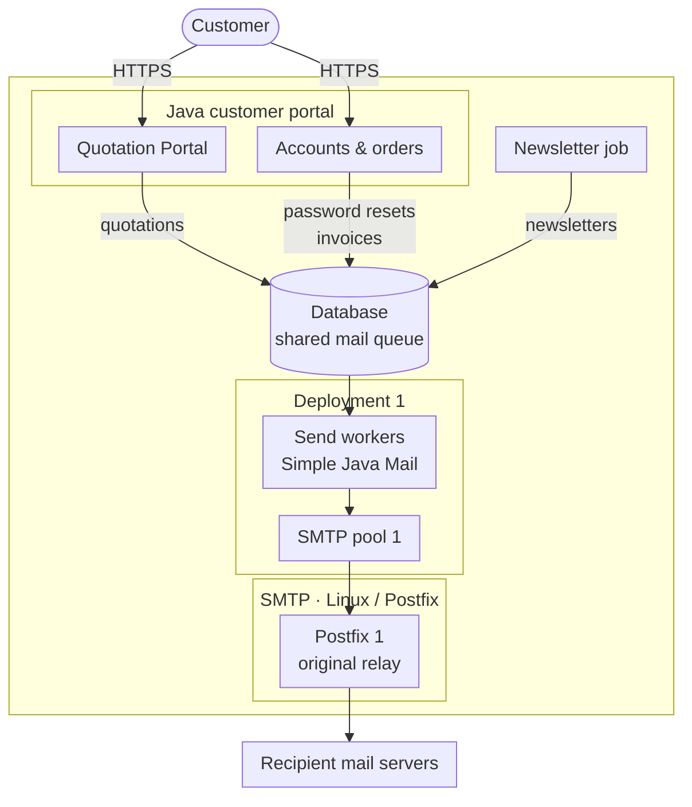
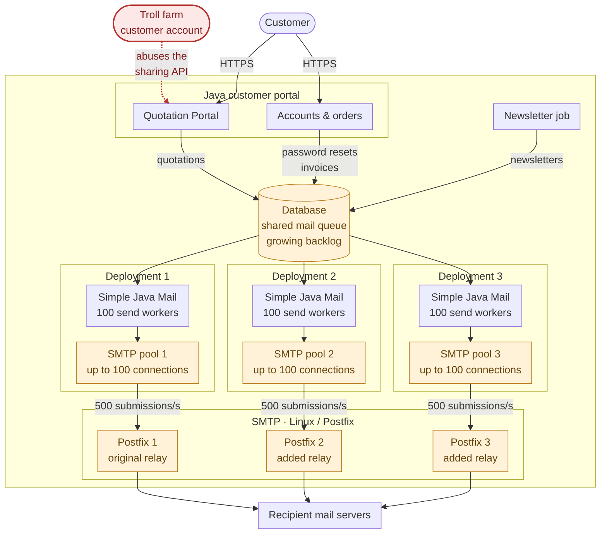
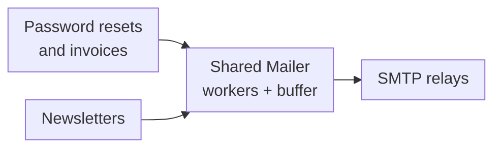
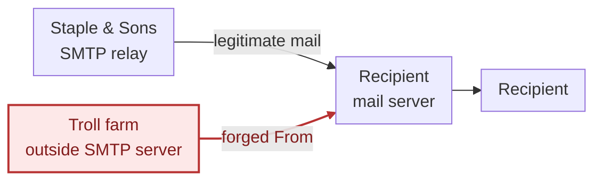
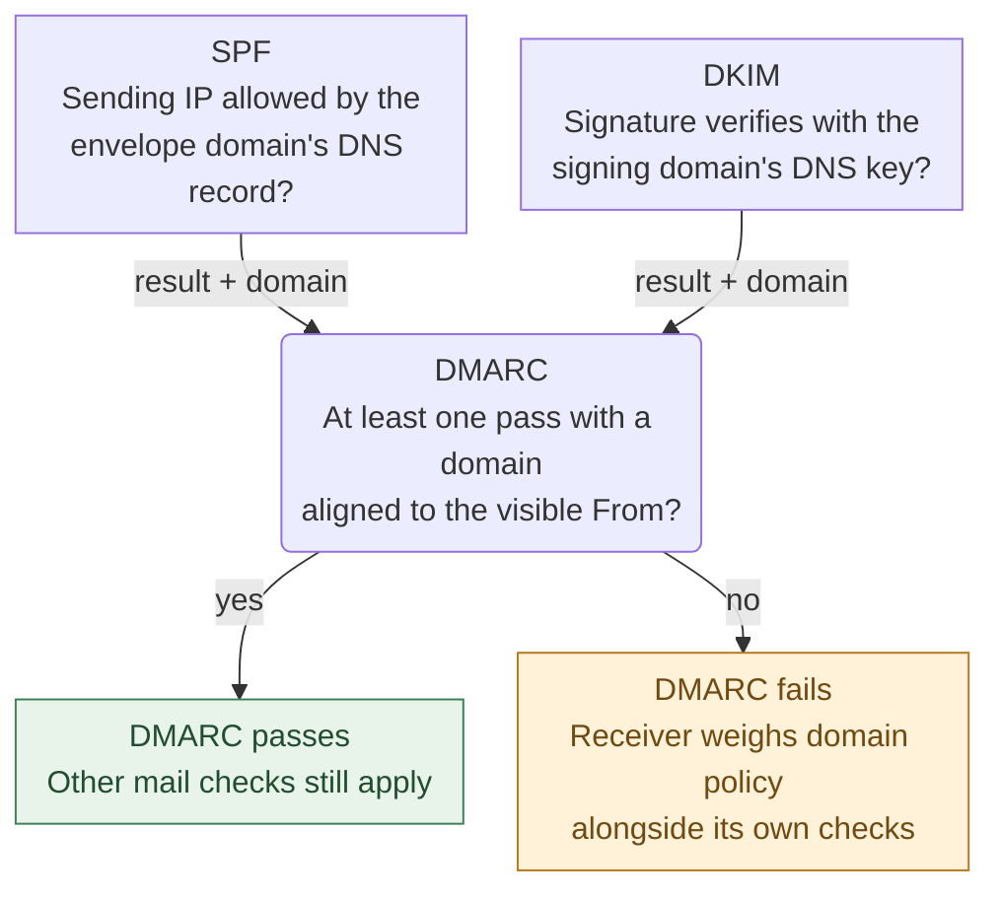
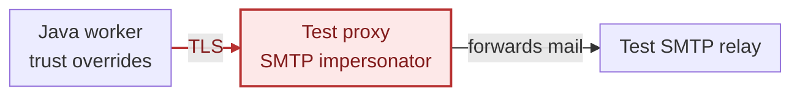
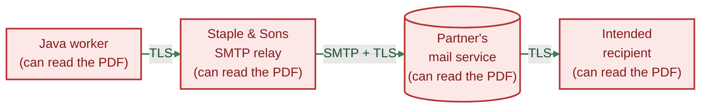

Staple & Sons sells things that hold other things together. Shelving, packaging, office furniture. There's nothing really special about Staple & Sons, it's all a little boring, really. Little did they know, their business was going to get a little bit less boring very soon.

There is a warehouse, a sales team and a customer portal. Two developers maintain the portal along with stock integration, a reporting application and several things that were supposed to be temporary. Email is only a small part of their week. This is a perfectly reasonable arrangement for a company whose principal expertise is shelving.

## The setup

Staple & Sons runs its own Linux/Postfix relay. Let's give it about 2,000 outgoing messages on an ordinary working day, with a 20,000-message newsletter now and then. Their mail takes this route:



A customer creates a quotation in the portal. The application saves it, puts a notification in its database queue, and a background worker sends the email through a reusable Mailer. Password resets, invoices and newsletters travel through much the same setup. A few regular customers also exchange pricing agreements through the portal.

Some time ago, a customer asked whether they could email a quotation to a colleague. Sales liked the idea. The developers added a recipient field and a personal note. It saved everyone forwarding PDFs around. Later, someone asked for several recipients and a more flexible note. Customers must sign in and can only share quotations from their own account.


## Apparently, we need more servers

It's a Tuesday and the first complaints start coming in. The first one is about invoices arriving late. Then password resets. The database queue is growing, and the developers can see that the sending workers are busy. Not to worry, they just increase the worker count. It's a good sign right, the company is growing!


That helps briefly. They increase the connection-pool limits too, so workers can handle more load at the same time. When the relay struggles, the hosting provider supplies another one, and a new deployment is wired up with its own sending configuration; they're running a cluster now. Before long, the small company has several SMTP pools and enough infrastructure to look impressive in a diagram.

Let's put numbers on that expansion. For this fictional peak, give each of three deployments 100 send workers and room for 100 SMTP connections. Assume each small, individually addressed message occupies a worker for an average of 200 milliseconds per successful submission, with all 300 workers kept busy:

```text
3 deployments × 100 concurrent sends ÷ 0.2 seconds = 1,500 submissions/second
1,500 submissions/second × (30 × 60 seconds)       = 2,700,000 messages
```

*From 2,000 messages a day to 2.7 million submitted in half an hour, under these assumptions.*

That's an illustrative workload and an educated guesstimate: the application, network and relays must sustain it, of course, but it's entirely plausible. [Parallel sends and reused SMTP connections](/smtp-connection-pooling.html#option-mailer) let workers keep submitting without waiting for every other send or reconnecting each time. We're counting messages accepted by their relays, not retries or confirmed arrivals in recipients' inboxes; [Postfix still has to queue and deliver them onward](https://www.postfix.org/QSHAPE_README.html).

Some time later, some operations time out again under the load. An existing retry job puts failed work back in the queue, where it competes with the original work and the whole thing starts to choke. Apparently, adding capacity hasn't stopped the backlog from growing. At this point, they're starting to wonder where the growth is coming from and they have a call with business. Well, business doesn't have a clue. What is happening at Staple & Sons?

## Who are we sending all this mail for?

So, the developers start digging. A few SQL queries and a look through the relay logs turn up one account that's keeping most of their new servers busy. The recipient addresses and message content they saw are *not* what the sales team had in mind when they greenlit the feature.


*a message from the trolls...*

The account belongs to a **troll farm running spam**, harassment and phishing campaigns through other people's services. It's logged in and the quotations belong to it, so both server checks pass. The farm can choose its recipients, fill the personal note with its own message and repeat the exercise as often as it likes. The quotation is just an excuse. Nobody singled out Staple & Sons because of its shelving; its portal simply offered another way to send mail at somebody else's expense.

By now, the setup had grown, and there's an intruder:



*Illustrative peak: 300 concurrent sends feed three relays. Much of that capacity now serves one customer account.*

No SMTP password has been stolen. Nobody has broken TLS. The application is doing the sending for the farm, with its own credentials and its own good name.

## Stop sending their mail

Well, first they need to stop sending the farm's mail. They disable the sharing route, suspend the account and quarantine its pending messages. The developers keep the relay logs and application records so they can investigate what was sent and who received it.

They bring quotation sharing back to what Sales originally asked for. A fixed message with a short personal note, a modest number of recipients and a sending allowance per account. Unusual volumes need approval. They also check whether the account is still allowed to send when its queued work reaches the dispatcher; suspending it shouldn't leave another afternoon's worth of messages waiting to go out.

They also try a subject and recipient name containing CR/LF characters. Simple Java Mail's [header-injection checks](/security.html#section-crlf-scanning) reject those attempts before SMTP submission.

They cap the finished email at five MiB, including MIME encoding and attachments:

```java
mailerBuilder.withMaximumEmailSize(5 * 1024 * 1024);
```

The portal's input limits still apply; this check happens after the message has been built.

## Before we switch it back on

The quotation-sharing loophole is closed, but the extra servers, overeager retry job and delayed password resets still need sorting out. Before changing more settings, the developers want to see what they're sending, on whose behalf and what happens to it. They add a small database-backed email archive and connect it to Simple Java Mail's [completion observer](/sending-and-execution.html#section-mail-send-observer).

The dispatcher stores the message before sending. Each attempt gets its own Message-ID, so the observer can find the right record. `archive` is their application's database repository and `mail` is its configured `SimpleJavaMail` factory:

```java
MailSend<MailSubmissionReceipt> sendArchived(String accountId, Email queuedEmail) {
    Email email = mail.emailBuilder()
        .copying(queuedEmail)
        .fixingMessageId("<" + randomUUID() + "@staple-and-sons.com>")
        .buildEmail();

    archive.insertAttempt(email.getId(), accountId, email);
    return mailer.async().sendMail(email);
}
```

*Before send attempt: obtain Message-ID and store the attempt in the database.*

When the attempt finishes, the completion observer updates that record with the result. They configure the Mailer once and reuse it:

```java
Mailer mailer = mailerBuilder
    .withMailSendObserver(outcome ->
        archive.recordOutcome(outcome.getInitialMessageId(), outcome))
    .buildMailer();
```

*After send attempt completes: store the result in the database*

An observer failure is logged without changing the send result, so a failed archive update does not mean the email failed to send.

Next time something goes wrong, they can look up what they tried to send and how each attempt ended. Bodies and attachments stay out of ordinary logs, which only need identifiers and results. Access to the stored messages is restricted and they don't keep them indefinitely. This is still something two developers have to look after; Polar Meridian takes the same idea considerably further.

## Give the servers a chance to breathe

Password resets still sometimes wait behind a newsletter run. The dispatcher takes work from the database as fast as it can and keeps filling the same workers and waiting slots. These messages are legitimate, but the customer trying to reset a password is still staring at an empty inbox:



### Where the time goes

They would also like to know what "slow" means before ordering anything else. The completion observer comes in handy again: when an attempt finishes, they log its available request, preparation, start and completion timestamps. From those they can work out how long preparation took, how long the send waited to execute and how long execution took. This happens in the completion callback, using the recorded times; they don't need a separate notification for every state change.

For a password reset, their completion callback might produce this log entry:

```text
2026-09-11T09:42:02.588Z INFO MailTiming - send completed
    messageId=<3c912d25-5db0-482b-8dd4-1e4e19b6f8f8@staple-and-sons.com>
    requestedAt=2026-09-11T09:42:00.000Z
    readyAt=2026-09-11T09:42:00.008Z
    startedAt=2026-09-11T09:42:02.408Z
    completedAt=2026-09-11T09:42:02.588Z
    preparation=8ms  ready-to-start=2400ms  execution=180ms
    submission=ACCEPTED
```

Hardly any preparation, 2.4 seconds waiting to execute and 180 milliseconds executing. That gives them something to investigate besides the total queue length. Time spent in the application's database queue needs its own measurement, since that happens before the Simple Java Mail attempt.

While work is backing up, a [queue snapshot](/debugging.html#section-async-queue) shows what the Mailer's workers and waiting slots are doing:

```java
mailer.getAsyncQueueSnapshot().ifPresent(queue ->
    log.info("Mail workers={}/{} queued={} rejections={}",
        queue.getActiveCount(), queue.getWorkerLimit(),
        queue.getQueuedCount(), queue.getRejectionCounts()));
```

These are momentary estimates, not a promise that the next send will fit. The dispatcher still needs to handle rejection.

### Two workers, twenty waiting slots

The backlog doesn't need to move into Java heap all at once. Having scaled up to a hundred send workers per deployment, the devs now leave pending messages in the database and try just two workers for bulk mail.

The limits control three different things:

- Workers executing sends
- Tasks waiting for a worker
- Reusable SMTP connections

Two connections don't mean two messages per second, and none of these settings knows how much mail a customer is allowed to send in a day. Admission and sending rates are still the application's job. The [queue documentation](/sending-and-execution.html#section-async-queue) covers what happens when work is rejected, and the [pooling documentation](/smtp-connection-pooling.html#option-mailer) explains connection reuse.

Their setup uses `batch-module` for the workers and connection pool; this trial configuration goes on top of the SMTP settings they already have, before the `buildMailer()` call above:

```java
mailerBuilder
    // at most two async sends at a time from this Mailer
    .withThreadPoolSize(2)
    // keep the in-memory backlog small; leave the rest in the database
    .withAsyncQueueCapacity(20)
    // tell the dispatcher to back off when the queue fills up
    .withAsyncQueueOverflowPolicy(AsyncQueueOverflowPolicy.REJECT)
    // no need to stay connected at all times
    .withConnectionPoolCoreSize(0)
    // no more than two connections to the relay from this pool
    .withConnectionPoolMaxSize(2)
    // give up after two seconds waiting for a pooled connection
    .withConnectionPoolClaimTimeoutMillis(2000)
    // budget for the send, including preparation and time in the queue
    .withMailSendTimeout(Duration.ofSeconds(30));
```

The two-second limit only covers obtaining a connection. The thirty-second [send budget](/sending-and-execution.html#section-send-deadlines) also covers using it; their managed Angus transport can abort stuck socket I/O. A timeout still doesn't prove that the relay rejected the message, as the retry job is about to find out.

`outbox` is their database queue, and `QueuedMail` supplies the database ID, account ID and `Email`. Both belong to their application, not Simple Java Mail.

Those twenty waiting slots sit in front of the two workers. The database can hold thousands more messages. If both workers are busy and all twenty slots are occupied, the next offer is refused before any SMTP work starts. The failure comes back through the returned handle:

```java
MailSend<MailSubmissionReceipt> send = sendArchived(queued.getAccountId(), queued.getEmail());
CompletableFuture<MailSubmissionReceipt> completion = send.getCompletion();
```

The call still returns normally. With `REJECT`, that completion has already failed with `MailSendRejectedException`, with reason `QUEUE_FULL`. The queue-full part of their completion handler stops fetching more work and returns this message to `outbox` with a five-second delay:

```java
completion.handle((receipt, failure) -> {
    if (failure instanceof MailSendRejectedException
            && ((MailSendRejectedException) failure).getReason() == QUEUE_FULL) {
        stopThisPass.set(true);
        outbox.defer(queued.getId(), Instant.now().plusSeconds(5));
    }
    return null;
});
```

Because the failed completion is already available, attaching the handler sets `stopThisPass` before the loop can claim another row. The existing sends keep their places in the Mailer. The dispatcher ends this pass and its scheduler calls it again five seconds later:

```java
dispatcher.scheduleWithFixedDelay(this::dispatchPending, 0, 5, SECONDS);
```

### Before sending that invoice again

Then there's that retry job, which has been helpfully putting work back into the queue. Consider an invoice that has been transmitted when the connection drops, before the final SMTP reply reaches the client. Did the relay accept it? The old job would schedule another send. That might give the customer *two copies* of the invoice.

Simple Java Mail reports an [unknown submission result](/analyzing-send-results.html#section-unknown-acceptance) when it cannot establish whether the server accepted the message. The developers can inspect the archived submission result and recipient details before deciding whether to try again. A send refused before it could be scheduled can wait for a later attempt; a missing final reply needs investigation. Treating both as just "failed" was making more work for everyone.

Only `QUEUE_FULL` is automatically retried here. A connection-claim timeout happens after a worker has started and is a different failure. That and other failures go on hold for review.

### The dispatcher, in full

Putting those pieces together, the dispatcher claims messages one at a time, feeds the Mailer until it refuses more work, then leaves the remaining backlog in the database. These methods live alongside `sendArchived()` in their application's `MailDispatcher` class. Its constructor receives the `mail` factory, `outbox`, `archive` and `mailer`:

```java
private final ScheduledExecutorService dispatcher =
    Executors.newSingleThreadScheduledExecutor();

void startDispatching() {
    dispatcher.scheduleWithFixedDelay(this::dispatchPending, 0, 5, SECONDS);
}

void dispatchPending() {
    AtomicBoolean stopThisPass = new AtomicBoolean();
    try {
        while (!stopThisPass.get() && !dispatcher.isShutdown()) {
            Optional<QueuedMail> next = outbox.claimNextDue(Instant.now());
            if (next.isEmpty()) {
                return;
            }
            QueuedMail queued = next.get();

            MailSend<MailSubmissionReceipt> send;
            try {
                send = sendArchived(queued.getAccountId(), queued.getEmail());
            } catch (RuntimeException failure) {
                outbox.holdForReview(queued.getId(), failure);
                throw failure;
            }

            send.getCompletion().handle((receipt, failure) -> {
                if (failure instanceof MailSendRejectedException
                        && ((MailSendRejectedException) failure).getReason() == QUEUE_FULL) {
                    stopThisPass.set(true);
                    outbox.defer(queued.getId(), Instant.now().plusSeconds(5));
                    log.info("Mail queue full; pausing dispatch for five seconds");
                } else if (failure == null) {
                    outbox.markSubmitted(queued.getId());
                } else {
                    outbox.holdForReview(queued.getId(), failure);
                }
                return null;
            }).exceptionally(failure -> {
                stopThisPass.set(true);
                log.error("Could not update queued mail {}", queued.getId(), failure);
                return null;
            });
        }
    } catch (RuntimeException failure) {
        log.error("Mail dispatch paused until the next poll", failure);
    }
}
```

The repository methods commit their changes, and `claimNextDue()` atomically reserves one eligible row so another deployment cannot pick it up too. It also checks that the account is still allowed to send. There is no need to load the whole backlog:

```java
interface MailOutbox {
    MailOutbox forWorkload(String workload); // view restricted to this workload
    Optional<QueuedMail> claimNextDue(Instant now);
    void defer(String id, Instant notBefore); // return to pending, with a delay
    void markSubmitted(String id);           // SMTP submission succeeded
    void holdForReview(String id, Throwable failure); // no automatic retry
}
```

Suppose there are 100 due messages and none finishes during that first pass. Two are executing, twenty are waiting in the Mailer, the 23rd has been deferred and the other 77 haven't even been fetched. Each later poll feeds in more as space becomes available. The archive keeps the rejected attempt too; a later attempt gets its own Message-ID through `sendArchived()`.

They start the dispatcher once when the application starts. At shutdown, they stop polling before closing the shared Mailer and letting it finish the sends it already accepted:

```java
void stopDispatching() throws Exception {
    dispatcher.shutdown();
    if (!dispatcher.awaitTermination(30, SECONDS)) {
        throw new IllegalStateException("Mail dispatcher is still running");
    }
    mailer.close();
}
```

They keep the two-worker `mailer` for bulk work and build a smaller one for account messages. Reusing the builder's SMTP, archive-observer and security settings doesn't change the Mailer they already built. A new cluster key gives the second Mailer its own connection pool:

```java
Mailer accountMailer = mailerBuilder
    .withClusterKey(randomUUID())
    .withThreadPoolSize(1)
    .withAsyncQueueCapacity(5)
    .withConnectionPoolMaxSize(1)
    .buildMailer();

MailDispatcher accountDispatcher = new MailDispatcher(
    mail, outbox.forWorkload("account"), archive, accountMailer);
MailDispatcher bulkDispatcher = new MailDispatcher(
    mail, outbox.forWorkload("bulk"), archive, mailer);

accountDispatcher.startDispatching();
bulkDispatcher.startDispatching();
```

`forWorkload()` returns a filtered view of the same database outbox. Its claim query selects only that workload, with password resets and invoices marked `account`, and newsletters and quotation sharing marked `bulk` when queued. Each dispatcher has its own polling thread, Mailer workers and waiting slots, so newsletters cannot fill the account-mail queue. They stop both dispatchers at application shutdown. Both still use the relays, of course; the developers have to watch the combined load from all those deployments.

They compare the timing figures while adjusting limits and watching the relays. Their ordinary 2,000 messages a day and occasional 20,000-message newsletter are a rather different workload from that 2.7-million-message half-hour. Once the legitimate traffic is comfortably handled, they can retire the extra relays. They're no longer trying to find the largest number that fits in `withConnectionPoolMaxSize()`.

---

### What changes at RelayDesk and Polar Meridian?


RelayDesk's quiet customer routes also suit a core size of zero. For a busy support team, though, `withConnectionPoolCoreSize(1)` could be worth keeping a connection ready, saving repeated connection, TLS and authentication setup between bursts. That costs a connection per pool and worker replica, so it would be a choice for that route, not a default for every customer.


Polar Meridian budgets workers and connections across its deployments and reserves capacity by workload. Its urgent service notices and bulk runs don't get the same allocation. Where Staple & Sons starts small and watches its relays, Polar Meridian sizes those allocations against submission targets and load tests. A larger pool has to earn its keep there too.

---

## We locked them out. Why are people still getting spam from us?

Not long after, a recipient forwards another suspicious email to Sales. Then another. They're spam and still appear to come from Staple & Sons. Wasn't that account suspended?


### Where is the mail coming from?

Back to the archive and relay logs, this time with the original message headers from the recipients. The developers compare the records and can't match them at all; these messages never even went through their portal or relays.

The troll farm still has its own campaigns and losing access to the portal hasn't stopped it from spamming the same people. This time it forges the `From` address to make the messages look like they came from Staple & Sons:



It's a simple trick to write the company's domain into a From header, really, and anybody can do it. The question is whether the *recipient's* mail server can *authenticate* that claim. There's nothing the developers can change in the quotation-sharing endpoint to answer it.

### SPF, DKIM and DMARC

The developers need to give receiving mail servers something to check against. Staple & Sons can publish which systems may send for its domain, sign its outgoing messages and publish a policy for messages that don't check out. There are established standards for each of those jobs.

SPF, short for [Sender Policy Framework](https://www.rfc-editor.org/rfc/rfc7208.html#section-1), identifies the authorized sending hosts for the envelope-sender domain. DKIM, or [DomainKeys Identified Mail](https://www.rfc-editor.org/rfc/rfc6376.html#section-1), gives the message a verifiable signature associated with a signing domain.

Neither, on its own, requires that domain to match the one the recipient sees in the From address. DMARC (Domain-Based Message Authentication, Reporting, and Conformance) adds that connection through alignment. An aligned pass from either SPF or DKIM can satisfy DMARC; they don't both have to pass.

Staple & Sons can publish a DMARC policy in DNS specifying how messages that fail should be handled, such as quarantining or rejecting them. The same record can specify a mailbox for reports showing which servers sent mail using the company's domain and whether the authentication checks passed. [The DMARC specification](https://www.rfc-editor.org/rfc/rfc9989.html#section-1) explains how those pieces fit together.

Their starting record will look like this, in DNS zone-file notation:

```text
_dmarc.staple-and-sons.com. 3600 IN TXT (
    "v=DMARC1; p=none; "
    "rua=mailto:dmarc-reports@staple-and-sons.com"
)
```

`p=none` starts them in [monitoring mode](https://www.rfc-editor.org/rfc/rfc9989.html#section-5.1.5), without changing how receivers handle mail because of this policy. `rua` points to a mailbox they set up to receive aggregate reports. It won't stop the spoofing yet, but they want to find any legitimate mail that would fail before changing the policy to `quarantine` or `reject`.

At the receiving server, the checks fit together like this:



### Start with the legitimate senders

First they inventory the legitimate senders, including an accounting service everybody had forgotten about. That still needs to send invoices after the cleanup. For the portal's mail they choose [DKIM signing](/security.html#section-sending-dkim) in Simple Java Mail, using the same signing configuration across the sending deployments. They could also arrange signing on the Postfix relays. Here they keep it with the application that produces the messages.

With the `dkim-module` on the classpath, they add this to the existing Mailer builder, before `buildMailer()`:

```java
import org.simplejavamail.api.email.config.DkimConfig;

mailerBuilder.withDefaultDkimSigning(
    DkimConfig.builder()
        .dkimPrivateKeyPath("/run/secrets/portal-dkim-private-key.pem")
        .dkimSigningDomain("staple-and-sons.com")
        .dkimSelector("portal2026")
        .build()
);
```

The PKCS#8 RSA private key is mounted as a deployment secret, not kept in source control. Its matching public key goes into a [DNS TXT record](https://www.rfc-editor.org/rfc/rfc6376.html#section-3.6.2.1):

```text
portal2026._domainkey.staple-and-sons.com. 3600 IN TXT (
    "v=DKIM1; k=rsa; "
    "p=BASE64_ENCODED_PUBLIC_KEY"
)
```

They replace `BASE64_ENCODED_PUBLIC_KEY` with the public key's Base64 data, without the PEM markers. The selector `portal2026` tells receivers which key to look up. The signing domain matches the domain in `From: quotations@staple-and-sons.com`, so a valid signature also gives them the alignment DMARC needs.

They check the signatures on sample messages sent through the relays, check the alignment of their sending identities and inspect DMARC reports before tightening the policy. The reports arrive as [XML attachments](https://www.rfc-editor.org/rfc/rfc9990.html#section-3.5.2), usually compressed. A small, fictional summary might look like this, with the source labels added by the developers after checking the sending IPs:

| Sending source | Messages | DMARC result |
| --- | ---: | --- |
| Company relay | 1,240 | Pass |
| Accounting service | 38 | Fail |
| Unrecognized sender | 860 | Fail |

They fix the accounting service's authentication so those 38 invoices pass, then check the reports as they move from `p=none` to `p=quarantine` and eventually `p=reject`. Receiving servers can use that policy against forged mail, but it wouldn't have stopped the first campaign: Staple & Sons really was sending those messages. A valid signature would only have confirmed that. They still had to close the quotation-sharing loophole.

## "But the connection was encrypted."

A developer sets up a test SMTP server to impersonate the real relay, using a certificate the application should reject. The message goes through just fine. Unfortunately, this was the test that was supposed to fail. An old workaround explains why: somebody had enabled trust for every SMTP certificate and disabled server-identity verification to get mail working again, and those settings were still in production. There's no evidence of an actual interception, but their test has just shown that the client wouldn't object.

```java
// Unsafe workaround left in production:
mailerBuilder
    .trustingAllHosts(true)          // trust any server certificate
    .verifyingServerIdentity(false); // don't check the hostname
```



The connection is encrypted, but their impersonator can still read the message. If TLS is optional, an attacker on the network path could also [suppress the STARTTLS advertisement](https://www.rfc-editor.org/rfc/rfc3207.html#section-6) and leave the client sending unencrypted. They remove the certificate workarounds, configure the proper trust store and require an encrypted connection to their actual relay:

```java
mailerBuilder
    .withTransportStrategy(TransportStrategy.SMTP_TLS)
    .trustingAllHosts(false)
    .trustingSSLHosts()
    .verifyingServerIdentity(true);
```

These settings restore 10.0.0's normal [certificate and hostname checks](https://www.rfc-editor.org/rfc/rfc8314.html#section-5.3). The empty `trustingSSLHosts()` call clears host-specific exceptions too. They check Session properties and custom socket factories for other overrides, and add the relay's private CA to the trust store if needed. On the next test run, untrusted certificates, wrong hostnames and missing TLS all stop the send.

Once they've rebuilt the Mailer with those settings, they can repeat connection checks without sending a test email, using the [connection probe](/debugging.html#section-smtp-capabilities):

```java
SmtpConnectionReport report = mailer.sync().probeConnection();
log.info("SMTP connection check: {}", report);
```

The report includes the available SMTP/TLS details and the step that failed, if any.

That fixes the application's connection to its relay. The email, however, still has some travelling to do.

## Some of these emails contain more than shipping labels

One of their regular customers has another question: who else can read the pricing agreements they exchange through the portal? Those PDFs contain negotiated prices and discounts, after all. The developers have a good answer about the connection to their relay. What about the rest?

### The relay can still read it

That TLS connection ends at the relay, which receives the message and forwards it to the partner's mail service. Even if every connection along the route uses TLS, the servers at either end can still read the PDF. Each connection being encrypted doesn't make the content unreadable to the systems handling it:



### Signing and encrypting the pricing agreement

To protect the pricing agreement itself, they decide to use [S/MIME](/security.html#section-sending-smime). A recipient can validate a signature to check the signing identity and detect changes to the signed content. Reading the encrypted content requires the matching private key, so the mail servers can pass along the PDF without being able to read it. The [S/MIME specification](https://www.rfc-editor.org/rfc/rfc8551.html#section-1) describes that message protection; it doesn't depend on every SMTP hop providing it.

They start with those few partners, which also makes the certificate arrangements manageable. They establish which certificates belong to which recipients through a trusted process, agree how signatures will be checked and decide what happens when certificates change or expire. The signing keys stay out of the source repository and only the sending component that needs them gets access. If a valid recipient certificate is missing, the mail waits. Quietly falling back to plaintext would undo the arrangement they just made with the customer.

With `smime-module` installed, they take their usual email builder, already containing the pricing agreement PDF and one partner recipient. They've loaded their signing-key configuration into `companySigningConfig` and that partner's verified certificate into `partnerEncryptionConfig`:

```java
Email protectedPricingAgreement = pricingAgreementEmailBuilder
    .signWithSmime(companySigningConfig)
    .encryptWithSmime(partnerEncryptionConfig)
    .buildEmail();

MailSend<MailSubmissionReceipt> send =
    sendArchived(partnerAccountId, protectedPricingAgreement);
```

The dispatcher uses the same archive helper and completion handling as before. In a test exchange, the partner decrypts the message and verifies the signature. A test client without the corresponding private key cannot read the PDF. The relays still forward the email as usual.

---


Polar Meridian Systems attaches an encryption certificate to each `Recipient`, so one message can go to several partners with different keys. Staple & Sons keeps it on the email builder for these one-partner exchanges.

---

### Protecting the archived copy

Security by design means protecting the copy they kept too: they encrypt the archived PDF, with separately managed keys and restricted access to decryption.

## Back to selling office furniture

After testing the troublesome cases once more, the developers switch quotation sharing back on without ordering another server. They have records to investigate and a retry job that is now more discerning about what to retry. Bounces and complaints still need attention, but email can go back to being a small part of their week.

The troll farm is still operating, but Staple & Sons is now as uninteresting to them as they already were to everyone else.

*The next two case studies visit Polar Meridian Systems for an enterprise mail setup, and RelayDesk, where the customers bring their own mail servers.*
