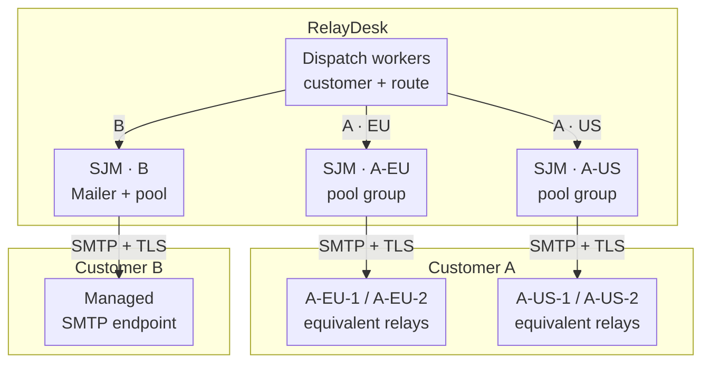

<!-- TODO: Author review of the narrative, company profile and examples; confirm the provisional publication date. -->

At RelayDesk, a support ticket can be resolved before its reply has left the building.

The support agent has written the answer. The application has saved it. The customer waiting for that answer is still waiting, because somebody changed an SMTP password on Friday afternoon.

Not RelayDesk's password. Its customer's password, on its customer's mail service, administered by somebody RelayDesk cannot reach until Monday.

RelayDesk is a small customer-support software company, with about a dozen engineers and a growing list of business customers. Its Java backend runs in Europe and North America. The product manages support conversations, attachments and case updates. Here we're following the outgoing replies; receiving messages is a separate integration.

Some customers are happy to use RelayDesk's default sending service. Others insist that outgoing replies pass through their own approved mail infrastructure. That brings their sender identities, credentials, regional arrangements and change procedures into what initially looked like a settings screen.

RelayDesk and its customers are fictional. This design uses Simple Java Mail 10.0.0 for SMTP submission. The customer registry, authorization, scheduling and configuration-change process described here are application responsibilities, not extra services supplied by the library.

## The setup

Here are three customer-supplied routes. RelayDesk selects the customer and approved region first; Simple Java Mail can then reuse a connection within that route. This is a logical view: European and American workers run in their permitted regions, not in one shared cross-region pool.



There is no arrow from one route to another. An unavailable European relay pair does not make the American pair, or another customer's server, an acceptable fallback. The default RelayDesk sending service is omitted here to keep the customer integrations visible.

## Send from our address, through our servers

A customer wants replies to come from its own support address. Using that address is only part of the request. Its IT department also wants messages to follow the existing mail route, so the usual policies and records still apply.

RelayDesk can support that. The application has to construct and submit the message either way. It just needs the right connection settings.

Then another customer provides two relay addresses. Either relay is approved for the same outgoing mail. A third has separate European and American operations, each with its own pair of relays. Another provides one managed submission hostname and explicitly asks RelayDesk to leave the infrastructure behind it alone.

Unlike [Staple & Sons](/journal/your-mail-server-works-for-a-troll-farm-now.html), RelayDesk cannot simply reconfigure these servers. Unlike [Polar Meridian](/journal/mail-at-polar-meridian-systems.html), it does not have a single corporate messaging team to agree a common service with. Its engineers get a contact address, a configuration form and occasionally a spreadsheet.

This gives the platform a useful rule: record what each customer actually permits, rather than treating every configured SMTP server as another place to try sending.

## One customer is not another customer's fallback

When a support reply is ready, RelayDesk first chooses its customer and approved route. That choice comes from the authenticated account, conversation and deployment policy. A caller does not get to supply an arbitrary cluster key with the message.

Only then can Simple Java Mail choose a connection from the eligible pools. For the customer with regional relays, the logical arrangement looks like this:

| Application-selected route | Eligible SMTP pools |
| --- | --- |
| Customer A, European operation | A-EU-1 and A-EU-2 |
| Customer A, American operation | A-US-1 and A-US-2 |
| Customer B | B's managed submission endpoint |

The [cluster key](/sending-and-execution.html#section-clustering) groups Mailers whose SMTP pools may serve the same sends. A shared key allows selection across those pools. Different keys keep those selections separate. The application has to get the grouping right: compatible credentials, sender permissions, transport requirements and allowed content cannot be inferred from the servers both speaking SMTP.

European and American routes are operated by the corresponding deployments where that is required. Reusing a cluster UUID across processes does not create a distributed pool, and a UUID does not establish where data is processed or stored.

If Customer A's European route is unavailable, Customer B's working connection is irrelevant. Even A's American route is not automatically an approved substitute. The dispatcher leaves affected work waiting and reports the problem.

For customers with one endpoint, a reusable Mailer with its own pool is enough. Multiple customers do not, by themselves, justify balancing across multiple servers. The explicit cluster configuration earns its place only for the routes that actually have interchangeable relays.

## The settings screen opens a network connection

Before any of this is useful, RelayDesk has to decide who may configure an endpoint and where its workers may connect. A server field is not an ordinary text preference. It asks RelayDesk's infrastructure to make an outbound connection.

Customer administrators get a constrained onboarding flow, not arbitrary JavaMail properties. The application checks permissions and validates the approved destination, while network policy limits reachable addresses and ports. Public customer endpoints must not provide access to RelayDesk's internal services or cloud metadata addresses. Any private customer connection requires a separate, operator-approved network arrangement. [OWASP's SSRF guidance](https://cheatsheetseries.owasp.org/cheatsheets/Server_Side_Request_Forgery_Prevention_Cheat_Sheet.html) explicitly includes SMTP among the protocols that can be involved; this is not only an HTTP problem.

The connection uses the agreed authentication method and required TLS with certificate and [server-identity verification](/security.html#section-verify-server-identity). A customer sending instructions to disable those checks gets a configuration discussion, not a checkbox. Private issuing authorities need an approved trust configuration. Credentials are stored separately from ordinary settings and are not returned to the browser or included in diagnostic output.

A controlled test message checks more than whether a socket can be opened. The configured identity must be allowed to send the intended kind of message, and the customer needs to know where it arrived. This still does not establish that every future recipient will accept it.

The customer continues to operate its mail service and domain authentication. RelayDesk does not add another DKIM signature merely because it can. If a route requires application-side signing or message protection, that becomes a specific part of the agreement.

## A quiet customer still costs resources

The first implementation could keep every customer's Mailers alive forever. That would be convenient right up until most of those customers were quiet and the process was still holding their resources.

RelayDesk keeps a bounded application registry of reusable Mailers for active routes. Quiet routes do not need permanently open SMTP connections; a zero pool core size and an appropriate idle expiry are available through the [pool configuration](/smtp-connection-pooling.html#option-mailer). Retiring a registry entry also needs a resource-cleanup process. Removing a map entry is not the same thing as closing a Mailer that still has accepted work.

The capacity calculation includes every active pool and every worker replica. A small per-pool maximum multiplied by several relays, customers and processes can produce a surprisingly large number of connections. SJM's local pool limit is not a platform-wide connection budget.

The registry, dispatcher and deployment limits therefore need to agree. A customer sending a handful of replies a week should not require the same permanently allocated machinery as one with a busy support operation.

## One slow server is not everybody else's problem

A customer's relay becomes slow. Its connections remain occupied, and the sends using them occupy execution capacity too. Adding more work to that customer's local queue does not help other customers get their replies out.

RelayDesk limits concurrent attempts per customer and uses a dispatcher that gives other customers a turn. Longer backlogs stay in durable application storage. The Mailer's [bounded async queue](/sending-and-execution.html#section-async-queue), where used, is a short local buffer rather than another copy of the entire backlog. If the application supplies its own executor, that executor's capacity and scheduling policy need to do the corresponding job.

Separate cluster keys alone do not provide fair scheduling. Nor does a low connection limit help if every shared worker is waiting for the same customer's pool. Admission has to happen before that customer consumes all the execution slots.

Connection-claim waits and [send deadlines](/sending-and-execution.html#section-send-deadlines) keep particular attempts from waiting indefinitely under the supported transport configuration. They do not choose the next customer to serve. That decision stays with the dispatcher.

When the relay recovers, RelayDesk paces the backlog instead of submitting everything at once. The customer's mail administrator does not need a second outage caused by recovery from the first.

## Somebody changed the password

This brings us back to Friday afternoon. RelayDesk needs a way to apply the replacement credentials without restarting every customer's mail integration.

The [configuration factory](/configuration.html#section-config-snapshot) provides an immutable snapshot. Editing a database record or a properties source does not update existing Mailers. For this draft's baseline deployment, RelayDesk pauses the affected route, drains its outstanding sends, closes its old Mailers and constructs replacements from the approved configuration. New replies can still be saved while that route waits to resume.

Replacing a whole relay group also means reconsidering its cluster registration. Pool settings are established by the first registration; registering another Mailer under the same key is not a general way to rewrite those settings.

An uninterrupted replacement would be a further application feature. It would need to direct new work to the new configuration while accounting for work already using the old one, then retire the old resources. Credential revocation during an incident may require stopping work rather than allowing a graceful drain. None of this should silently turn an uncertain send into a fresh attempt.

<!-- TODO: Before adding executable reconfiguration examples, test route admission versus Mailer close, partial group replacement, and repeated replacement/retirement. Check cleanup of both pool resources and retained cluster settings; do not imply that removing the last Mailer automatically forgets all cluster metadata. -->

For this first version of the service, a brief, visible pause for one customer is preferable to claiming a seamless handover that has not been demonstrated. The [Mailer lifecycle](/sending-and-execution.html#section-mailer-lifecycle) supplies part of the mechanism. The surrounding route-management code still needs its own tests.

## Tell the support agent what actually happened

The product already stores the support reply and its attachments. It does not need a second content archive just to record the result of sending that reply.

Each attempt gets an identifier and a record of the customer, route and configuration revision used. The [completion observer](/sending-and-execution.html#section-mail-send-observer), `MailSendObserver.onMailSendCompleted(MailSendOutcome)`, associates the terminal result and recorded timestamps with that attempt. Those timestamps describe the stages reached by a completed attempt; they are not separate live notifications at every transition.

The UI can distinguish a saved reply waiting for dispatch, an attempt that failed, and confirmed SMTP submission. Those are RelayDesk's product states, backed by its queue and attempt records. An authentication failure can tell the customer's administrator that the sending configuration needs attention without exposing a password or a raw protocol transcript to the support agent.

If recording an outcome fails, the persistence error is recovered separately from SMTP sending. Offloaded observer work needs bounded capacity and failure reporting of its own. Polar Meridian's [archive and observer example](/journal/mail-at-polar-meridian-systems.html#when-the-archive-is-slower-than-smtp) goes further into that arrangement; RelayDesk's addition is the customer and conversation context.

An [unknown submission result](/analyzing-send-results.html#section-unknown-acceptance) needs different handling. The relay may have accepted the message before the connection was lost. The product must not offer a reassuring automatic retry that could send the same reply twice. Confirmed submission is also not confirmation that the recipient read or even received the message.

### Five minutes later, it bounces

On another ticket, the customer's relay accepts the reply. Five minutes later a bounce reports that the recipient's mailbox no longer exists. The completion observer has already recorded a successful submission; that later message has to come back through RelayDesk's incoming-mail integration.

They arrange two return routes during onboarding: ordinary replies back to the conversation, and delivery failures back to the individual send attempt. For Customer A, its administrator approves the addresses below and connects them to RelayDesk's incoming-mail integration. `conversationToken` and `attemptToken` are opaque identifiers recorded by the application before sending. The email builder already contains the reply, attachments and recipient:

```java
import org.simplejavamail.api.email.config.DeliveryStatusNotification;

Email reply = replyEmailBuilder
    .from("Customer A Support", "support@customer-a.example")
    .withReplyTo("Customer A Support",
        "ticket+" + conversationToken + "@replies.customer-a.example")
    .withBounceTo("bounce+" + attemptToken + "@bounces.customer-a.example")
    .withDeliveryStatusNotification(
        DeliveryStatusNotification.ReturnOption.HEADERS_ONLY,
        DeliveryStatusNotification.NotifyOption.FAILURE,
        DeliveryStatusNotification.NotifyOption.DELAY)
    .buildEmail();
```

`Reply-To` is a message header directing ordinary human replies. `withBounceTo(...)` sets the SMTP envelope sender, `MAIL FROM`, where delivery failures normally return. The [DSN options](/features.html#section-delivery-status-notification) request failure and delay reports from servers supporting that SMTP extension, with only the original headers returned rather than another copy of the reply and its attachments. These are [delivery-status notifications](https://www.rfc-editor.org/rfc/rfc3461.html#section-4), not read receipts.

Onboarding includes a real bounce test against the customer's service. The chosen envelope sender must be permitted by that service and configured consistently with the customer's domain authentication; the test also checks whether the service rewrites it before sending onward.

RelayDesk's incoming-mail handler parses the delivery report and checks it against the stored attempt, customer and recipient before adding "Bounced after submission" to the ticket. The successful submission record stays: delivery failed later. The application doesn't automatically resend to an address the report says is invalid.

[Read-receipt headers](/features.html#section-return-receipt), configured through `withDispositionNotificationTo(...)` or the provider-dependent `withReturnReceiptTo(...)`, remain an optional customer setting. [MDN requests can be ignored](https://www.rfc-editor.org/rfc/rfc8098.html#section-2.1), so no receipt doesn't mean the reply went unread.

## Do we need service discovery for this?

Not just because the customers are spread around the world. A customer's managed submission hostname may stay constant while its infrastructure changes underneath. A normal [Kubernetes Service](https://kubernetes.io/docs/concepts/services-networking/service/) can likewise present a stable endpoint while its backing Pods change.

If RelayDesk later adopts Spring Cloud for externalized configuration, [refresh scope](https://docs.spring.io/spring-cloud-commons/reference/spring-cloud-commons/application-context-services.html#refresh-scope) can help reinitialize configured beans. It does not by itself specify the complete handover of a customer's active SMTP route. The lifecycle decisions above remain relevant.

Directly discovering individual relay instances might become justified for a particular integration. It is not a prerequisite for this one. The first version needs controlled customer configuration changes far more than it needs to follow every server address in real time.

## Back to the support ticket

The replacement credentials are approved, the affected route resumes, and its waiting replies get their turn. Other customers have continued sending. The original support agent can see the reply's submission result without asking a RelayDesk engineer to search every worker's logs.

There are still mail servers RelayDesk cannot repair, customer changes it cannot schedule and policies it cannot negotiate away. The useful improvement is that each of those problems can be attached to the right customer, route and attempt, with a clear account of what has and has not happened.

RelayDesk sells support software. Its engineers would quite like to get back to that.
