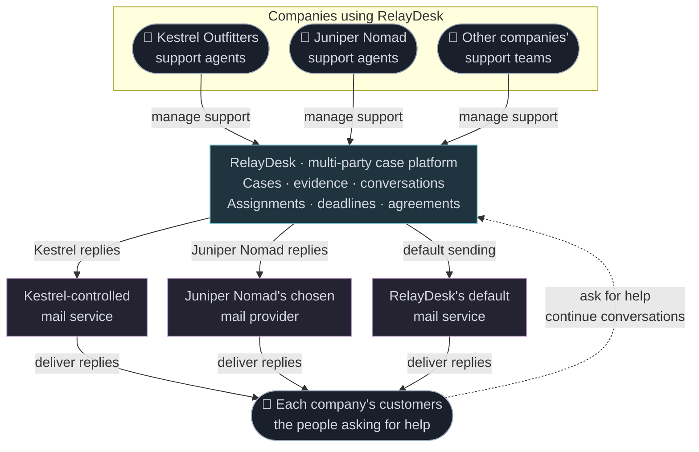
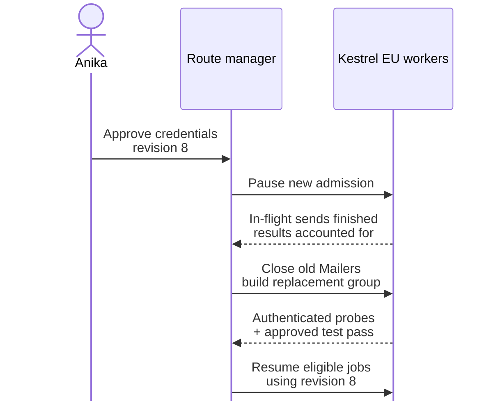

Between the corporate towers and street-level businesses, a team of runners enter a grimy bar. It's their usual spot for winding down after a run. In the corner sits an orc, preoccupied with his pad, scrolling. A repair gig catches his eye. He accepts. The half-orc waitress sets down his beer, but he is already getting up, waving his cred stick. He puts the pad inside his worn brown leather jacket, eyes the group of runners for a second and heads out, leaving the beer untouched. Outside, he climbs into a Juniper Nomad air taxi and takes off.

There are two reasons why Sam might leave his beer for a job. One is a good gig from a fixer, the other is an incident at RelayDesk.

## Centralized support, decentralized mail servers

RelayDesk is old and trusted. Nobody knows who operates it. Some say an AI; others call it a relic from the before time. It has survived and become the backbone of many a fixer and information broker.

It keeps multi-party cases together: participants, evidence, assignments, deadlines and a record of what everybody agreed to. Businesses use it for support and deliveries; fixers and brokers coordinate jobs and information requests. Each party chooses its approved communication channels, including its own mail service.

And it uses Simple Java Mail, which apparently stood the test of time. In another timeline, RelayDesk was a perfectly respectable customer-support SaaS. Then Sam became an orc, and things escalated.

<!-- Editable Mermaid source for the infographic below. Template contents do not display or run. -->
<template id="relaydesk-support-network-source" data-pagefind-ignore>


```mermaid
%%{init: { "flowchart": { "padding": 10, "wrappingWidth": 280, "nodeSpacing": 24, "rankSpacing": 40 } } }%%
flowchart TB
    accTitle: Customer support is one use of RelayDesk's multi-party case platform
    accDescr: Fixers, brokers and businesses use RelayDesk to coordinate cases. This view focuses on customer support: Kestrel Outfitters, Juniper Nomad and other companies manage conversations, evidence, assignments and follow-ups. Human agents and authorized AI coordinators work within their customer workspaces. Outgoing replies use each company's approved mail service. This view shows external relationships, not the internal sending implementation.

    subgraph teams["Companies using RelayDesk"]
        kestrelAgents(["👤 Kestrel Outfitters<br/>support agents"])
        juniperAgents(["👤 Juniper Nomad<br/>support agents"])
        otherAgents(["👥 Other companies'<br/>support teams"])
    end

    relaydesk["RelayDesk · multi-party case platform<br/>Cases · evidence · conversations<br/>Assignments · deadlines · agreements"]

    kestrelMail["Kestrel-controlled<br/>mail service"]
    juniperMail["Juniper Nomad's chosen<br/>mail provider"]
    defaultMail["RelayDesk's default<br/>mail service"]
    customers(["👥 Each company's customers<br/>the people asking for help"])

    kestrelAgents -->|manage support| relaydesk
    juniperAgents -->|manage support| relaydesk
    otherAgents -->|manage support| relaydesk
    relaydesk -->|Kestrel replies| kestrelMail
    relaydesk -->|Juniper Nomad replies| juniperMail
    relaydesk -->|default sending| defaultMail
    kestrelMail -->|deliver replies| customers
    juniperMail -->|deliver replies| customers
    defaultMail -->|deliver replies| customers
    customers -.->|ask for help<br/>continue conversations| relaydesk

    classDef person fill:#191F2B,stroke:#9DA9B8,color:#D2D7DF
    classDef product fill:#20343F,stroke:#7BCBD6,color:#D2D7DF
    classDef external fill:#252332,stroke:#B99AC8,color:#D2D7DF
    class kestrelAgents,juniperAgents,otherAgents,customers person
    class relaydesk product
    class kestrelMail,juniperMail,defaultMail external
```

</template>

[](/assets/journal/relaydesk-support-network.jpg)

*Customer support is one use of RelayDesk; each company's replies leave through its approved mail service.*

Kestrel Outfitters sells drones, spare parts and field equipment for riggers and is one of RelayDesk's customers. Its support agents work in RelayDesk, but their replies go out as Kestrel Support. Most tenants use RelayDesk's default sending service. A fixer brokered Kestrel's deal with RelayDesk, but Kestrel supplied the mail settings and one firm condition: replies go through its own SMTP servers, where it already manages domain signing and mail policies.

## Maya has the answer, but the customer hears nothing

<div class="journal-persona-block journal-persona-intro">
<header class="journal-persona-header"><strong>Maya</strong><span>AI case coordinator · Kestrel workspace</span><span class="journal-persona-stats">[+2 Investigation · +1 Diplomacy · −1 Sysadmin]</span></header>

<a href="/assets/journal/personas/relay-desk-maya.jpg"></a>

*Maya has found the spider-bot. Her customer is still waiting for the answer.*

<div class="journal-persona-copy">

Maya handles Kestrel's routine support cases inside RelayDesk. She's an AI case coordinator; the woman in the portrait is her avatar. Kestrel lets her inspect its support records and send replies, but its mail settings remain Anika's responsibility.

A shopper wants to know where their **Logicoma MKII** spider-bot has gone. Maya finds it waiting at a collection point and submits the directions through Kestrel's approved mail service, but the message gets stuck: Kestrel rotated an SMTP password on Friday afternoon, and RelayDesk is still using the old one. RelayDesk posts an integration-repair gig. That's the job that drew Sam out of the bar.

</div>
</div>

<div class="journal-persona-block journal-persona-intro journal-persona-intro--portrait-left">
<header class="journal-persona-header"><strong>Sam</strong><span>Freelance Java developer · RelayDesk contract</span><span class="journal-persona-stats">[+2 Debugging · +1 Engineering · −1 Admin rights]</span></header>

<a href="/assets/journal/personas/relay-desk-sam.jpg"></a>

*Sam's contract covers the sending integration, not Kestrel's mail administration.*

<div class="journal-persona-copy">

Sam, a freelance orc Java developer, investigates the failed send under his RelayDesk contract. He needs replacement credentials from Anika, Kestrel's mail administrator, but cannot reach her until Monday. He can repair RelayDesk's integration, but other people's passwords are beyond his reach.

</div>
</div>

Let's give Sam a better answer than restarting the application and hoping. We'll use Simple Java Mail for the sending work, with customer permissions, job scheduling and configuration changes handled by RelayDesk's application.

## The setup

RelayDesk's Java backend runs in Europe and North America; contractors such as Sam work on its integrations. Kestrel operates in both regions, with a pair of equivalent relays in each. Maya's ticket belongs to its European operation.

Juniper Nomad Air Services gives RelayDesk one SMTP address to send through; its mail provider manages the servers behind that address. Juniper's agents keep sending replies while Kestrel's mail is stuck. Here's a closer look at the sending code and the services it connects to:

```mermaid
%% journal: compact
%%{init: { "flowchart": { "curve": "stepAfter", "padding": 8, "wrappingWidth": 320, "nodeSpacing": 24, "rankSpacing": 32 } } }%%
%% journal-portrait-link: agentsToPortal agents source bottom
%% journal-portrait-link: samMaintenance sam source left
%% journal-portrait-link: kestrelAdmin anika target top
%% journal-image-inlet: storedJobs workers
flowchart TB
    accTitle: RelayDesk uses the sending service approved by each customer
    accDescr: Maya is an AI case coordinator authorized to save and send replies within Kestrel's workspace. Human case agents use the same platform. Sam repairs the sending integration under contract; its regional dispatch workers use Simple Java Mail through approved mail services. Kestrel has separate European and North American relay pairs; Juniper has one managed endpoint. Anika administers Kestrel's relays. The diagram groups deployments logically, not into a cross-region pool.

    agents@{ shape: rect, label: "<span class='diagram-person diagram-person-hex'><span class='diagram-person-portrait'><img src='/assets/journal/personas/relay-desk-maya-portrait.jpg' width='58' height='66' alt=''/></span><span class='diagram-person-copy'><strong>Maya</strong><span>Kestrel AI coordinator</span></span></span>" }
    subgraph relaydesk["RelayDesk · multi-party case platform"]
        portal@{ img: "/assets/journal/relaydesk-cyberpunk-support-conversations-node.png", label: "Case conversations", h: 85, pos: "b", constraint: "on" }
        store@{ img: "/assets/journal/relaydesk-cyberpunk-database-node.png", label: "Saved replies<br/>+ send attempts", h: 85, pos: "b", constraint: "on" }
        workers@{ img: "/assets/journal/relaydesk-cyberpunk-dispatch-workers-node.png", label: "Regional dispatch workers<br/>Simple Java Mail", h: 150, pos: "b", constraint: "on" }
        portal --> store
        store storedJobs@--> workers
    end
    agents agentsToPortal@--> portal
    sam@{ shape: rect, label: "<span class='diagram-person diagram-person-hex'><span class='diagram-person-portrait'><img src='/assets/journal/personas/relay-desk-sam-portrait.jpg' width='58' height='66' alt=''/></span><span class='diagram-person-copy'><strong>Sam</strong><span>Contract developer</span></span></span>" }
    sam samMaintenance@-.->|handles this update gig| workers

    defaultMail@{ img: "/assets/journal/relaydesk-cyberpunk-default-smtp-node.png", label: "RelayDesk default<br/>sending service", h: 85, pos: "b", constraint: "on" }
    kestrel@{ img: "/assets/journal/relaydesk-cyberpunk-kestrel-smtp-node.png", label: "Kestrel Outfitters<br/>EU relay pair · US relay pair<br/>separate regional groups", h: 85, pos: "b", constraint: "on" }
    juniper@{ img: "/assets/journal/relaydesk-cyberpunk-juniper-smtp-node.png", label: "Juniper Nomad<br/>managed SMTP endpoint", h: 85, pos: "b", constraint: "on" }
    workers ---> defaultMail
    workers ---> kestrel
    workers ---> juniper
    anika@{ shape: rect, label: "<span class='diagram-person diagram-person-hex'><span class='diagram-person-portrait'><img src='/assets/journal/personas/relay-desk-anika-portrait.jpg' width='58' height='66' alt=''/></span><span class='diagram-person-copy'><strong>Anika</strong><span>Kestrel mail administrator</span></span></span>" }
    kestrel kestrelAdmin@-.->|administered by| anika
    agentsToPortal@{ curve: basis }
    samMaintenance@{ curve: basis }
    kestrelAdmin@{ curve: basis }

    classDef person fill:none,stroke:none,color:#BECBD0
    classDef component fill:none,stroke:none,color:#E4E9EE
    classDef storage fill:none,stroke:none,color:#E4E9EE
    classDef external fill:none,stroke:none,color:#E4E9EE
    class agents,sam,anika person
    class portal,workers component
    class store storage
    class defaultMail,kestrel,juniper external
```

*Maya submits an authorized reply; Kestrel decides which mail servers can carry it.*

RelayDesk runs each customer's dispatch workers in the agreed regions, with each deployment maintaining its own connection pools.

Unlike the two developers at [Staple & Sons](/journal/your-mail-server-works-for-a-troll-farm-now.html), Sam cannot reconfigure his customers' mail servers. Nor does he have [Polar Meridian's](/journal/mail-at-polar-meridian-systems.html) dedicated corporate messaging team to agree a common enterprise service with. Instead, he gets a contact address, a configuration form and occasionally a spreadsheet; he gets to point the tenant's outgoing mail at the customer's chosen servers, and that's mostly it. "Work work" and "Job's done!" is more his thing, good little peon that he is.

## Sam checks a customer's SMTP settings before connecting

<div class="journal-persona-block journal-persona-intro">
<header class="journal-persona-header"><strong>Anika</strong><span>Mail administrator · Kestrel Outfitters</span><span class="journal-persona-stats">[+2 Sysadmin · +1 Security · −1 Weekend availability]</span></header>

<a href="/assets/journal/personas/relay-desk-anika.jpg"></a>

*Anika decides how RelayDesk may use Kestrel's mail servers.*

<div class="journal-persona-copy">

When Kestrel first onboarded, Anika supplied its SMTP settings before RelayDesk was allowed to connect to its relays. The SMTP hostname looks harmless enough in a form, but it asks RelayDesk's servers to connect somewhere on the customer's behalf.

</div>
</div>

The onboarding checks cover a few different things:

- **Who may change it?** A permitted customer administrator, with an audit trail of approved changes. Neither Maya nor a human case agent may redirect the company's mail.
- **Where may workers connect?** Approved destinations and ports, enforced in the application and by network egress rules. DNS changes must not turn a permitted public hostname into access to internal services or cloud metadata. Private customer networks require a separate, deliberately approved connection.
- **Who is at the other end?** Required TLS, certificate trust and [server-identity verification](/security.html#section-verify-server-identity). Private certificate authorities need an approved trust configuration, not a “trust everything” checkbox.
- **What may this account send?** Agreed sender and return addresses, authentication and a controlled test message. Secrets go into protected storage, never back into the settings page or diagnostic logs.

[OWASP's SSRF guidance](https://cheatsheetseries.owasp.org/cheatsheets/Server_Side_Request_Forgery_Prevention_Cheat_Sheet.html) includes SMTP among the protocols an attacker can abuse. Validating a hostname once isn't enough, and configuring a secure Mailer doesn't replace the network checks.

Kestrel's relays already handle [DKIM](/journal/your-mail-server-works-for-a-troll-farm-now.html#spf-dkim-and-dmarc); Anika confirms the SPF and DMARC setup too. Its wholesale-support conversations have an additional requirement: business partners exchange commercial attachments using [OpenPGP](/security.html#section-sending-openpgp). Those replies must be signed and encrypted. Maya's spider-bot reply doesn't need a shopper to install PGP software.

## Maya's reply cannot borrow Juniper's connection

With the servers approved, RelayDesk needs to choose the right one for each reply. Here, a **route** means the customer's permitted region, SMTP endpoint or interchangeable endpoints, and approved configuration revision. RelayDesk derives it from the authenticated customer account and saved conversation; the browser cannot choose a cluster key.

For our two customers, the choices are:

| Reply belongs to | Eligible SMTP connections |
| --- | --- |
| Kestrel's European operation, including Maya's ticket | Kestrel EU relay 1 or EU relay 2 |
| Kestrel's North American operation | Kestrel US relay 1 or US relay 2 |
| Juniper Nomad | Juniper's managed endpoint |

Each row gets its own [SJM cluster key](/sending-and-execution.html#section-clustering). Mailers sharing a key can use connections from one another's pools, so only relays approved for the same messages belong together. Sender permissions, credentials and TLS requirements all matter here; speaking SMTP is not enough to make two servers interchangeable.

The keys are application-managed identifiers, loaded from RelayDesk's approved configuration:

```java
Mailer kestrelEu1 = createMailer(mail, kestrelEuKey,
    "smtp-eu-1.kestrel-outfitters.com", username, password,
    observer, observerWorkers);
Mailer kestrelEu2 = createMailer(mail, kestrelEuKey,
    "smtp-eu-2.kestrel-outfitters.com", username, password,
    observer, observerWorkers);
```

*Kestrel's European relays can share the work. Juniper's working server is not a fallback.*

`createMailer(...)` is a small application helper, shown next. `mail` is a `SimpleJavaMail` factory using an approved configuration snapshot; the credentials come from secret storage. Both relay members are built before the route accepts work. The same key in another JVM does **not** create a distributed pool, nor does a UUID enforce data residency.

Juniper needs only one reusable Mailer. Its provider already manages the servers behind the hostname. Multi-server clustering earns its place for Kestrel's interchangeable relays, not merely because RelayDesk has multiple customers.

### Reuse the connections without keeping them all open

Some customers send all day; others answer a few tickets a week. RelayDesk keeps reusable Mailers in a bounded registry of active routes, but quiet customers don't need permanently open SMTP connections. Here's the helper for Kestrel's STARTTLS submission endpoints, with the batch module present:

```java
static Mailer createMailer(SimpleJavaMail mail, UUID clusterKey,
        String smtpHost, String username, String password,
        MailSendObserver observer, Executor observerWorkers) {
    return mail.mailerBuilder()
        .withSMTPServer(smtpHost, 587, username, password)
        .withTransportStrategy(TransportStrategy.SMTP_TLS)
        .trustingAllHosts(false)
        .trustingSSLHosts() // clear any host-specific trust exceptions
        .verifyingServerIdentity(true)
        .withProperty("mail.smtp.sendpartial", true) // inspect results when only some recipients succeed
        .withClusterKey(clusterKey)
        .withConnectionPoolCoreSize(0) // no need to stay connected while quiet
        .withConnectionPoolMaxSize(2) // at most two connections per relay pool
        .withConnectionPoolExpireAfterMillis(30_000) // retire idle connections
        .withConnectionPoolClaimTimeoutMillis(2_000) // don't wait forever for a pool
        .withMailSendTimeout(Duration.ofSeconds(20)) // bound each send attempt
        .withThreadPoolSize(2)
        .withAsyncQueueCapacity(4) // a small buffer, not the customer's backlog
        .withAsyncQueueOverflowPolicy(AsyncQueueOverflowPolicy.REJECT)
        .withMailSendObserver(observer, observerWorkers)
        .buildMailer();
}
```

*Quiet customers release idle connections; busy customers still have limits.*

These settings are for Kestrel, not every customer. Its two pools can open **four connections per dispatch process**, or twelve across three processes. `withConnectionPoolMaxSize(2)` is not a company-wide cap. Partial sending is deliberate too: one rejected recipient need not block the others, provided RelayDesk checks their individual results.

Before admitting work, Sam tests each approved endpoint with an [authenticated probe](/debugging.html#section-smtp-capabilities):

```java
SmtpConnectionReport report = mailer.sync().probeConnection(true);
if (!report.isSuccessful()) {
    throw new IllegalStateException("SMTP credential check did not pass: " + report);
}
```

*Test Kestrel's credentials without submitting a support reply.*

The probe uses a dedicated connection, outside the pool. It sends no message and doesn't replace the controlled test email. Sam also includes these cases when onboarding a customer's servers:

| Test message | What Sam checks |
| --- | --- |
| A large attachment | Rehearsal shows encoded size; the actual send checks the relay's advertised SIZE limit. Missing size information means unknown, not unlimited. |
| A recipient such as `josé@partner.com` | The mailbox needs SMTPUTF8. An accented display name or MIME-encoded subject alone doesn't. Raw eight-bit content may separately need 8BITMIME. |

SJM checks the capabilities on the actual sending connection. A missing required capability stops submission; Sam doesn't enable [legacy compatibility](/configuration.html#section-legacy-smtp-content) across all customers to make the warning disappear.

The Mailers are reusable, but their lifetime needs managing too. Idle expiry only closes connections. To retire a route, RelayDesk stops accepting new jobs for it, waits for admitted sends to finish and closes its Mailers; deleting a registry entry does none of that. We'll use the same process when Anika supplies the replacement password.

### Protect Kestrel's wholesale replies

With Kestrel's Mailers configured, Sam can prepare its wholesale replies for the partners who require OpenPGP. `wholesaleReply` is the `Email` containing their commercial attachments; `keys` is RelayDesk's tenant-specific key directory. With `openpgp-module` installed, the helper uses `kestrelEu1` to resolve the message's actual recipients before looking up their approved keys:

```java
String customerId = "kestrel";
MailRehearsal draft = kestrelEu1.rehearse(wholesaleReply, false);
OpenPgpEncryptionConfig.OpenPgpEncryptionConfigBuilder encryption =
    OpenPgpEncryptionConfig.builder();
for (String address : draft.getEnvelopeRecipients()) {
    encryption.addRecipientPublicKeyRing(
        keys.requireRecipientKey(customerId, address));
}
EmailPopulatingBuilder protectedReply = mail.emailBuilder()
    .copying(draft.getEffectiveEmail())
    .ignoringDefaults().ignoringOverrides() // already applied before key selection
    .signWithOpenPgp(keys.requireSigningConfig(customerId))
    .encryptWithOpenPgp(encryption.build());
if (!draft.getEffectiveEmail().getOverrideReceivers().isEmpty()) {
    protectedReply.withOverrideReceivers(draft.getEffectiveEmail().getOverrideReceivers());
}
Email encryptedReply = protectedReply.buildEmail();
```

*Look up each partner's approved key under Kestrel's account, not somebody else's.*

The application's key directory verifies identities and approvals; a missing key holds the reply, with no plaintext fallback. This preliminary rehearsal skips cryptography; sending the protected reply performs it. Protection covers outgoing content, not RelayDesk's stored conversation. [Polar Meridian uses S/MIME](/journal/mail-at-polar-meridian-systems.html#one-protected-message-several-partners) for its partners' different requirements.

## Juniper's replies still need to leave

Kestrel's broken European credentials shouldn't stop its US operation or Juniper's support desk. Nor should a slow Kestrel relay occupy every worker while Juniper's perfectly usable connection sits idle. Separate cluster keys stop the wrong connection being selected, but they don't decide who gets a worker.

RelayDesk's dispatcher polls a durable job store and gives eligible customers a turn. Before calling SJM, it checks the customer's concurrency and sending-rate limits. Jobs that cannot run yet remain in the database:

```mermaid
%% journal: compact
%%{init: { "flowchart": { "padding": 8, "wrappingWidth": 320, "nodeSpacing": 32, "rankSpacing": 40 } } }%%
%% journal-image-branch: dispatchKestrelUs dispatcher kestrelUs
%% journal-image-branch: dispatchKestrel dispatcher kestrel center
%% journal-image-branch: dispatchJuniper dispatcher juniper
%% journal-image-branch: savedReplies store dispatcher center
flowchart LR
    accTitle: A blocked customer does not occupy the whole dispatcher
    accDescr: Saved replies wait in durable storage. RelayDesk's dispatcher checks customer limits before submitting work. Kestrel's paused European route leaves its replies in storage, while its US route and Juniper keep sending through their own Mailers. This logical view brings separate regional deployments together; it does not create a worldwide connection pool. Simple Java Mail's connection pools do not implement this scheduling policy.

    %% Reserve the same caption height as the dispatcher to align the artwork centers.
    store@{ img: "/assets/journal/relaydesk-cyberpunk-database-node.png", label: "Saved replies<br/>&nbsp;", h: 85, pos: "b", constraint: "on" }
    dispatcher@{ img: "/assets/journal/relaydesk-cyberpunk-dispatch-workers-node.png", label: "RelayDesk dispatcher<br/>customer turn + available capacity", h: 150, pos: "b", constraint: "on" }
    kestrelUs@{ img: "/assets/journal/relaydesk-cyberpunk-kestrel-smtp-us-node.png", label: "Kestrel US · ready<br/>submit through its Mailers", h: 85, pos: "b", constraint: "on" }
    kestrel@{ img: "/assets/journal/relaydesk-cyberpunk-kestrel-smtp-eu-node.png", label: "Kestrel EU · route paused<br/>keep jobs in storage", h: 85, pos: "b", constraint: "on" }
    juniper@{ img: "/assets/journal/relaydesk-cyberpunk-juniper-smtp-node.png", label: "Juniper · ready<br/>submit through its Mailer", h: 85, pos: "b", constraint: "on" }
    store savedReplies@--> dispatcher
    dispatcher dispatchKestrelUs@---> kestrelUs
    dispatcher dispatchKestrel@---> kestrel
    dispatcher dispatchJuniper@---> juniper
    classDef waiting fill:none,stroke:none,color:#EBA680
    classDef ready fill:none,stroke:none,color:#A4E7B1
    classDef storage fill:none,stroke:none,color:#E4E9EE
    class kestrel waiting
    class kestrelUs,juniper ready
    class store,dispatcher storage
    linkStyle 1,3 stroke:#A4E7B1
    linkStyle 2 stroke:#EBA680
```

*Kestrel EU waits for its administrator. Kestrel US and Juniper keep sending.*

The four-entry async queue in the helper is a short local buffer **per Mailer**. When it fills, SJM's [queue-full rejection](/sending-and-execution.html#section-async-queue) means that attempt wasn't admitted. The dispatcher releases its reservation and defers the job; it doesn't spin or fall back to sending on the caller's thread. Other failures need the submission result checked before deciding whether another attempt is safe.

A worker waiting for a connection still uses execution capacity. The claim timeout limits that wait, while the [send deadline](/sending-and-execution.html#section-send-deadlines) limits the whole attempt with the managed SMTP transport used here. Neither selects the next customer. RelayDesk's dispatcher does that, taking all of a customer's Mailers and dispatch processes into account.

The dispatcher can also pace Kestrel's backlog when it recovers. Anika doesn't need a second outage caused by recovery from the first.

## What happened to Maya's reply?

Before Sam resumes the waiting jobs, he needs to know what happened to the attempts already made. Retrying a definite authentication failure is one thing; retrying a reply the relay might have accepted could make Maya send the same answer twice.

RelayDesk already stores the reply and attachments with the conversation. Before handing the email to SJM, it also saves an attempt record containing its Message-ID, customer, ticket, route and configuration revision. The [completion observer](/sending-and-execution.html#section-mail-send-observer) supplies the result against that record:

```java
MailSendObserver observer = outcome ->
    attemptResults.record(outcome.getInitialMessageId(), outcome);
```

*Connect the send result to the attempt that already knows Maya's ticket and configuration revision.*

`attemptResults` is RelayDesk's persistence adapter. The fixed initial Message-ID remains its lookup key even if the transport reports another ID. `MailSendOutcome` includes the stages' timestamps, not live status-change events.

Once the dispatcher has admitted Maya's job and saved its attempt record, it submits the prepared `Email reply` through one of Kestrel's European Mailers:

```java
MailSend<MailSubmissionReceipt> send = kestrelEu1.async().sendMail(reply);
```

*Submit Maya's reply through Kestrel; the configured observer records how the attempt finished.*

`MailSend` is SJM's asynchronous send handle. Its `getCompletion()` lets a caller await the result; the observer above also captures failed attempts, including those that never produce a submission receipt.

### Give Maya a result she can act on

With the attempt result saved, Maya can follow up without guessing. Kestrel's human staff can inspect the same evidence in the ticket:

| Evidence in RelayDesk | Case status |
| --- | --- |
| Saved reply, no attempt admitted yet | Waiting to send |
| Authentication failed before submission | Sending paused; your mail administrator has been notified |
| Receipt confirms SMTP acceptance | Submitted to your mail service |
| Partial or unknown acceptance | Needs investigation; no automatic resend of the whole reply |
| A later, validated delivery failure report | Bounced after submission |

Those are product labels, not SJM enum names. Maya and Kestrel's human staff can access the saved `MailSendOutcome outcome` only after a workspace permission check. The `ticket` UI adapter presents size facts to human staff without exposing passwords or protocol transcripts:

```java
outcome.getSubmissionReceipt().ifPresent(receipt ->
    ticket.showMessageSize(receipt.getMessageSize(), receipt.getServerMaximumMessageSize()));
```

*An oversized attachment gets an explanation: encoded message 12 MB, relay maximum 10 MB. Illustrative values; either fact may be unavailable.*

### Retry the warehouse's copy, not the buyer's

Another support reply includes a buyer, a warehouse contact and a former colleague. With partial sending enabled, the [receipt](/analyzing-send-results.html#section-partial-send) in this reply's saved `outcome` can distinguish all three:

| Recipient | Submission result | Next step |
| --- | --- | --- |
| Buyer | Accepted after DATA | Don't resend this copy |
| Warehouse | Temporarily rejected at RCPT | Eligible for a later attempt |
| Former colleague | Permanently rejected at RCPT | Correct the contact details |

```java
outcome.getSubmissionReceipt().ifPresent(receipt -> {
    ticket.showRecipients(receipt.getRecipientResults());
    ticket.showRetryAdvice(receipt.getRetryDisposition(), receipt.getRetryableRecipients());
});
```

*The warehouse can be retried without sending the buyer another copy.*

These are candidates, not scheduled retries: the dispatcher still checks authorization and backoff. If final acceptance is unknown, the attempt needs investigation. Without partial sending, the recipient rejection would prevent DATA submission for the buyer too.

The bounded `observerWorkers` executor and persistence adapter must report failed writes. [Polar Meridian covers those failures](/journal/mail-at-polar-meridian-systems.html#when-the-archive-is-slower-than-smtp); here too, a missing result after a crash calls for investigation, not an automatic resend.

## Update Kestrel's settings without stopping Juniper

By Monday, Sam has a definite authentication failure for Maya's attempt and Anika has approved the replacement credentials. Updating RelayDesk's database won't update existing Mailers: the [configuration factory](/configuration.html#section-config-snapshot) and the Mailers built from it use snapshots.

RelayDesk's route manager replaces Kestrel's affected European relay group as a unit. During the short pause, Maya can still save replies and Juniper keeps sending:


```mermaid
%%{init: { "sequence": { "mirrorActors": false, "actorMargin": 24, "width": 125, "height": 125, "messageMargin": 32 } } }%%
%% journal-portrait: admin /assets/journal/personas/relay-desk-anika-portrait.jpg
%% journal-node: registry /assets/journal/relaydesk-cyberpunk-route-manager-node.png
%% journal-node: workers /assets/journal/relaydesk-cyberpunk-dispatch-workers-node.png
sequenceDiagram
    accTitle: Replacing Kestrel's approved mail configuration
    accDescr: Anika approves replacement credentials. RelayDesk's route manager stops admitting work to Kestrel EU across its dispatch processes, waits for their in-flight sends, closes the old Mailers, constructs the complete replacement group and tests it. Admission resumes only if the replacement group passes the checks. Other customer routes continue throughout.
    actor admin as Anika
    participant registry as Route manager
    participant workers as Kestrel EU workers

    admin->>registry: Approve credentials<br/>revision 8
    registry->>workers: Pause new admission
    workers-->>registry: In-flight sends finished<br/>results accounted for
    registry->>workers: Close old Mailers<br/>build replacement group
    workers-->>registry: Authenticated probes<br/>+ approved test pass
    registry->>workers: Resume eligible jobs<br/>using revision 8
```

*Change Kestrel's configuration together; leave the other customers running.*

The pause covers every dispatch process using this route: no job may slip in while the old Mailers close. Once admitted sends finish, [`Mailer.close()`](/sending-and-execution.html#section-mailer-lifecycle) retires each member. Sam repeats `probeConnection(true)` on every replacement and the controlled-send test before resuming. A failed replacement stays paused and its new Mailers are closed; it doesn't fall back to the old credentials.

For this password change, the replacement keeps the group's key and pool policy. The **first cluster registration establishes the pool settings**; changing them requires a separate plan, not just rebuilding under the same key. The [integration notes](/assets/journal/examples/relaydesk/README.md) cover the additional cleanup needed when routes are repeatedly created and retired.

Credential revocation during a security incident would need a different decision about sends already in progress. Here, a visible pause is sufficient. Once the test passes, the dispatcher schedules a **new attempt** for Maya's confirmed authentication failure, linked to the same reply but using revision 8. Any ambiguous attempt remains out of the automatic retry queue.

### Does this need service discovery?

Juniper's provider manages the servers behind its hostname; RelayDesk needn't discover them individually. [Spring Cloud refresh scope](https://docs.spring.io/spring-cloud-commons/reference/spring-cloud-commons/application-context-services.html#refresh-scope) could rebuild configured beans, but wouldn't replace the pause, drain and testing process above.

## Accepted by SMTP. Then a bounce arrives.

Maya's retried reply is accepted by Kestrel's relay. RelayDesk now shows “Submitted to your mail service”, and the shopper receives her answer. On the next ticket, though, a reply gets the same successful submission result and comes back five minutes later: that recipient's mailbox no longer exists.

The send observer has finished its job. The bounce is a new incoming email, sent to one of the return addresses Anika approved during onboarding. Ordinary replies belong with the conversation; delivery failures belong with the particular send attempt.

The reply builder already contains the recipient, content and attachments. RelayDesk generates and stores opaque UUID tokens for the conversation and attempt, then applies Kestrel's approved addresses:

```java
Email reply = replyEmailBuilder
    .fixingMessageId("<" + attemptToken + "@mail.relaydesk.com>")
    .from("Kestrel Support", "support@kestrel-outfitters.com")
    .withReplyTo("Kestrel Support",
        "ticket+" + conversationToken + "@replies.kestrel-outfitters.com")
    .withBounceTo("bounce+" + attemptToken + "@bounces.kestrel-outfitters.com")
    .withDeliveryStatusNotification(
        DeliveryStatusNotification.ReturnOption.HEADERS_ONLY,
        DeliveryStatusNotification.NotifyOption.FAILURE,
        DeliveryStatusNotification.NotifyOption.DELAY)
    .fixingEnvelopeId(attemptToken.toString())
    .buildEmail();
```

*Human replies return to the ticket; delivery reports identify the send attempt.*

`Reply-To` is a message header. `withBounceTo(...)` sets the SMTP envelope sender, `MAIL FROM`, where failures normally return. The [delivery-status notification options](/features.html#section-delivery-status-notification) request failure and delay reports from servers supporting DSN, with headers rather than another copy of the attachments. The envelope ID can also identify the attempt in a returned DSN. These are [delivery reports](https://www.rfc-editor.org/rfc/rfc3461.html#section-4), not read receipts or a promise that a report will arrive.

Anika's onboarding test includes a real bounce: the relay must permit the envelope sender, its domain authentication must work with it, and any address rewriting must leave RelayDesk a usable way to correlate reports. An opaque token helps with correlation; it doesn't make an incoming message trustworthy.

RelayDesk's incoming-mail handler checks the report against the stored customer, attempt and recipient before updating the ticket. It handles duplicate reports without duplicating notifications and doesn't resend to a reported invalid address. The original SMTP acceptance stays in the history:

```text
Ticket KD-1043 · attempt 1
10:14  Submitted to Kestrel's mail service
10:19  Delivery failed: recipient mailbox does not exist
       Maya notified; reply not automatically resent
```

*“Submitted” was correct at 10:14. The later failure belongs beside it, not in its place.*

[Read-receipt requests](/features.html#section-return-receipt) remain optional. SJM can set `withDispositionNotificationTo(...)` or the provider-dependent `withReturnReceiptTo(...)`, but [a recipient can ignore an MDN request](https://www.rfc-editor.org/rfc/rfc8098.html#section-2.1). No receipt doesn't tell Maya whether somebody read her reply.

The [Java helpers](/assets/journal/examples/relaydesk/RelayDeskMailExamples.java) collect the Mailer, observer and return-address examples with their imports. Their [integration notes](/assets/journal/examples/relaydesk/README.md) distinguish these library calls from the customer registry, dispatcher and storage you'll need to connect them to.

## Back to Maya's support ticket

Maya's reply has reached the shopper, and Juniper's support desk has kept sending throughout Kestrel's password change. When another address bounces, Maya records what failed and flags the contact details for review instead of asking an engineer to search every worker's logs.

Simple Java Mail handles the [connection reuse](/sending-and-execution.html#section-reusing-connections), [approved pool groups](/sending-and-execution.html#section-clustering), [protected submission](/security.html#section-transport-strategy-tls) and [send results](/analyzing-send-results.html#section-get-receipt). Sam still can't repair somebody else's server, but he can keep its problems from becoming every customer's problem.

The next fixer can bring another customer, and another contract for Sam. This time, there's a repeatable onboarding and change process to work from.

<div class="journal-mission-debrief" role="group" aria-labelledby="relaydesk-run-complete">
  <p class="journal-mission-title" id="relaydesk-run-complete">RUN COMPLETE</p>
  <div class="journal-mission-opening">
  <p class="journal-mission-story">Back at the bar, Sam orders a fresh beer.<br>
    This time, his pad stays in his jacket.<br>
    For the moment.</p>
  
  </div>
  <dl>
    <dt>Maya</dt><dd class="journal-mission-result"><span>Reply delivered. Level up.</span></dd>
    <dt>Sam</dt><dd class="journal-mission-result"><span>Access restored. Level up.</span></dd>
    <dt>Anika</dt><dd class="journal-mission-result"><span>Credentials replaced. Level up.</span></dd>
    <dt class="journal-mission-reward">REWARD</dt><dd class="journal-mission-reward">10.547 credits &mdash; contract complete.</dd>
  </dl>
  <p class="journal-mission-signoff">&gt; Job's done. Jack out.</p>
</div>
