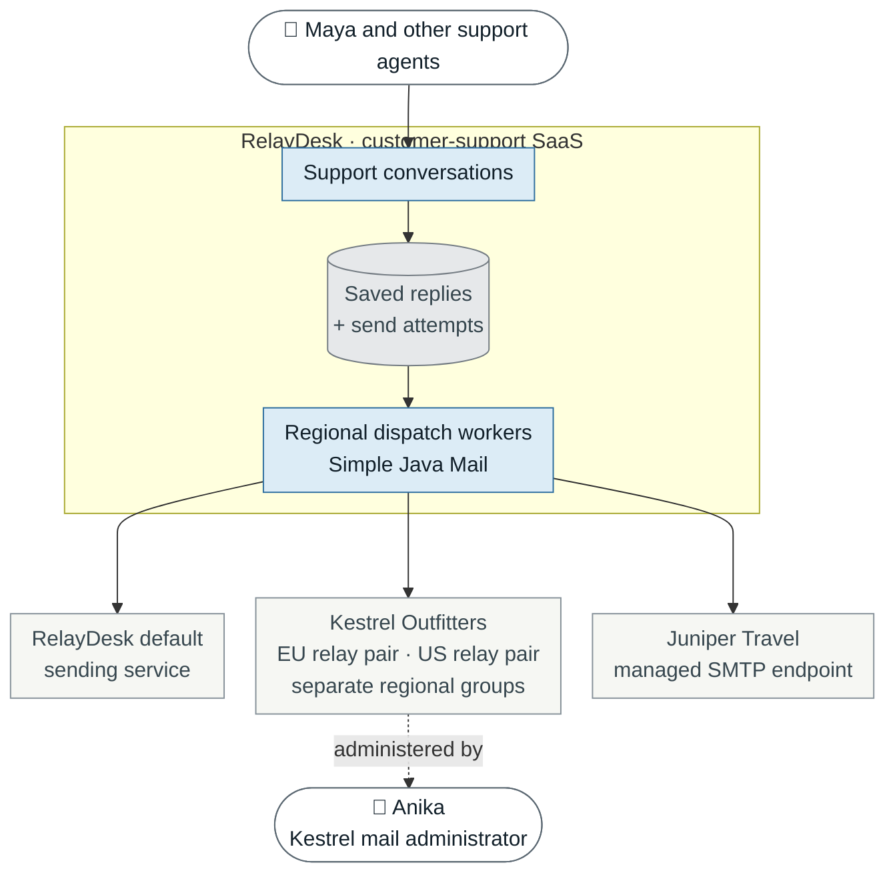
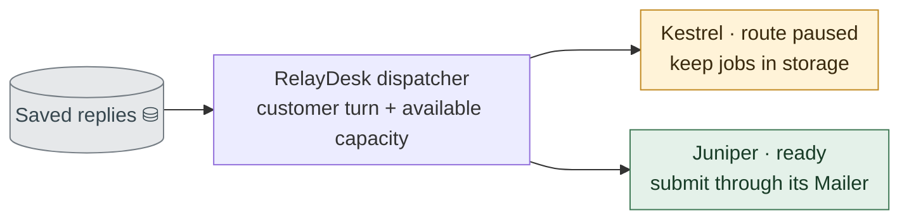
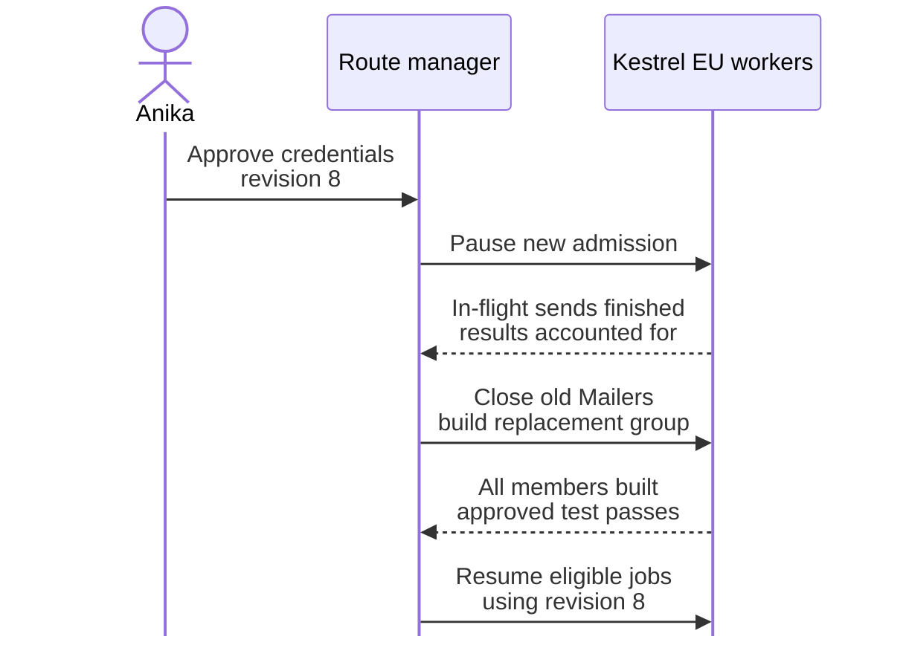

<!-- TODO: Author review of the narrative, fictional personas and examples; confirm the provisional publication date. -->

At RelayDesk, a support ticket can be resolved before its reply has left the building.

RelayDesk sells a multi-tenant SaaS platform for running a customer-support desk. It brings tickets and customer history together so agents can pick up a conversation, route it to the right team and ask colleagues for help without losing context. Workflow rules handle follow-ups and escalations, while reporting helps managers track backlogs, response times and service-level agreements. Email is one of the channels those teams use to talk to customers.

Kestrel Outfitters is one of RelayDesk's customers. Its support agents work in RelayDesk, but their replies go out as Kestrel Support. Most tenants use RelayDesk's default sending service; Kestrel requires its replies to pass through Kestrel-controlled SMTP servers, where it already manages domain signing and mail policies.

Maya, one of Kestrel's support agents, opens a ticket from a shopper whose parcel hasn't arrived. The tracking information shows it's waiting at a collection point, so she writes back in RelayDesk to explain where to pick it up. She clicks Send, but the message gets stuck: Kestrel rotated an SMTP password on Friday afternoon, and RelayDesk is still using the old one.

Anika, Kestrel's mail administrator, can arrange the replacement credentials. Unfortunately, Sam, the Java developer investigating the failed send at RelayDesk, cannot reach her until Monday. He can fix his own application; he cannot reset somebody else's password.

Let's give Sam a better answer than restarting the application and hoping. RelayDesk, its customers and the people here are fictional; we'll use Simple Java Mail 10.0.0 for the sending work, with customer permissions, job scheduling and configuration changes handled by RelayDesk's application.

## The setup

About a dozen engineers maintain RelayDesk's Java backend, deployed in Europe and North America. Kestrel operates in both regions, with a pair of equivalent relays in each. Maya's ticket belongs to its European operation.

Juniper Travel, another RelayDesk tenant, gives RelayDesk one SMTP address to send through; its mail provider manages the servers behind that address. Juniper's agents keep sending replies while Kestrel's mail is stuck. The email part of the setup looks like this:


```mermaid
%% journal: compact
%%{init: { "flowchart": { "padding": 8, "wrappingWidth": 220, "nodeSpacing": 24, "rankSpacing": 32 } } }%%
flowchart TB
    accTitle: RelayDesk uses the sending service approved by each customer
    accDescr: Support agents use RelayDesk to save replies. Regional dispatch workers use Simple Java Mail either through RelayDesk's default sending service or through customer-approved mail services. Kestrel has separate European and North American relay pairs; Juniper has one managed endpoint. Anika administers Kestrel's relays, not RelayDesk's workers. The diagram groups deployments logically, not into a cross-region pool.

    agents(["👤 Maya and other support agents"])
    subgraph relaydesk["RelayDesk · customer-support SaaS"]
        portal["Support conversations"]
        store[("Saved replies<br/>+ send attempts")]
        workers["Regional dispatch workers<br/>Simple Java Mail"]
        portal --> store
        store --> workers
    end
    agents --> portal

    defaultMail["RelayDesk default<br/>sending service"]
    kestrel["Kestrel Outfitters<br/>EU relay pair · US relay pair<br/>separate regional groups"]
    juniper["Juniper Travel<br/>managed SMTP endpoint"]
    workers ---> defaultMail
    workers ---> kestrel
    workers ---> juniper
    anika(["👤 Anika<br/>Kestrel mail administrator"])
    kestrel -.->|administered by| anika

    classDef person fill:#FFFFFF,stroke:#5B6872,color:#13212B
    classDef component fill:#DCECF6,stroke:#2F6F9F,color:#13212B
    classDef storage fill:#E6E8EA,stroke:#757D84,color:#37474F
    classDef external fill:#F6F7F3,stroke:#87929A,color:#37474F
    class agents,anika person
    class portal,workers component
    class store storage
    class defaultMail,kestrel,juniper external
```

*Maya clicks Send in RelayDesk; Kestrel decides which mail servers can carry her reply.*

The regional workers run where each customer's agreement permits. This picture brings them together for us to look at; it doesn't put their connections into one worldwide pool.

Unlike the developers at [Staple & Sons](/journal/your-mail-server-works-for-a-troll-farm-now.html), Sam cannot reconfigure Kestrel's mail servers. Nor does he have [Polar Meridian's](/journal/mail-at-polar-meridian-systems.html) single corporate messaging team to agree a common service with. He gets a contact address, a configuration form and occasionally a spreadsheet.

## The settings screen opens a network connection

Anika supplies Kestrel's SMTP settings during onboarding, before the application is allowed to connect to its relays. The SMTP hostname looks harmless enough in a form, but it asks RelayDesk's servers to connect somewhere on the customer's behalf.

The onboarding checks cover a few different things:

- **Who may change it?** A permitted customer administrator, with an audit trail of approved changes. An ordinary support agent cannot redirect the company's mail.
- **Where may workers connect?** Approved destinations and ports, enforced in the application and by network egress rules. DNS changes must not turn a permitted public hostname into access to internal services or cloud metadata. Private customer networks require a separate, deliberately approved connection.
- **Who is at the other end?** Required TLS, certificate trust and [server-identity verification](/security.html#section-verify-server-identity). Private certificate authorities need an approved trust configuration, not a “trust everything” checkbox.
- **What may this account send?** Agreed sender and return addresses, authentication and a controlled test message. Secrets go into protected storage, never back into the settings page or diagnostic logs.

[OWASP's SSRF guidance](https://cheatsheetseries.owasp.org/cheatsheets/Server_Side_Request_Forgery_Prevention_Cheat_Sheet.html) includes SMTP among the protocols an attacker can abuse. Validating a hostname once isn't enough, and configuring a secure Mailer doesn't replace the network checks.

Anika also confirms how Kestrel handles SPF, DKIM and DMARC. Its relays already do the required signing, so there's no need to add another signature just because SJM supports it. A requirement for application-side signing or [S/MIME encryption](/security.html#section-sending-smime) would become part of that customer's integration, as it did for Polar Meridian's confidential partner messages.

## Maya's reply cannot borrow Juniper's connection

With the servers approved, RelayDesk needs to choose the right one for each reply. Here, a **route** means the customer's permitted region, SMTP endpoint or interchangeable endpoints, and approved configuration revision. RelayDesk derives it from the authenticated customer account and saved conversation; the browser cannot choose a cluster key.

For our two customers, the choices are:

| Reply belongs to | Eligible SMTP connections |
| --- | --- |
| Kestrel's European operation, including Maya's ticket | Kestrel EU relay 1 or EU relay 2 |
| Kestrel's North American operation | Kestrel US relay 1 or US relay 2 |
| Juniper Travel | Juniper's managed endpoint |

Each row gets its own [SJM cluster key](/sending-and-execution.html#section-clustering). Mailers sharing a key can use connections from one another's pools, so only relays approved for the same messages belong together. Sender permissions, credentials and TLS requirements all matter here; speaking SMTP is not enough to make two servers interchangeable.

The keys are application-managed identifiers, loaded from RelayDesk's approved configuration:

```java
Mailer kestrelEu1 = createMailer(mail, kestrelEuKey,
    "smtp-eu-1.kestrel-outfitters.com", username, password,
    observer, observerWorkers);
Mailer kestrelEu2 = createMailer(mail, kestrelEuKey,
    "smtp-eu-2.kestrel-outfitters.com", username, password,
    observer, observerWorkers);
```

*Kestrel's European relays can share the work. Juniper's working server is not a fallback.*

`createMailer(...)` is a small application helper, shown next. `mail` is a `SimpleJavaMail` factory using an approved configuration snapshot; the credentials come from secret storage. Both relay members are built before the route accepts work. The same key in another JVM does **not** create a distributed pool, nor does a UUID enforce data residency.

Juniper needs only one reusable Mailer. Its provider already manages the servers behind the hostname. Multi-server clustering earns its place for Kestrel's interchangeable relays, not merely because RelayDesk has multiple customers.

### Reuse the connections without keeping them all open

Some customers send all day; others answer a few tickets a week. RelayDesk keeps reusable Mailers in a bounded registry of active routes, but quiet customers don't need permanently open SMTP connections. Here's the helper for Kestrel's STARTTLS submission endpoints, with the batch module present:

```java
static Mailer createMailer(SimpleJavaMail mail, UUID clusterKey,
        String smtpHost, String username, String password,
        MailSendObserver observer, Executor observerWorkers) {
    return mail.mailerBuilder()
        .withSMTPServer(smtpHost, 587, username, password)
        .withTransportStrategy(TransportStrategy.SMTP_TLS)
        .trustingAllHosts(false)
        .trustingSSLHosts() // clear any host-specific trust exceptions
        .verifyingServerIdentity(true)
        .withClusterKey(clusterKey)
        .withConnectionPoolCoreSize(0) // no need to stay connected while quiet
        .withConnectionPoolMaxSize(2) // at most two connections per relay pool
        .withConnectionPoolExpireAfterMillis(30_000) // retire idle connections
        .withConnectionPoolClaimTimeoutMillis(2_000) // don't wait forever for a pool
        .withMailSendTimeout(Duration.ofSeconds(20)) // bound each send attempt
        .withThreadPoolSize(2)
        .withAsyncQueueCapacity(4) // a small buffer, not the customer's backlog
        .withAsyncQueueOverflowPolicy(AsyncQueueOverflowPolicy.REJECT)
        .withMailSendObserver(observer, observerWorkers)
        .buildMailer();
}
```

*Quiet customers release idle connections; busy customers still have limits.*

These are illustrative settings for Kestrel, not defaults for every customer. Two relay pools with a maximum of two connections each can open **four connections per dispatch process**. Three such processes could open twelve connections, all counting towards Kestrel's agreed limit. `withConnectionPoolMaxSize(2)` is not a company-wide cap.

Idle expiry only deals with connections. Retiring a whole route means stopping its admission of new work and closing its Mailers after accepted sends finish; deleting a registry entry does neither. We'll use that same process when Anika supplies the replacement password.

## Juniper's replies still need to leave

Kestrel's broken credentials shouldn't stop Juniper's support desk. Nor should a slow Kestrel relay occupy every worker while Juniper's perfectly usable connection sits idle. Separate cluster keys stop the wrong connection being selected, but they don't decide who gets a worker.

RelayDesk's dispatcher polls a durable job store and gives eligible customers a turn. Before calling SJM, it checks the customer's concurrency and sending-rate limits. Jobs that cannot run yet remain in the database:


```mermaid
%% journal: compact
%%{init: { "flowchart": { "padding": 8, "wrappingWidth": 220, "nodeSpacing": 32, "rankSpacing": 40 } } }%%
flowchart LR
    accTitle: A blocked customer does not occupy the whole dispatcher
    accDescr: Saved replies wait in durable storage. RelayDesk's dispatcher checks customer limits before submitting work. Kestrel's paused route leaves its replies in storage, while Juniper's eligible replies go to its own Mailer. Simple Java Mail's connection pools do not implement this scheduling policy.

    store[("Saved replies ⛁")]
    dispatcher["RelayDesk dispatcher<br/>customer turn + available capacity"]
    kestrel["Kestrel · route paused<br/>keep jobs in storage"]
    juniper["Juniper · ready<br/>submit through its Mailer"]
    store --> dispatcher
    dispatcher ---> kestrel
    dispatcher ---> juniper
    classDef waiting fill:#FFF3D8,stroke:#C28A22,color:#3A2A0E
    classDef ready fill:#E4F1E9,stroke:#427B58,color:#183C27
    classDef storage fill:#E6E8EA,stroke:#757D84,color:#37474F
    class kestrel waiting
    class juniper ready
    class store storage
```

*Kestrel waits for its administrator. Juniper doesn't have to wait with it.*

The four-entry async queue in the helper is a short local buffer **per Mailer**. When it fills, SJM's [queue-full rejection](/sending-and-execution.html#section-async-queue) means that attempt wasn't admitted. The dispatcher releases its reservation and defers the job; it doesn't spin or fall back to sending on the caller's thread. Other failures need the submission result checked before deciding whether another attempt is safe.

A worker waiting for a connection still uses execution capacity. The claim timeout limits that wait, while the [send deadline](/sending-and-execution.html#section-send-deadlines) limits the attempt as a whole under the supported transport configuration. Neither selects the next customer. RelayDesk's dispatcher does that, taking all of a customer's Mailers and dispatch processes into account.

The dispatcher can also pace Kestrel's backlog when it recovers. Anika doesn't need a second outage caused by recovery from the first.

## What happened to Maya's reply?

Before Sam resumes the waiting jobs, he needs to know what happened to the attempts already made. Retrying a definite authentication failure is one thing; retrying a reply the relay might have accepted could make Maya send the same answer twice.

RelayDesk already stores the reply and attachments with the conversation. Before handing the email to SJM, it also saves an attempt record containing its Message-ID, customer, ticket, route and configuration revision. The [completion observer](/sending-and-execution.html#section-mail-send-observer) supplies the result against that record:

```java
MailSendObserver observer = outcome ->
    attemptResults.record(outcome.getInitialMessageId(), outcome);
```

*The SMTP result returns to the attempt that already knows Maya's ticket and configuration revision.*

`attemptResults` is RelayDesk's persistence adapter, not SJM API. Each email has a fixed, unique Message-ID, which remains the lookup key even if the transport reports a different effective ID. The observer receives a terminal `MailSendOutcome`, including the timestamps of the stages the attempt reached; it isn't a stream of live status-change events.

From that evidence, RelayDesk can show something useful in the ticket:

| Evidence in RelayDesk | What Maya sees |
| --- | --- |
| Saved reply, no attempt admitted yet | Waiting to send |
| Authentication failed before submission | Sending paused; your mail administrator has been notified |
| Receipt confirms SMTP acceptance | Submitted to your mail service |
| Partial or unknown acceptance | Needs investigation; no automatic resend of the whole reply |
| A later, validated delivery failure report | Bounced after submission |

Those are product labels, not SJM enum names. Maya's ticket leaves out passwords and protocol transcripts; raw diagnostics are for the people investigating the failure. A rejected or partially accepted send also needs recipient-specific [retry decisions](/analyzing-send-results.html#section-retry-decisions), not just a red button labelled “Try again.”

The helper offloads observation to RelayDesk's bounded `observerWorkers` executor. That executor and the persistence adapter must report failures; a lost database write is not a reason to send the email again. [Polar Meridian's observer example](/journal/mail-at-polar-meridian-systems.html#when-the-archive-is-slower-than-smtp) covers this in more depth. After a worker crash, an unfinished attempt stays unresolved until investigated, rather than being mistaken for a reply that was never submitted.

## Update Kestrel's settings without stopping Juniper

By Monday, Sam has a definite authentication failure for Maya's attempt and Anika has approved the replacement credentials. Updating RelayDesk's database won't update existing Mailers: the [configuration factory](/configuration.html#section-config-snapshot) and the Mailers built from it use snapshots.

RelayDesk's route manager replaces Kestrel's affected European relay group as a unit. During the short pause, Maya can still save replies and Juniper keeps sending:


```mermaid
%%{init: { "sequence": { "mirrorActors": false, "actorMargin": 24, "width": 125, "height": 65, "messageMargin": 32 } } }%%
sequenceDiagram
    accTitle: Replacing Kestrel's approved mail configuration
    accDescr: Anika approves replacement credentials. RelayDesk's route manager stops admitting work to Kestrel EU across its dispatch processes, waits for their in-flight sends, closes the old Mailers, constructs the complete replacement group and tests it. Admission resumes only if the replacement group passes the checks. Other customer routes continue throughout.
    actor admin as Anika
    participant registry as Route manager
    participant workers as Kestrel EU workers

    admin->>registry: Approve credentials<br/>revision 8
    registry->>workers: Pause new admission
    workers-->>registry: In-flight sends finished<br/>results accounted for
    registry->>workers: Close old Mailers<br/>build replacement group
    workers-->>registry: All members built<br/>approved test passes
    registry->>workers: Resume eligible jobs<br/>using revision 8
```

*Change Kestrel's configuration together; leave the other customers running.*

The pause must cover every dispatch process using this route. A job claim cannot slip through between “no sends left” and closing the Mailers. Once all accepted sends in the group have finished, [`Mailer.close()`](/sending-and-execution.html#section-mailer-lifecycle) retires each member's resources. A partially built or failed replacement stays paused, with any newly created Mailers cleaned up. It doesn't quietly send through the old configuration instead.

For this password change, the replacement keeps the group's key and pool policy. The **first cluster registration establishes the pool settings**; reusing the key is not a way to change those settings. Closing the last Mailer also mustn't be treated as erasing every retained cluster definition, so allocating a fresh UUID on every edit isn't a complete long-running cleanup strategy.

<!-- TODO: Integration-test route-wide admission/pause races, draining and partial replacement across processes, plus repeated retirement and retained cluster-settings growth, before publishing a complete executable route registry. The helper below configures Mailers; it does not implement that registry. -->

Credential revocation during a security incident would need a different decision about sends already in progress. Here, a visible pause is sufficient. Once the test passes, the dispatcher schedules a **new attempt** for Maya's confirmed authentication failure, linked to the same reply but using revision 8. Any ambiguous attempt remains out of the automatic retry queue.

### Does this need service discovery?

Juniper's provider can change the servers behind its managed hostname without RelayDesk having to discover them individually. Even if RelayDesk adopts [Spring Cloud refresh scope](https://docs.spring.io/spring-cloud-commons/reference/spring-cloud-commons/application-context-services.html#refresh-scope) to rebuild configured beans, it still needs the admission, drain and replacement process above. For now, applying an approved customer change safely is the useful feature.

## Accepted by SMTP. Then a bounce arrives.

Maya's retried reply is accepted by Kestrel's relay. RelayDesk now shows “Submitted to your mail service”, and the shopper receives her answer. On the next ticket, though, a reply gets the same successful submission result and comes back five minutes later: that recipient's mailbox no longer exists.

The send observer has finished its job. The bounce is a new incoming email, sent to one of the return addresses Anika approved during onboarding. Ordinary replies belong with the conversation; delivery failures belong with the particular send attempt.

The reply builder already contains the recipient, content and attachments. RelayDesk generates and stores opaque UUID tokens for the conversation and attempt, then applies Kestrel's approved addresses:

```java
Email reply = replyEmailBuilder
    .fixingMessageId("<" + attemptToken + "@mail.relaydesk.com>")
    .from("Kestrel Support", "support@kestrel-outfitters.com")
    .withReplyTo("Kestrel Support",
        "ticket+" + conversationToken + "@replies.kestrel-outfitters.com")
    .withBounceTo("bounce+" + attemptToken + "@bounces.kestrel-outfitters.com")
    .withDeliveryStatusNotification(
        DeliveryStatusNotification.ReturnOption.HEADERS_ONLY,
        DeliveryStatusNotification.NotifyOption.FAILURE,
        DeliveryStatusNotification.NotifyOption.DELAY)
    .fixingEnvelopeId(attemptToken.toString())
    .buildEmail();
```

*Human replies return to the ticket; delivery reports identify the send attempt.*

`Reply-To` is a message header. `withBounceTo(...)` sets the SMTP envelope sender, `MAIL FROM`, where failures normally return. The [delivery-status notification options](/features.html#section-delivery-status-notification) request failure and delay reports from servers supporting DSN, with headers rather than another copy of the attachments. The envelope ID can also identify the attempt in a returned DSN. These are [delivery reports](https://www.rfc-editor.org/rfc/rfc3461.html#section-4), not read receipts or a promise that a report will arrive.

Anika's onboarding test includes a real bounce: the relay must permit the envelope sender, its domain authentication must work with it, and any address rewriting must leave RelayDesk a usable way to correlate reports. An opaque token helps with correlation; it doesn't make an incoming message trustworthy.

RelayDesk's incoming-mail handler checks the report against the stored customer, attempt and recipient before updating the ticket. It handles duplicate reports without duplicating notifications and doesn't resend to a reported invalid address. The original SMTP acceptance stays in the history:

```text
Ticket KD-1043 · attempt 1
10:14  Submitted to Kestrel's mail service
10:19  Delivery failed: recipient mailbox does not exist
       Maya notified; reply not automatically resent
```

*“Submitted” was correct at 10:14. The later failure belongs beside it, not in its place.*

[Read-receipt requests](/features.html#section-return-receipt) remain optional. SJM can set `withDispositionNotificationTo(...)` or the provider-dependent `withReturnReceiptTo(...)`, but [a recipient can ignore an MDN request](https://www.rfc-editor.org/rfc/rfc8098.html#section-2.1). No receipt doesn't tell Maya whether somebody read her reply.

The [Java helpers](/assets/journal/examples/relaydesk/RelayDeskMailExamples.java) collect the Mailer, observer and return-address examples with their imports. Their [integration notes](/assets/journal/examples/relaydesk/README.md) distinguish these library calls from the customer registry, dispatcher and storage you'll need to connect them to.

## Back to Maya's support ticket

Maya's reply has reached the shopper, and Juniper's support desk has kept sending throughout Kestrel's password change. When another address bounces, Maya can see what failed and correct the contact details instead of asking an engineer to search every worker's logs.

Simple Java Mail handles the [connection reuse](/sending-and-execution.html#section-reusing-connections), [approved pool groups](/sending-and-execution.html#section-clustering), [protected submission](/security.html#section-transport-strategy-tls) and [send results](/analyzing-send-results.html#section-get-receipt). Around it, RelayDesk has a repeatable onboarding and change process for the next customer's mail service. Sam still can't repair somebody else's server, but he can keep its problems from becoming every customer's problem.

RelayDesk sells support software. Its engineers would quite like to get back to that.
