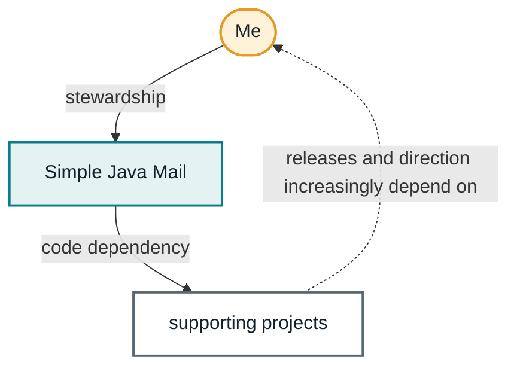
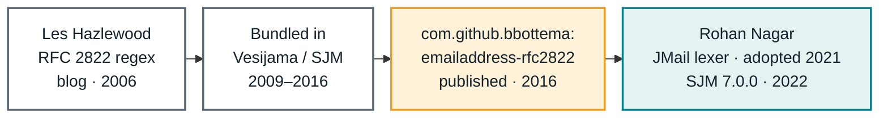
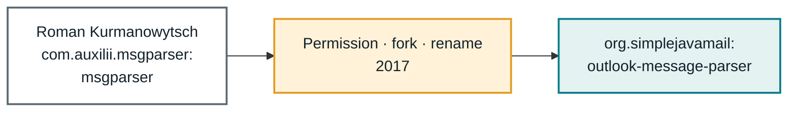
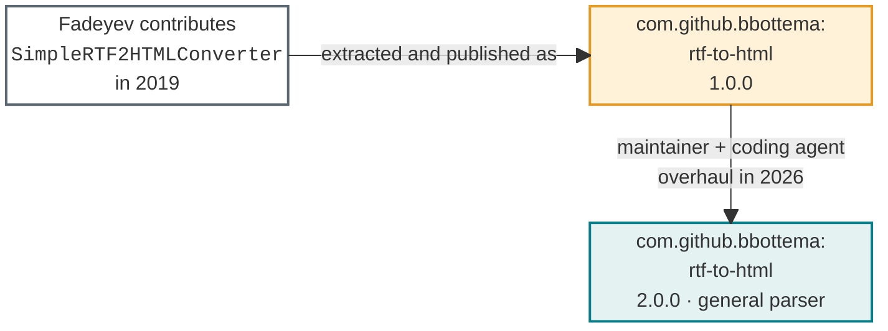
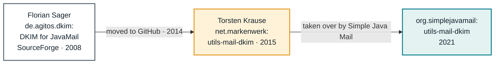
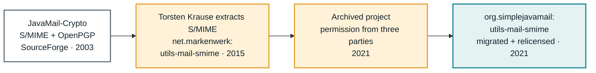
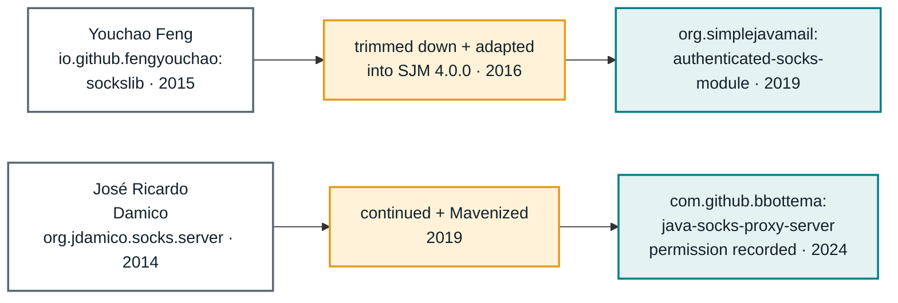
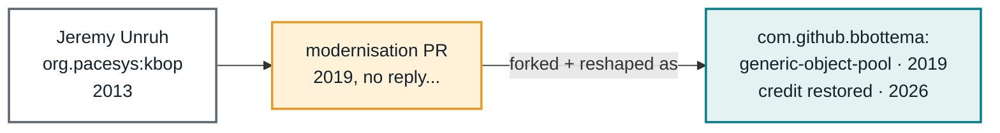
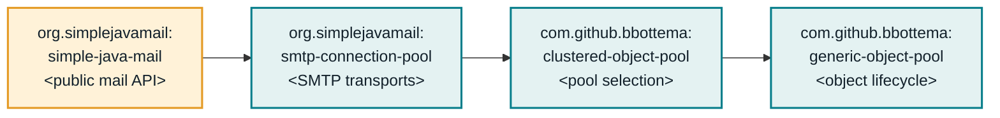
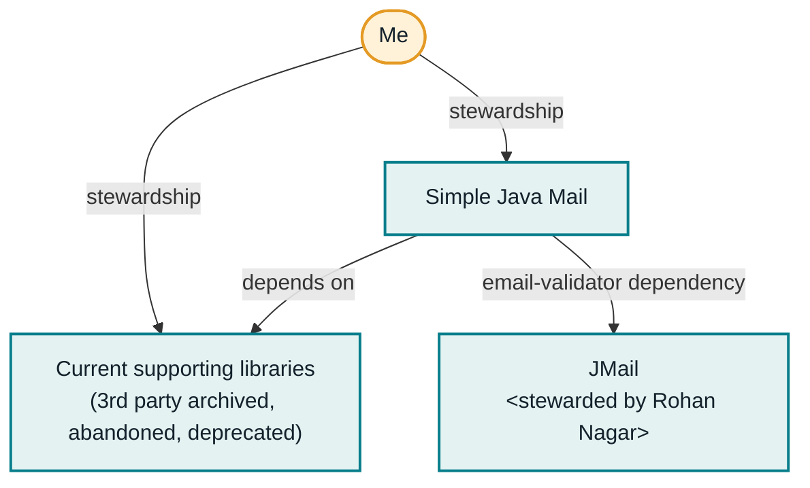

## I am a hack

I steal libraries.

Not literally, although one forgotten attribution further down makes that opening less comfortable than I intended. What I mean is that I find code all over the place, pull it apart, mould it, steward it and repurpose it to serve a bigger whole. Simple Java Mail sits on top of a surprising collection of projects that arrived that way.

I am not an expert on DKIM, S/MIME, object-pooling semantics, SOCKS, Outlook's file format, RTF or email-address validation. You will probably never find me at a conference teaching the finer points of the MIME standards. I do know how to take something complex and daunting and make it feel manageable. I can divide it into parts, decide which parts a user actually needs to see, and find the right balance between a useful API and escape hatches for the cases I cannot predict. I basically pretend to be a user looking for the easiest way to do something.

That is my power. In practice it often looks like me reading a half-understood codebase at night, renaming everything, adding tests and trying to work out which three concepts should survive into its public API. This has been my cycle since even before I went to college.

The supporting libraries behind Simple Java Mail are a record of that way of working. Some began as forks. Some were inherited when their maintainers stopped. One was hiding inside a pull request. One was my own solution until somebody wrote a much better one and I happily replaced it. Together they let Simple Java Mail present DKIM, S/MIME, OpenPGP, Outlook conversion, authenticated proxies and clustered SMTP connections as parts of one understandable system.

They also contain some lessons about credit and licences that I learned later than I should have.

## A dependency graph became a maintenance graph

At first, these were dependencies in a `pom.xml`: code somebody else would keep working on while I concentrated on Simple Java Mail. That is a comforting fiction until a dependency is archived, a licence blocks the next release, a user finds a production leak across four repositories, or a mail client invents another way to encode the same body.

The graph gradually turned around. Simple Java Mail depended on these projects, but their releases and direction increasingly depended on me. Today that family includes the [Outlook Message Parser](https://github.com/bbottema/outlook-message-parser), [RTF-to-HTML](https://github.com/bbottema/rtf-to-html), [DKIM](https://github.com/simple-java-mail/java-utils-mail-dkim), [S/MIME](https://github.com/simple-java-mail/java-utils-mail-smime), [Generic Object Pool](https://github.com/bbottema/generic-object-pool), [Clustered Object Pool](https://github.com/bbottema/clustered-object-pool), [SMTP Connection Pool](https://github.com/simple-java-mail/smtp-connection-pool) and a [SOCKS proxy server](https://github.com/bbottema/java-socks-proxy-server) used by integration tests. The old email validator belongs in the family tree too, even though Simple Java Mail no longer uses it.

Calling all of these "my libraries" hides too much. Authorship, maintenance and stewardship are not the same thing. Their histories are messy in different ways, and the mess is the interesting part.

## The validator I was happy to replace

Email-address validation was there almost from the beginning. The original code was a large regular expression copied from [Les Hazlewood's 2006 blog post](https://web.archive.org/web/20100629170852/http://leshazlewood.com/2006/11/06/emailaddress-java-class/) and adapted into [Vesijama](/journal/simple-java-mails-origin-story.html). When its strict interpretation rejected addresses people actually used, I first wanted to leave the imported code alone and then decided that ["usability comes first"](/sources/google-code/vesijama/issue-4.html#comment-1), making the restrictions configurable. It grew options and workarounds until even its own Google Code tracker described it as having ["grown like fungus"](/sources/google-code/emailaddress/issue-2.html#comment-0).

Then somebody found an address that sent the regex into catastrophic backtracking. It could pin a processor core for hours. The old Simple Java Mail issue's test procedure ended with ["Wait for computer to explode"](/sources/google-code/simple-java-mail/issue-3.html#comment-0). I fixed the immediate problem, later extracted the code into `email-rfc2822-validator`, and kept maintaining it. Even that one-purpose library managed to pull JavaMail and Activation into users' applications until [issue #21](https://github.com/bbottema/email-rfc2822-validator/issues/21) made them optional. Extraction separated the validator from Simple Java Mail; it did not make the underlying approach less fragile.

In 2021 Rohan Nagar compared it with his lexer-based JMail library and filed the differences as [issue #22](https://github.com/bbottema/email-rfc2822-validator/issues/22). That discussion is open source at its best. His comparison found mistakes in our validator. Connor Hazlewood found mistakes in JMail's results. The RFCs had moved since the original implementation and everybody learned something.

It also made the architectural answer obvious. A lexer could explain where an address failed and deal with a grammar directly. The regex was, well, a very large regex. I wrote that the lexer was better ["by a landslide"](https://github.com/bbottema/email-rfc2822-validator/issues/22#issuecomment-849915847) and that JMail superseded our project on all counts. Simple Java Mail [switched to JMail](https://github.com/bbottema/simple-java-mail/issues/319) in 7.0.0.

There was no prize for keeping my own solution in the stack. The useful thing I could do as maintainer was recognise a better one, help compare the edge cases and get out of its way.

## Outlook Message Parser was a succession

The Outlook parser did not begin with me either. [`msgparser`](/sources/sourceforge/msgparser/project.html) was a small SourceForge project dating back to 2007. In 2017 I helped bring that history to GitHub in [TheConfusedCat/msgparser](https://github.com/TheConfusedCat/msgparser/commit/2f6c61c88838b722ea6cde3f9224b5cd9a01c202). My reason was practical: I wanted to continue it, and I needed a repository I could actually work with.

I made what the first commit called the ["completed fork"](https://github.com/bbottema/outlook-message-parser/commit/35b0c802825e3631e40430e332baf55d97d2b5a4) into Outlook Message Parser. The old repository [received the changes back](https://github.com/TheConfusedCat/msgparser/commit/6c010ccadc27584ff8890c6be0f0a35013f832c3) for a while and was eventually archived with an explicit [pointer to its successor](https://github.com/TheConfusedCat/msgparser/commit/4e6cd846d9f1e9dc5f925bacdf4d4f96aafda7bf). When someone later questioned whether the licence allowed this, I documented that I had [express permission from the original author](https://github.com/bbottema/outlook-message-parser/issues/35).

That is not a clean invention story. It is a succession story. Somebody else supplied the foundation. I supplied years of changes, releases and an API that Simple Java Mail could use. Both facts matter.

Outlook then made sure the work never became routine. One `.msg` file stored corrupted native HTML beside RTF containing Chinese text, with one Windows code page for visible text and another for control characters. I solved it with what I called ["some hacking work"](https://github.com/bbottema/outlook-message-parser/issues/3#issuecomment-414206592) and immediately wrote that I eventually wanted a token-based parser. Later issues had to preserve both [SMTP and X.500 recipient identities](https://github.com/bbottema/outlook-message-parser/issues/73), recognise S/MIME through [content types and carefully limited filename fallbacks](https://github.com/bbottema/outlook-message-parser/issues/51), and deal with [New Outlook files](https://github.com/bbottema/outlook-message-parser/issues/90) that sometimes contain only native HTML and trailing NUL bytes. What I need to know is where that complexity ends and the object model callers can actually use begins.

## RTF-to-HTML began with a contribution

RTF-to-HTML took another route into the family. Outlook Message Parser already contained several conversion attempts when Fadeyev contributed a structured RTF parser in [pull request #15](https://github.com/bbottema/outlook-message-parser/pull/15). The contribution was aimed at Outlook's HTML-derived RTF, where the original HTML survives inside `htmltag` destinations. I looked at it and immediately saw a separate library. The next day I had [moved all RTF conversion code out](https://github.com/bbottema/outlook-message-parser/pull/15#issuecomment-541452206) and released both projects.

That clean extraction did not mean I understood RTF. We soon established that Outlook can contain at least three materially different bodies: HTML-derived RTF, plain text represented as RTF and genuine rich text that needs an actual RTF renderer. The first contribution handled one family very well. It did not magically become the general parser described in [issue #16](https://github.com/bbottema/outlook-message-parser/issues/16).

The gap became painful in [RTF-to-HTML issue #6](https://github.com/bbottema/rtf-to-html/issues/6). Outlook used `\par` in ways our converter did not understand. In 2021 I wrote, ["I currently have no idea how to solve this"](https://github.com/bbottema/rtf-to-html/issues/6#issuecomment-852450864). In 2022 I still could not, or as I put it in Dutch, ["I really can't make cheese out of it"](https://github.com/bbottema/rtf-to-html/issues/6#issuecomment-1025916084). The reporter's helpdesk had users forward a message, switch it to HTML and save the unsent copy as a new `.msg` file just to avoid garbled imports. When asked again in 2023, my answer was simply that I did not expect progress any time soon.

This is where my usual style of hacking reaches its limit. I could see what the parser needed to do and what its API should look like. I could not keep enough of the RTF grammar, Outlook's variations and rendering semantics in my head to implement a real parser in the time I had.

Capable coding agents changed that equation. I could make them investigate the formats, compare implementations, preserve the split between RTF parsing and Outlook conversion and produce the irritating number of regression tests the problem deserved. I still had to decide what the converter promised and how Outlook Message Parser should use it. The agent could stay inside the parser until the details were right. In July 2026, more than six years after the general-parser issue was opened, the [parser overhaul](https://github.com/bbottema/rtf-to-html/commit/9775f4c72b51f843068ba3236fdfcbded395ab8e) finally handled real RTF-only Outlook messages and the original `\par` case. [The Library I Keep Coming Back To](/journal/the-library-i-keep-coming-back-to.html) tells the broader story of how that changed my maintenance rhythm.

Coding agents do not turn me into an RTF expert; they let me combine architectural judgement with more technical depth than I could muster by myself.

## DKIM changed hands twice

I tend to mention the DKIM and S/MIME projects together because both now live in the Simple Java Mail organisation and both had to move for the Jakarta Mail migration. Their origins are not the same.

DKIM for JavaMail began on [SourceForge](/sources/sourceforge/dkim-javamail/project.html) in 2008 under Apache 2.0. Its old support threads show how hard it is to claim expertise in email from reading a specification. At one point [Yahoo rejected signatures](/sources/sourceforge/dkim-javamail/discussion/error-sending-to-yahoo.html#a7cd/57b5/60e8) that Gmail and several reflectors accepted. Users compared raw messages, moved headers around and eventually narrowed it to header placement; Florian contacted Yahoo before publishing the fix. Another thread corrected [CRLF canonicalisation](/sources/sourceforge/dkim-javamail/discussion/body-end-of-line-normalization-missing.html#229d/4ee2). This was already a community-built body of awkward interoperability knowledge before it [moved to GitHub](https://github.com/usrflo/DKIM-for-JavaMail/commit/c62bbf41cef9ab292a61a4472418e320723d71c2) in 2014.

Torsten Krause continued it under Markenwerk in 2015, but accidentally changed the licence to LGPL. By 2018 users were forking Simple Java Mail just to remove the DKIM integration because they were worried about that copyleft dependency. I raised it in [issue #10](https://github.com/markenwerk/java-utils-mail-dkim/issues/10); Torsten recognised the mistake and [restored the original Apache licence](https://github.com/markenwerk/java-utils-mail-dkim/commit/b7610f35b957ec069be9b43bb03f9e4f56f90b7b). The project eventually [moved under Simple Java Mail's care](https://github.com/markenwerk/java-utils-mail-dkim/commit/bcbe03c8246f78680e9306cff1db986d4564b069).

## S/MIME needed three permissions

S/MIME support had quite a detour. In November 2018 an [Outlook Message Parser user handed me a signed `.msg` file](https://github.com/bbottema/outlook-message-parser/issues/4) that the library could not unpack. I knew next to nothing about S/MIME and didn't want to go anywhere near the then-mystical Bouncy Castle, so I went shopping for a library once again. [Four days later](https://github.com/bbottema/outlook-message-parser/issues/4#issuecomment-443763501) I had found Torsten Krause's `markenwerk/java-utils-mail-smime`. Simple Java Mail relied on it for the next three years. By 2021, however, the project was archived.

That left users [stranded behind ignored fixes](https://github.com/bbottema/simple-java-mail/issues/334), and blocked the move from `javax.mail` to Jakarta Mail. I wanted to take over the project, migrate it to Jakarta Mail and relicense it under Simple Java Mail, but that required permission from three parties across its history.

You see, the code had already passed through several hands. JavaMail-Crypto started on [SourceForge](/sources/sourceforge/javamail-crypto/project.html) in 2003 and covered both S/MIME and OpenPGP. Its archives contain the same sort of real-world friction: a signature [accepted by Outlook and Thunderbird but rejected by webMethods](/sources/sourceforge/javamail-crypto/mailman/message-457552.html#message-457552), and an old bug where [`setHeader` overwrote repeated headers](/sources/sourceforge/javamail-crypto/bugs/3.html#ticket-3) such as multiple `To` fields. Torsten extracted and modernised the S/MIME part in [2015](https://github.com/markenwerk/java-utils-mail-smime/commit/2ae3534db52e00bd8427cdc68ed83fef4f0d8066) as `java-utils-mail-smime`.

I had permission from [two of the three](https://github.com/bbottema/simple-java-mail/issues/295#issuecomment-869926957) by June 2021 and [all three by Christmas Eve](https://github.com/bbottema/simple-java-mail/issues/295#issuecomment-1000912695). The Jakarta Mail migration had been underway for half a year by then, with [a break while I caught my breath](/journal/the-library-i-keep-coming-back-to.html#i-thought-i-was-done). On 28 December I finished [migrating and relicensing `java-utils-mail-smime`](https://github.com/simple-java-mail/java-utils-mail-smime/commit/6eac0beb12506b9dbfb345431ab3f1de05ffb5e4). Simple Java Mail 7.0.0 followed days later. What I took home from this is that working in open source and trying to be effective sometimes means you have to track down the people behind three generations of a project before you can move it forward.

## A tale of two proxies

Simple Java Mail has two unrelated SOCKS stories, and I have managed to blur them together before.

The first is the feature users see. [Still the Same Ticket](/journal/twenty-years-of-simple-java-mail.html) covers the six-year journey from declining proxy support to making it a supported feature. The supporting-library detail is that [issue #38](https://github.com/bbottema/simple-java-mail/issues/38) led me to adapt `sockslib` down to a small local bridge that accepts JavaMail's anonymous connection and forwards it through an authenticated proxy. One follow-up bug then turned out to be the difference between Windows saying `socket closed` and Linux saying [`Socket closed`](https://github.com/bbottema/simple-java-mail/issues/56). These are the details hiding behind a checkbox labelled "authenticated proxy support."

The second is [java-socks-proxy-server](https://github.com/bbottema/java-socks-proxy-server), a server used to test SOCKS integrations. It continued a small GPLv2 project by José Ricardo Damico. I had changed and relicensed it without preserving a convincing permission trail. An annoyed user eventually challenged that in [issue #11](https://github.com/bbottema/java-socks-proxy-server/issues/11) and said, ["I will not use 'your' code"](https://github.com/bbottema/java-socks-proxy-server/issues/11#issuecomment-1311974568). The quotation marks did their job.

I contacted the original author and obtained written permission. The public record was finally [added to the repository](https://github.com/bbottema/java-socks-proxy-server/commit/827a7813fafe510b3ff47aeeb32e2f633eaa960c) in 2024. Infuriatingly, the apparently exasperated reporter never returned once I had added the permission trail. However, he _was_ right; stewardship cannot rely on me vaguely remembering that something was probably fine.

## A small pool grew into a stack

I had forgotten the exact origin of Generic Object Pool until researching this article. I knew it was not Stormpot, although I considered that too (but [dismissed](https://github.com/bbottema/simple-java-mail/issues/214#issuecomment-506239556) it). In fact, the first SMTP connection pool briefly used Cluster Stormpot before I [replaced it with the two-layer stack](https://github.com/simple-java-mail/smtp-connection-pool/commit/cba346dd1fbcb8b4ce2a83a57adc802851c9f532) that became Generic Object Pool and Clustered Object Pool. The missing foundation underneath the generic layer was Jeremy Unruh's [KBOP](https://github.com/gondor/kbop), a tiny Key Based Object Pool.

The archive is wonderfully specific. In [KBOP issue #1](https://github.com/gondor/kbop/issues/1) I called it one of the few implementations with a small footprint that was simple and worked on Java 7. I submitted a fourteen-commit [modernisation pull request](https://github.com/gondor/kbop/pull/3) covering Java 7, generics, tests, nullability, static analysis and API cleanup. When it received no response, I closed it and went my own way.

Generic Object Pool was not merely inspired by KBOP. It began as a heavily reworked derivative. I dropped its keyed design, renamed the lifecycle, and added the expiration, metrics and shutdown behaviour needed by the pooling stack. But enough of its bones survived to be recognisable. The initial [allocator lifecycle](https://github.com/bbottema/generic-object-pool/blob/e3f64572a49949dfd8d3b501b2f80765f8bdc8b4/src/main/java/org/bbottema/genericobjectpool/Allocator.java#L6-L38) maps directly to KBOP's [factory lifecycle](https://github.com/gondor/kbop/blob/a176fd845f1e146610f03a1cb3cb0d661ebf4faa/src/main/java/org/pacesys/kbop/IPoolObjectFactory.java#L4-L41), and the first [single-pool test suite](https://github.com/bbottema/generic-object-pool/blob/e3f64572a49949dfd8d3b501b2f80765f8bdc8b4/src/test/java/org/bbottema/genericobjectpool/SimpleSingleObjectPoolTest.java#L27-L181) retains the structure, comments and even one spelling mistake from [KBOP's tests](https://github.com/gondor/kbop/blob/8a52bbdb73f36b85b8dcf57aa3dd67c4400a46bf/src/test/java/org/paceys/kbop/KeyedSingleObjectPoolTest.java#L27-L177).

By the time Generic Object Pool first appeared publicly in June 2019, I had already overhauled the project, so the repository does not reveal when I forked KBOP. Somewhere along the way I also dropped Jeremy's attribution. KBOP's own licence metadata was inconsistent: its final [licence file is MIT](https://github.com/gondor/kbop/blob/a176fd845f1e146610f03a1cb3cb0d661ebf4faa/LICENSE.txt), while its stale [POM says Apache 2.0](https://github.com/gondor/kbop/blob/a176fd845f1e146610f03a1cb3cb0d661ebf4faa/pom.xml#L18-L31). The code told a clearer story. This agent-powered archaeology dig traced the surviving code back to KBOP, and on 2 September 2026 I [restored Jeremy and KBOP's attribution and added the MIT licence](https://github.com/bbottema/generic-object-pool/commit/25f044ca87e9d1bf677eb885d91bc1f548d0c768). Project archaeology occasionally sends you back to finish maintenance you did not realise you still owed.

Whatever its starting point, the pool became my responsibility once I put it underneath Simple Java Mail. In 2022 a user reported that a production SMTP server closing idle connections caused an ever-growing thread leak. He supplied graphs, a reproducer and eventually traced it through all the layers: `Transport.close()` threw during cleanup, causing the generic pool's background worker to [die silently](https://github.com/bbottema/simple-java-mail/issues/387#issuecomment-1079734068). No more objects were deallocated. Fixing one Simple Java Mail issue required new releases of Generic Object Pool, Clustered Object Pool, SMTP Connection Pool and Simple Java Mail 7.1.1.

A source IP and a destination domain turned out to need [different cluster and pool keys](https://github.com/bbottema/clustered-object-pool/issues/1). Global defaults inherited from the first `Mailer` contaminated [later clusters](https://github.com/bbottema/simple-java-mail/issues/565). A request to ping idle connections became the more general [`claimMatching` API](https://github.com/bbottema/generic-object-pool/issues/11), letting the SMTP layer decide whether a pooled connection was still usable without teaching the generic pool anything about networks. Another request preserved the pool's honest [synchronous allocation contract](https://github.com/bbottema/generic-object-pool/issues/12), while the SMTP layer grew a Jakarta Mail [provider integration](https://github.com/simple-java-mail/smtp-connection-pool/issues/10) that has to delegate without recursively selecting itself.

And so it goes: something breaks at the surface, but you end up fixing it three layers deep, triggering a cascade of releases. The price to pay for slicing and packaging up domains... did I go too far? Perhaps `clustered-object-pool` and `generic-object-pool` should have been a single library. But here we are, with a pooling stack of three layers, each separately useful.

## What I actually bring to the stack

There is a version of this history in which I apologise for not being an expert in all the underlying topics. I do not think that is the right conclusion. Domain expertise is one kind of expertise. Building abstractions around it that are usable, secure, performant and difficult to misuse is another.

What I bring is engineering, architecture and developer UX together. Libraries have UX too; Joshua Bloch has made the case for API ergonomics [many times](https://www.artima.com/articles/josh-bloch-on-design). I can recognise the useful parts, reduce them to their essentials and shape them into something reusable that fits naturally into the larger library. The aim is a robust library without putting every user in a Boeing cockpit. Otherwise Simple Java Mail, whose mission is to hide the low-level MIME standards, would defeat itself.

Simple Java Mail can make strong choices about MIME structure, TLS, DKIM, S/MIME, pooling and Outlook conversion without pretending those choices fit everybody. When they do not, its [extension points](/features.html#section-extension-points) expose the `Session`, properties, validators, executors, token providers, socket factories and sending logic needed to take over deliberately.

That is why the ecosystem exists. It is not an empire of subjects I mastered. It is a set of hard problems I made relatable and composable.

The uncomfortable parts belong to that story too. Borrowed foundations need credit. Licence assumptions need evidence. A fork becomes a promise to its original authors as well as its users. Inherited code does not become mine because I changed most of it. And sometimes the best stewardship of my own library is to replace it with somebody else's.

Coding agents fit me so well because they amplify this particular strength. They are not working from a blank page either. Over nineteen years, the project has built up momentum and established development routes for agents to follow, providing a strong harness for their work. I can show them where a change belongs, explain the history and what must keep working, then make them focus on a protocol or some parser until they get the details and semantics right. I still have to review that work and own the public promise. But I no longer have to become a world authority on every topic before I can improve it.

I take complicated things apart, bring the useful pieces back together into something people can actually use, and take responsibility for both the pieces and the whole. So am I a hack? Software Engineer with a Hacksaw sounds closer to the truth. Hmm, maybe I should put that on LinkedIn.
