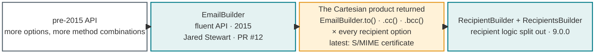
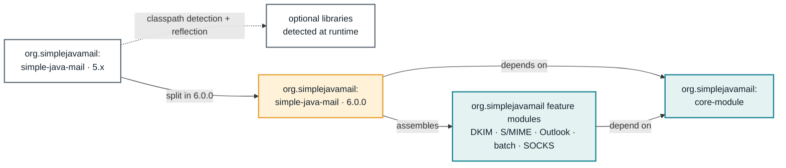

## It all started with a ticket

Telling the [origin story](/journal/simple-java-mails-origin-story.html) was one thing. There was a ticket, a MIME-shaped problem and eventually a utility class that solved it. Following what happened over the next twenty years, mostly one issue at a time, is another thing entirely.

I should get one technicality out of the way first: Simple Java Mail has not been public for twenty years. I am counting from that first ticket at the insurance company in 2006, before the code had a name or a repository. Vesijama first appeared on Google Code in 2009 and became Simple Java Mail in 2011. So this is the history of the code and the idea behind it, not twenty years of published releases.

Nor is this going to cover every release. The [release history](https://github.com/bbottema/simple-java-mail/blob/fae8504956bf07e107df04af9675c7e513e96f0c/RELEASE_HISTORY.md) already does that job and proves that I am perfectly capable of writing far too much about patch versions. These are the turns that changed what I thought the library was responsible for.

| When | What changed |
| --- | --- |
| 2006 | An email-rendering bug produced the utility class that became the foundation of the library. |
| 26 April 2009 | I made the code public as Vesijama in the [first Google Code commit](https://github.com/bbottema/simple-java-mail/commit/4d5bf205a1a5193d4ea1d655f98e875f0b026e7f). |
| March–August 2011 | Vesijama became Simple Java Mail, gained SSL and TLS support and was prepared for Maven Central. |
| 2015 | The project moved from Google Code to GitHub and received a contributed fluent `EmailBuilder` API. |
| 2016–2018 | DKIM, conversion, batch sending, proxies, configuration and stronger builder APIs changed it from a mail helper into a much broader library. |
| January 2020 | [6.0.0](https://github.com/bbottema/simple-java-mail/releases/tag/6.0.0) split optional capabilities into modules and added S/MIME, the CLI, clustered batch sending and content-specific MIME structures. |
| January 2022 | [7.0.0](https://github.com/bbottema/simple-java-mail/releases/tag/7.0.0) finally moved to Java 8 and Jakarta Mail 2.0.1, which also meant taking responsibility for abandoned supporting libraries. |
| 2023–2025 | The late 7.x and 8.x lines kept refining defaults, overrides, OAuth2, Outlook conversion, DKIM, S/MIME and connection-pool behaviour. |
| July 2026 | [9.0.0](https://github.com/bbottema/simple-java-mail/releases/tag/9.0.0) rolled roughly two years of backlog into one major release. |
| Work toward 10.0.0 | The focus moved from adding more ways to send towards preparing, observing and reporting each submission, with deliberate places for applications to take control. |

That table makes the path look much straighter than it was. There were quiet years, bursts in which several releases appeared within days, experiments that were later removed and APIs I cleaned up only after users showed me what I had got wrong.

## The first users found the missing half

The first two reported issues arrived less than two months after the initial upload. One was a null pointer when no HTML body was supplied. The reporter not only found it, but [returned with the exact patch](/sources/google-code/vesijama/issue-1.html#comment-1) twenty-five minutes later. Basic stuff, stuff you normally catch with JUnit. I had much to learn.

The other was even worse. A `Mailer` could retain content from the _previously_ sent message because I reused part of the MIME structure. The report correctly called out the ["severe security and performance implications"](/sources/google-code/vesijama/issue-2.html#comment-0). I had made a reusable mailer that should not be reused. The fix was to create a fresh MIME wrapper for every email. This is painful to read back, now.

That became a familiar pattern: I would implement what looked complete, and actual usage would reveal the missing half. Users corrected the brackets around a [`Content-ID`](/sources/google-code/vesijama/issue-5.html#comment-0), found that JavaMail's default charset could quietly turn text into US-ASCII instead of [UTF-8](/sources/google-code/vesijama/issue-7.html#comment-2), and discovered that a port stopped working when I passed JavaMail an `Integer` while its properties expected a [string](/sources/google-code/vesijama/issue-8.html#comment-0). That last one had even worked in my tests.

Sometimes the missing half was conceptual. When somebody asked for a reply-to address, I initially thought the sender address already covered it. He explained the perfectly ordinary case of an automated bounce address and a human reply address. Halfway through the discussion I realised that my own Gmail and domain setup worked exactly that way. ["Ahh, I understand now"](/sources/google-code/simple-java-mail/issue-1.html#comment-3) is not a bad summary of a surprising amount of API development. I had much to learn.

The most useful reports were often the ones that made an inconsistency impossible to defend. In 2012 a user pointed out that `Email.getRecipients()` returned a `Recipient` type that was private. I first answered as if `Recipient` were some internal JavaMail detail. It was my own class. As he dryly noted, [calling the method would not even compile](/sources/google-code/simple-java-mail/issue-4.html#comment-4). `Recipient` became public in 2.1. I physically cringe, reading this back. I still had so much to learn.

2015 was a pivotal year: Jared Stewart contributed a [fluent interface for building emails](https://github.com/bbottema/simple-java-mail/pull/12). A builder feels inevitable when looking at the API today, but it changed the library's direction. The original API was mostly a friendlier way to operate JavaMail, but it had become a nightmare to maintain; every new option multiplied the Cartesian product of methods. A builder on the other hand could describe an email in the language of an application, offer only compatible choices and use single-purpose methods without losing flexibility. Once that became the public API, every new capability had to answer two questions: how should a user express this, and how much should Simple Java Mail handle for them? After that, it was [builders all the way down](/features.html#section-builder-api).

The issue tracker became the place where those answers were negotiated. It was never quite a roadmap. It was closer to a long-running argument with reality.

## The first API was the filename

Not all feedback was technical. Vesijama stood for **Ve**ry **Si**mple **Ja**va **Ma**il, which I considered clever right up to the point where other people had to say it out loud. In 2010 one blog reader praised the library and then said there was [no way he would install a file named `vesijama`](/sources/project-nibble/vesijama-very-simple-java-mail.html#comment-1305) on a client's computer.

That comment did not single-handedly rename the project, but it captured the complaints rather well. In March 2011 I finally [announced the less inventive name](/sources/project-nibble/vesijama-renamed-to-simple-java-mail.html). Usability apparently starts before the first method call.

## When simple stopped meaning small

For a while, it was easy to explain Simple Java Mail as a wrapper around JavaMail. That description stopped fitting as the library acquired DKIM signing, Outlook `.msg` conversion, EML conversion, connection pooling, proxy support, Spring integration, a command-line interface and eventually S/MIME signing and encryption.

Some of those additions are far outside the original utility class. Yet each came from the same practical problem: somebody wanted to send or process an email without first becoming the integrator of several lower-level libraries. Telling them to combine JavaMail, a DKIM implementation, an S/MIME implementation, a connection pool and an Outlook parser themselves would have kept Simple Java Mail small. It would not have kept email simple.

Proxy support is a good example of how my answer changed. In 2010 somebody asked Vesijama to support proxies and I admitted that I was [intimidated by the added complexity](/sources/google-code/vesijama/issue-3.html#comment-6). I did not have the spare time to figure it out and invited patches. Six years later JavaMail still supported only anonymous SOCKS proxies, so for [issue #38](https://github.com/bbottema/simple-java-mail/issues/38) I reduced `sockslib` to the bare minimum needed to run a small authenticated bridge beside the mailer. What had felt too peripheral in 2010 had become part of making SMTP usable in a real network.

The email validator went the other way. The original regular expression came from code I had found online and eventually acquired its own repository. It also proved that some complexity should never have been hidden inside one expression. Years later a better parser let me stop owning that solution. That story belongs with the other projects [behind Simple Java Mail](/journal/the-libraries-behind-simple-java-mail.html), because expanding responsibly also means knowing when somebody else has solved the problem better.

"Simple" never meant "few features" to me. It has always meant the same thing: emailing made simple, with MIME, JavaMail and SMTP plumbing hidden behind a streamlined API. Authenticated proxy support fits that promise. Continuing to maintain my own brittle validator implementation after a better one existed did not. The challenge is adding or replacing those pieces without letting the API become as complicated as the problems it hides.

## Optional dependencies stopped being simple

The move to modules taught me just how costly "optional" dependencies can become. Before that, I tried to keep third-party dependencies optional. Put a particular dependency on the classpath and its feature became available; leave it out and the core library would still work. In theory this kept things lightweight. In practice it combined feature detection, reflection and dependency compatibility inside one artifact. Version 5.0.1 exists partly because the supposedly optional DKIM integration could still produce a `ClassNotFoundException` when it was not being used.

The fix was to stop being clever about the classpath and make Maven enforce the structure. S/MIME, Outlook conversion, Spring, the CLI and batch processing moved into separate modules with dependencies pointing one way. Instead of asking users to discover the correct collection of third-party libraries, Simple Java Mail's own [modules](/modules.html) could manage those combinations.

The 6.0.0 release was the point where that design became visible. The core became smaller even while the overall project became more capable. It also made the architecture more honest. S/MIME was no longer an optional trick hiding inside the main JAR; it had its own code, dependencies and reasons to change. The CLI sat above the library instead of being tangled through it. Advanced batch processing could own pooling and clustering without making every `Mailer` pay for it.

An Outlook issue helped draw one of those lines. When the parser encountered a signed message, adding JavaMail and Bouncy Castle to the Outlook library was an option. We decided that [signature handling was not actually Outlook-specific](https://github.com/bbottema/outlook-message-parser/issues/4). The parser should expose what was in the file; Simple Java Mail's S/MIME module should decide what it meant. That sounds obvious after the modules exist. It was not obvious while trying to make one broken message work.

At the time, I mainly thought of modules as dependency management. They turned out to be something more valuable: an executable record of which parts of the system are allowed to know about each other.

## Sometimes the ground moves underneath you

A library can remain stable while everything it depends on moves, gets renamed or is abandoned. Simple Java Mail spent its early years on Java 6 and Sun JavaMail. It moved slowly to Java 7, then almost comically late to Java 8, and from `javax.mail` to Jakarta Mail.

That last migration could not be contained to this repository. The S/MIME library had been archived and still targeted the old mail API. The DKIM integration had its own history. The Outlook parser, RTF converter, proxy server and three layers of pooling all had releases and compatibility decisions that could block the main library. By 7.0.0, a dependency tree I had once treated as implementation detail had become a collection of projects I had to keep moving.

The full story is in [The Libraries Behind Simple Java Mail](/journal/the-libraries-behind-simple-java-mail.html). It includes SourceForge projects, forks, permissions, licence mistakes, a contribution that became its own library and one old foundation I had completely forgotten. It taught me that an abstraction is only as maintained as the layers it hides.

## Every convenience creates a policy

There have been plenty of times when I mistook a cleaner implementation for a better public API. In 2017 I streamlined the recipient methods and broke backwards compatibility. One patch later I [put the old API back](https://github.com/bbottema/simple-java-mail/issues/101) as deprecated. When I rewrote the release history years later, the most accurate summary I could add was ["sorry for removing it abruptly"](https://github.com/bbottema/simple-java-mail/commit/7fcca4bc473fa02d8a75916ef1f398c5b4cebe81). The larger recipient cleanup eventually had to wait for a major version and a migration guide.

The same problem eventually returned inside the builder. Recipient options kept growing, and each one brought another set of `to()`, `cc()` and `bcc()` convenience methods. Defaults could come from global configuration, a `Mailer`, an `Email` or a builder call. The most recent recipient-level addition was the S/MIME certificate, and by then the overloads had become a Cartesian product of sorts. Version 9 finally removed that method jungle and moved recipient construction into dedicated [`RecipientBuilder` and `RecipientsBuilder` APIs](/migration-notes-9.0.0.html#recipient-builders).

Even a small convenience could hide a policy decision. When somebody asked for email priority in 2011, different clients expected `X-Priority`, `X-MSMail-Priority`, `Importance` or some combination of them. The eventual answer was both: [a priority API for the common case and open headers](/sources/google-code/simple-java-mail/issue-2.html#comment-1) for the cases the library did not know.

Security made these trade-offs less optional. CRLF-injection checks, timeouts, TLS upgrades, hostname verification, DKIM rules and S/MIME algorithms all needed useful defaults. But applications also needed custom `Session` instances, additional properties, socket factories and complete sending replacements. A safe default that cannot be escaped becomes an integration bug; an escape hatch that silently disables the safety model becomes a security bug.

A [2012 testing proposal](/sources/google-code/simple-java-mail/issue-5.html#comment-2) sounds surprisingly familiar now. The suggested `SmtpReceiver` would sit at the end of the sending chain so a test could inspect the high-level email and simulate failure. I cannot draw a straight historical line from that suggestion to today's custom sending APIs. I can say that the same need kept resurfacing: sometimes a caller needs the library to do everything except the last step.

That is the idea behind the library's [extension points](/features.html#section-extension-points): handle what can be solved consistently, make the common path safe, and give callers deliberate ways to take over when the library cannot predict their needs. I have not always got that balance right, but I now consider it part of the feature rather than an inconvenience around it.

## The 2026 return

The 9.0.0 release notes say that it rolled roughly two years of backlog into a major release. Across Simple Java Mail and its supporting libraries, more than a hundred issues and pull requests were reviewed, fixed, merged or closed. There were new recipient APIs, delivery-status notifications, pre-encoded resources, mailer-level DKIM defaults, simpler batch sending, Java module descriptors and a long list of fixes that only make sense after somebody has encountered the corresponding failure in production.

That burst happened because I changed how I work. I had begun using coding agents seriously and found that the architecture, tests and issue history had become mature enough to keep them on track. The personal side of that return belongs in [The Library I Keep Coming Back To](/journal/the-library-i-keep-coming-back-to.html). For this history, what matters is that agent-assisted development did not make architecture less important. It made clear structure more valuable.

As I write this, 10.0.0 is still being assembled. The work says something about how my priorities changed. Much of it is not about another content type or transport option. It is about making the send process visible: preparing an email before opening a connection, returning structured submission outcomes, making synchronous and asynchronous behaviour obvious, observing the complete send lifecycle and treating the places where applications hook into it as APIs I have to support.

That feels like the work of a library growing up. Early versions tried to make the happy path short. A mature library also has to explain what happened when sending does not go to plan.

## Still the same ticket

There is no useful definition of feature-complete for email. The standards keep moving, providers disagree, security expectations change and users will always produce a message assembled by a system nobody has tested before. I no longer expect Simple Java Mail to finish.

What did survive is the promise behind that first utility class. A user should describe the email they want. The library should work out the MIME structure, apply the configured security transformations, prepare the transport and report what happened. When the defaults do not fit, the user should be able to take control without having to discard the entire abstraction.

Simple Java Mail became much larger by following that promise. The definition of responsibility changed, the API changed, the dependencies changed and occasionally I changed my mind. But twenty years later, I am still trying to solve the same ticket: put the complexity somewhere it can be understood once instead of rediscovered in every application.
